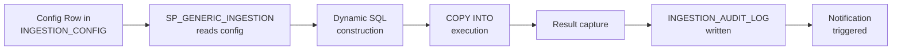
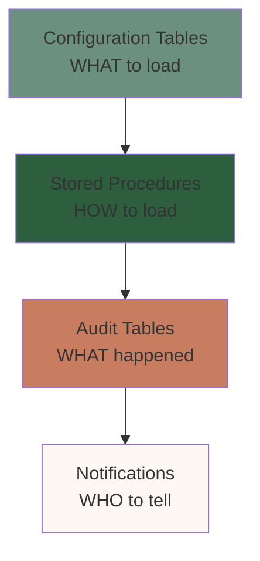
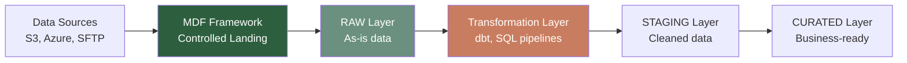
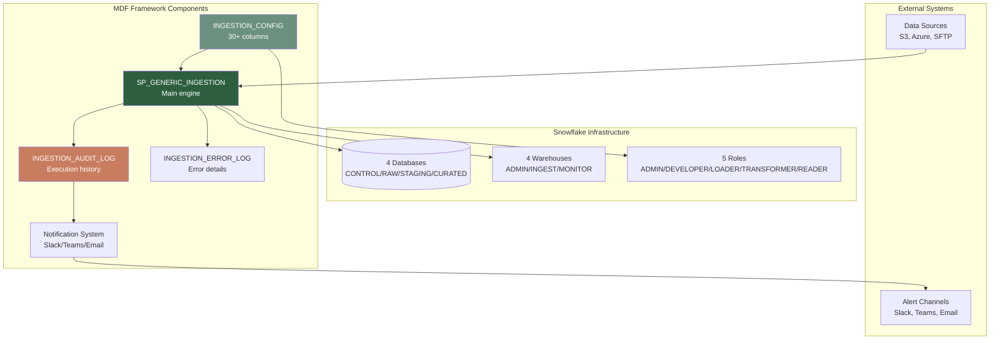
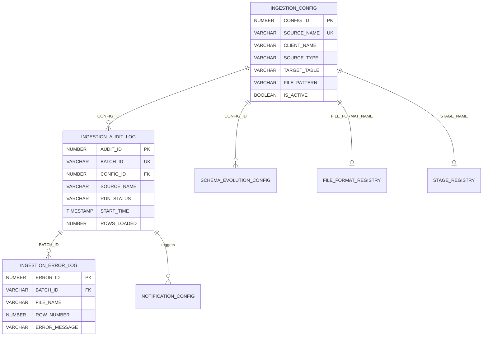
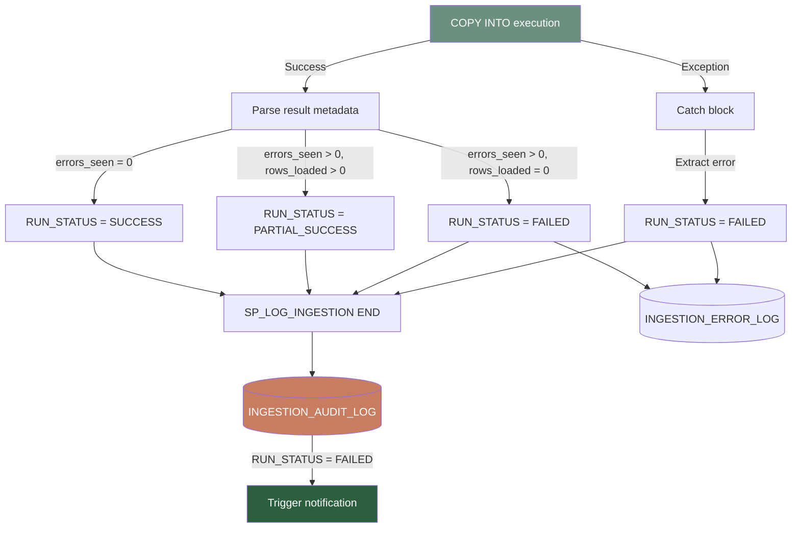
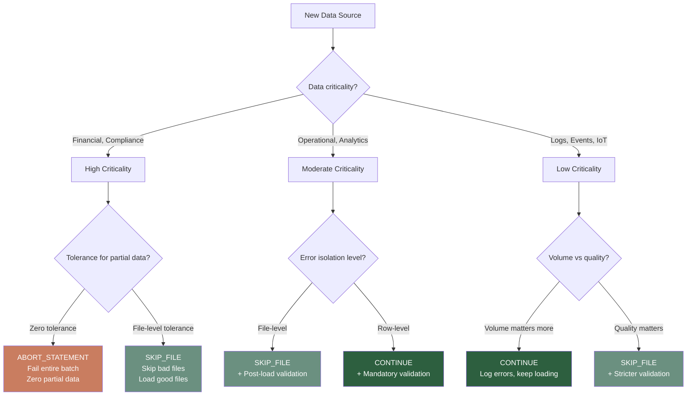
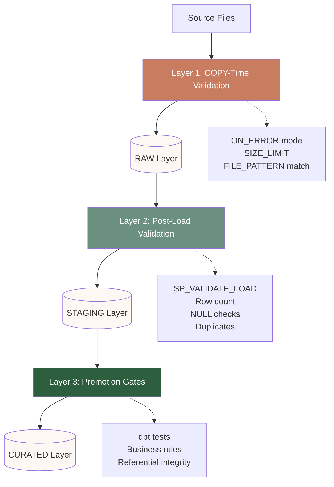
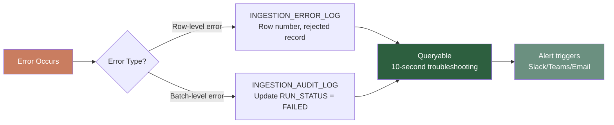

# Metadata-Driven Ingestion Framework: Complete Technical Guide

**Version:** 1.0
**Last Updated:** February 2026
**Target Audience:** Mid-Senior Data Engineers
**Framework:** Snowflake Enterprise Edition

---

## Table of Contents

### Part 1: Introduction & Overview
1. [Executive Summary](#1-executive-summary)
2. [What is MDF? Philosophy & Design Principles](#2-what-is-mdf)
3. [When to Use MDF (vs When NOT to Use)](#3-when-to-use-mdf)
4. [Architecture Overview](#4-architecture-overview)
5. [Prerequisites & Setup Requirements](#5-prerequisites-setup)

### Part 2: Core Concepts
6. [Metadata-Driven Design Pattern](#6-metadata-driven-design-pattern) ⭐ START HERE
7. [Metadata Tables: The Brain](#7-metadata-tables-the-brain)
8. [Stored Procedure Architecture](#8-stored-procedure-architecture)
9. [Audit Trail & Observability](#9-audit-trail-observability)
10. [Error Handling Philosophy](#10-error-handling-philosophy)

### Part 3: Module-by-Module Implementation
11. [Module 01: Foundation Setup](#module-01-foundation-setup)
12. [Module 02: File Formats & Stages](#module-02-file-formats-stages)
13. [Module 03: Configuration Tables](#module-03-configuration-tables)
14. [Module 04: Core Stored Procedures](#module-04-core-stored-procedures)
15. [Module 05: CSV Ingestion Lab](#module-05-csv-ingestion-lab)
16. [Module 06: Semi-Structured Data](#module-06-semi-structured-data)
17. [Module 07: Error Handling & Audit](#module-07-error-handling-audit)
18. [Module 08: Automation - Tasks & Streams](#module-08-automation)
19. [Module 09: Monitoring & Dashboards](#module-09-monitoring-dashboards)
20. [Module 10: Schema Evolution & Advanced](#module-10-schema-evolution)

### Part 4: Production Deployment
21. [End-to-End Setup Guide (Quick Start)](#21-quick-start)
22. [Scenario 1: 500 CSV Files/Day from S3](#22-scenario-1)
23. [Scenario 2: Multi-Source (S3 + Azure + SFTP)](#23-scenario-2)
24. [Scenario 3: IoT JSON/Parquet with Schema Evolution](#24-scenario-3)
25. [Performance Tuning & Optimization](#25-performance-tuning)
26. [Troubleshooting Guide](#26-troubleshooting)
27. [Production Runbook](#27-production-runbook)

### Part 5: Reference
28. [SQL Scripts Index](#28-sql-scripts-index)
29. [Stored Procedure Reference](#29-stored-procedure-reference)
30. [Configuration Reference](#30-configuration-reference)
31. [Monitoring Queries Cookbook](#31-monitoring-cookbook)
32. [Best Practices Checklist](#32-best-practices)
33. [FAQ & Common Issues](#33-faq)

### Appendices
- [Appendix A: Sample Data Files](#appendix-a-sample-data)
- [Appendix B: Webhook Payload Templates](#appendix-b-webhooks)
- [Appendix C: Dashboard Setup (Snowsight)](#appendix-c-dashboards)
- [Appendix D: Migration from Manual COPY Scripts](#appendix-d-migration)

---

# Part 1: Introduction & Overview

## 1. Executive Summary
[To be written]

## 2. What is MDF?
[To be written]

## 3. When to Use MDF
[To be written]

## 4. Architecture Overview
[To be written - Include MDF AT A GLANCE Mermaid diagram]

## 5. Prerequisites & Setup
[To be written]

---

# Part 2: Core Concepts

## 6. Metadata-Driven Design Pattern

### The Problem: When Configuration Becomes Code

A production story from a financial services client:

> *"We had 80 data sources. 80 hand-written COPY INTO scripts. Each one slightly different — different file patterns, different error handling, different target tables. When a source changed format, we'd update the script, test it, deploy it, and hope nothing broke. One schema change took three days from detection to production. We were spending more time maintaining ingestion scripts than actually using the data."*

This is the traditional approach to data ingestion. Each data source gets its own script:

```sql
-- customers.sql
COPY INTO RAW_CUSTOMERS
FROM @CUSTOMER_STAGE
FILE_FORMAT = (TYPE = CSV, SKIP_HEADER = 1, FIELD_DELIMITER = ',')
PATTERN = '.*customers.*\.csv'
ON_ERROR = CONTINUE;

-- orders.sql
COPY INTO RAW_ORDERS
FROM @ORDER_STAGE
FILE_FORMAT = (TYPE = CSV, SKIP_HEADER = 1, FIELD_DELIMITER = '|')  -- Different delimiter!
PATTERN = '.*orders.*\.csv'
ON_ERROR = ABORT_STATEMENT;  -- Different error handling!

-- products.sql
COPY INTO RAW_PRODUCTS
FROM @PRODUCT_STAGE
FILE_FORMAT = (TYPE = CSV, SKIP_HEADER = 1, FIELD_DELIMITER = ',')
PATTERN = '.*products.*\.csv'
ON_ERROR = CONTINUE;

-- ... 77 more scripts ...
```

**The maintenance burden:**
- New source? Write new script (30-60 min)
- Change error handling? Edit script, test, deploy (15-30 min)
- Deactivate broken source? Comment out code, redeploy (10-15 min)
- Schema change? Update script, coordinate with downstream (hours to days)
- Find out why a load failed 3 days ago? Check logs, grep for errors, reconstruct timeline (30-60 min)

At scale, this doesn't work. The effort to maintain 100 scripts exceeds the value they provide.

---

### The MDF Solution: Configuration Over Code

The Metadata-Driven Ingestion Framework replaces scripts with data.

**Traditional Approach vs MDF:**

| Aspect | Traditional (Script-per-Source) | MDF (Metadata-Driven) |
|--------|--------------------------------|----------------------|
| **New source** | Write new COPY script (30-60 min) | INSERT config row (2 min) |
| **Change frequency** | Edit cron job, redeploy (15 min) | UPDATE LOAD_FREQUENCY column (30 sec) |
| **Deactivate source** | Comment out code, commit, deploy (10 min) | SET IS_ACTIVE = FALSE (10 sec) |
| **Error handling** | Edit ON_ERROR in script, test, deploy (20 min) | UPDATE ON_ERROR column (30 sec) |
| **Find failure reason** | Grep logs, reconstruct timeline (30-60 min) | SELECT FROM INGESTION_AUDIT_LOG (10 sec) |
| **Number of artifacts** | 100 scripts (code artifacts) | 1 procedure + 100 config rows (data artifacts) |
| **Change tracking** | Git commits (if disciplined) | Automatic (CREATED_AT, UPDATED_AT) |
| **Audit trail** | Manual logging (if implemented) | Built-in (every load logged) |

**The core insight:**

> *"MDF treats data sources as data, not as code. A configuration table row describes how to load a source. A generic stored procedure reads that row and executes the load. Change the row, change the behavior. No code changes. No deployments."*

---

### Core Principles

#### 1. Configuration Over Code (Primary Principle)

**Traditional pattern:**
```sql
-- Hard-coded script (configuration embedded in code)
COPY INTO RAW_CUSTOMERS
FROM @CUSTOMER_STAGE
FILE_FORMAT = CSV_FORMAT
PATTERN = '.*customers.*\.csv'
ON_ERROR = CONTINUE;
```

**MDF pattern:**
```sql
-- Configuration as data (behavior defined in table)
SELECT SOURCE_NAME, STAGE_NAME, FILE_PATTERN, FILE_FORMAT_NAME,
       TARGET_TABLE, ON_ERROR, IS_ACTIVE
FROM INGESTION_CONFIG
WHERE SOURCE_NAME = 'DEMO_CUSTOMERS_CSV';

-- Returns:
-- SOURCE_NAME          | STAGE_NAME    | FILE_PATTERN      | FILE_FORMAT    | TARGET_TABLE   | ON_ERROR | IS_ACTIVE
-- DEMO_CUSTOMERS_CSV   | @CUSTOMER_STG | .*customers.*\.csv | CSV_STANDARD   | RAW_CUSTOMERS  | CONTINUE | TRUE
```

The configuration row **is** the script. The stored procedure reads it and executes it.

**Result:**
- Configuration is queryable: `SELECT * FROM INGESTION_CONFIG WHERE IS_ACTIVE = TRUE;`
- Configuration is auditable: `WHERE UPDATED_AT >= DATEADD(DAY, -7, CURRENT_TIMESTAMP())`
- Configuration is versionable: Track who changed what when
- Configuration is testable: `WHERE SOURCE_NAME = 'TEST_SOURCE'`

#### 2. One Procedure for All Sources (Supporting Pillar)

Instead of N scripts for N sources, MDF uses **one generic procedure**:

```sql
CALL SP_GENERIC_INGESTION('DEMO_CUSTOMERS_CSV', FALSE);
-- OR
CALL SP_GENERIC_INGESTION('ALL', FALSE);  -- Process all active sources
```

The procedure:
1. Reads config from `INGESTION_CONFIG` table
2. Builds COPY INTO statement dynamically based on config
3. Executes the COPY
4. Logs results to `INGESTION_AUDIT_LOG`
5. Returns status summary (JSON)

**Same procedure handles:**
- CSV, JSON, Parquet, Avro, ORC
- Different delimiters, headers, compression
- Different stages (internal, external, S3, Azure, GCS)
- Different error handling (CONTINUE, SKIP_FILE, ABORT)
- Different validation rules
- Different notification channels

**One codebase. Unlimited configurations.**

#### 3. Audit-First Design (Supporting Pillar)

Every load attempt is logged, whether it succeeds or fails:

```sql
-- Every row in INGESTION_AUDIT_LOG represents one execution
SELECT BATCH_ID, SOURCE_NAME, RUN_STATUS, START_TIME, END_TIME,
       FILES_PROCESSED, ROWS_LOADED, ERROR_MESSAGE
FROM INGESTION_AUDIT_LOG
ORDER BY START_TIME DESC
LIMIT 10;
```

Benefits:
- **Observability**: See what happened, when, and why
- **Troubleshooting**: Failure details captured automatically
- **Compliance**: Complete audit trail for data lineage
- **Analytics**: Query your ingestion patterns (success rates, duration trends, volume)

---

### How It Works: From Config to Data

#### The Transformation Flow



**Step-by-step:**

1. **Config Row** defines the source:
   ```sql
   {
     "source_name": "DEMO_CUSTOMERS_CSV",
     "stage": "@CUSTOMER_STAGE",
     "file_pattern": ".*customers.*\\.csv",
     "file_format": "CSV_STANDARD",
     "target_table": "RAW_CUSTOMERS",
     "on_error": "CONTINUE",
     "is_active": true
   }
   ```

2. **Procedure reads config** and builds COPY command:
   ```sql
   COPY INTO RAW_CUSTOMERS
   FROM @CUSTOMER_STAGE
   FILE_FORMAT = (FORMAT_NAME = 'CSV_STANDARD')
   PATTERN = '.*customers.*\.csv'
   ON_ERROR = CONTINUE
   RETURN_FAILED_ONLY = FALSE;
   ```

3. **COPY executes**, Snowflake loads data

4. **Results captured** (rows loaded, files processed, errors)

5. **Audit log updated** with complete execution details

6. **Notification sent** (if configured) via Slack/Teams/Email

**The key:** Steps 2-6 are automatic. You only configure step 1.

---

### Common Operations via Configuration

#### Operation 1: Adding a New Data Source

**Traditional approach (Script-based):**
```sql
-- 1. Write new COPY script (30-60 min)
-- File: load_invoices.sql
COPY INTO RAW_INVOICES
FROM @INVOICE_STAGE
FILE_FORMAT = (TYPE = CSV, SKIP_HEADER = 1, FIELD_DELIMITER = '|')
PATTERN = '.*invoices.*\.csv'
ON_ERROR = SKIP_FILE;

-- 2. Add to scheduler/cron
-- 3. Test in dev
-- 4. Deploy to prod
-- 5. Monitor for issues
```

**MDF approach (Config-based):**
```sql
-- 1. Insert config row (2 min)
CALL SP_REGISTER_SOURCE(
  P_SOURCE_NAME => 'DEMO_INVOICES_CSV',
  P_CLIENT_NAME => 'DEMO',
  P_SOURCE_TYPE => 'CSV',
  P_TARGET_TABLE => 'RAW_INVOICES',
  P_FILE_PATTERN => '.*invoices.*\.csv',
  P_LOAD_TYPE => 'APPEND',
  P_ON_ERROR => 'SKIP_FILE'
);

-- 2. Upload files to stage
-- 3. Test: CALL SP_GENERIC_INGESTION('DEMO_INVOICES_CSV', FALSE);
-- 4. Verify in audit log
-- Done. No deployment.
```

**Time saved:** 28-58 minutes per source

#### Operation 2: Changing Load Frequency

**Traditional:** Edit cron expression in scheduler config, redeploy, wait for next execution

**MDF:**
```sql
UPDATE INGESTION_CONFIG
SET LOAD_FREQUENCY = 'HOURLY',
    UPDATED_BY = CURRENT_USER(),
    UPDATED_AT = CURRENT_TIMESTAMP()
WHERE SOURCE_NAME = 'DEMO_CUSTOMERS_CSV';
```

**Time:** 30 seconds. Change takes effect on next task run.

#### Operation 3: Deactivating a Broken Source at 3 AM

**Traditional:** Comment out code, commit, deploy (or manually kill running process)

**MDF:**
```sql
UPDATE INGESTION_CONFIG
SET IS_ACTIVE = FALSE,
    UPDATED_BY = CURRENT_USER(),
    UPDATED_AT = CURRENT_TIMESTAMP()
WHERE SOURCE_NAME = 'BROKEN_SOURCE';
```

**Time:** 10 seconds. No deployment. No code changes. Fully audited.

**Key insight:** The most common operations (add, change, deactivate) are **data operations**, not **code operations**. This fundamentally changes your development velocity and operational risk profile.

---

### Architecture Components: The Metadata Ecosystem

MDF is built on **four types of metadata tables**, each with a specific role:

#### 1. Configuration Tables (The "What")
- `INGESTION_CONFIG` - Defines what to load, where to find it, where to put it
- `NOTIFICATION_CONFIG` - Defines who gets alerted when
- `SCHEMA_EVOLUTION_CONFIG` - Defines how to handle schema drift

**Purpose:** Describe desired behavior

#### 2. Audit Tables (The "What Happened")
- `INGESTION_AUDIT_LOG` - One row per ingestion run (batch-level)
- `INGESTION_ERROR_LOG` - One row per error (detail-level)

**Purpose:** Record execution history for troubleshooting, compliance, analytics

#### 3. Registry Tables (The "Inventory")
- `FILE_FORMAT_REGISTRY` - Catalog of all file format objects
- `STAGE_REGISTRY` - Catalog of all stages used by framework

**Purpose:** Provide metadata layer over Snowflake objects (can't easily query SHOW commands)

#### 4. Validation Tables (The "Rules")
- `DATA_QUALITY_RULES` - Post-load validation checks (row counts, nulls, duplicates)
- `SCHEMA_VALIDATION_RULES` - Column-level constraints and type checks

**Purpose:** Define quality gates for promotion from RAW → STAGING

#### Separation of Concerns



- **Config tables** define behavior (what, where, when, how)
- **Stored procedures** implement behavior (dynamic SQL, execution logic)
- **Audit tables** record outcomes (observability, compliance)
- **Notification layer** alerts humans (proactive issue detection)

Each layer is independent. You can query config without running loads. You can analyze audit history without touching config. You can add notification channels without changing ingestion logic.

**Note:** Config changes are tracked via `CREATED_AT`, `UPDATED_AT`, `UPDATED_BY` columns (detailed in Section 7).

---

### Benefits of the Metadata-Driven Pattern

#### Auditability Built-In

Traditional approach:
- Manual logging (if implemented at all)
- Log files scattered across systems
- No correlation between config changes and execution outcomes

MDF approach:
- Every load automatically logged to `INGESTION_AUDIT_LOG`
- Every error captured in `INGESTION_ERROR_LOG`
- Every config change tracked with timestamp and user
- Batch IDs correlate all related events

**Query example:**
```sql
-- What changed in the last 7 days?
SELECT SOURCE_NAME,
       COLUMN_NAME,
       OLD_VALUE,
       NEW_VALUE,
       UPDATED_BY,
       UPDATED_AT
FROM CONFIG_CHANGE_HISTORY
WHERE UPDATED_AT >= DATEADD(DAY, -7, CURRENT_TIMESTAMP())
ORDER BY UPDATED_AT DESC;
```

**Performance insight:** The audit log also enables data-driven optimization. Query warehouse usage per source to identify bottlenecks and optimize file sizes or warehouse sizing dynamically:

```sql
SELECT SOURCE_NAME,
       AVG(DURATION_SECONDS) AS AVG_LOAD_DURATION,
       AVG(ROWS_LOADED) AS AVG_ROWS_PER_LOAD,
       AVG(BYTES_LOADED / 1024.0 / 1024.0) AS AVG_MB_PER_LOAD
FROM INGESTION_AUDIT_LOG
WHERE RUN_STATUS = 'SUCCESS'
  AND CREATED_AT >= DATEADD(DAY, -30, CURRENT_TIMESTAMP())
GROUP BY SOURCE_NAME
ORDER BY AVG_LOAD_DURATION DESC;
-- Identifies slow sources that may need larger warehouse or file optimization
```

#### Self-Documenting Architecture

The `INGESTION_CONFIG` table **is** the documentation:

```sql
-- What sources are we loading?
SELECT SOURCE_NAME, CLIENT_NAME, SOURCE_TYPE, LOAD_FREQUENCY, IS_ACTIVE
FROM INGESTION_CONFIG
ORDER BY CLIENT_NAME, SOURCE_NAME;

-- What sources use JSON?
SELECT SOURCE_NAME, TARGET_TABLE, FILE_PATTERN
FROM INGESTION_CONFIG
WHERE SOURCE_TYPE = 'JSON';

-- What sources are configured for daily loads?
SELECT SOURCE_NAME, LOAD_FREQUENCY, LAST_RUN_AT
FROM INGESTION_CONFIG
WHERE LOAD_FREQUENCY = 'DAILY';
```

No need to maintain separate documentation. The config table is always accurate because it's the source of truth.

#### Lower Barrier to Entry

**Traditional:** Junior engineer asks, "How do I add a new source?"
- Answer: "Write a COPY script, understand file formats, test edge cases, set up error handling, deploy, monitor..."
- Skill required: SQL + deployment pipelines + testing + monitoring
- Time to productivity: Days to weeks

**MDF:** Junior engineer asks, "How do I add a new source?"
- Answer: "Call `SP_REGISTER_SOURCE()` or INSERT a row into `INGESTION_CONFIG`"
- Skill required: Basic SQL INSERT
- Time to productivity: Minutes

**Example onboarding:**
```sql
-- Junior engineer adds a new source (self-service)
CALL SP_REGISTER_SOURCE(
  P_SOURCE_NAME => 'ACME_SHIPMENTS_CSV',
  P_CLIENT_NAME => 'ACME',
  P_SOURCE_TYPE => 'CSV',
  P_TARGET_TABLE => 'RAW_SHIPMENTS',
  P_FILE_PATTERN => '.*shipments.*\.csv'
);
-- Defaults applied automatically (format, stage, error handling)
-- Upload files, run ingestion, verify in audit log
-- Total time: < 10 minutes for experienced user
```

#### Testability at Every Layer

**Config-level testing:**
```sql
-- Test mode: Insert test config, run ingestion, verify, delete config
INSERT INTO INGESTION_CONFIG (...) VALUES ('TEST_SOURCE', ...);
CALL SP_GENERIC_INGESTION('TEST_SOURCE', FALSE);
SELECT * FROM INGESTION_AUDIT_LOG WHERE SOURCE_NAME = 'TEST_SOURCE';
DELETE FROM INGESTION_CONFIG WHERE SOURCE_NAME = 'TEST_SOURCE';
```

**Dry-run mode:**
```sql
-- See what would happen without actually loading data
CALL SP_GENERIC_INGESTION('DEMO_CUSTOMERS_CSV', DRY_RUN => TRUE);
-- Returns: Generated COPY command, validation results, but doesn't execute
```

**Isolation:**
- Test sources in dev database without affecting prod
- Test config changes on specific sources without impacting others
- Test schema evolution on copy of table before applying to production

---

### Anti-Patterns: What We're Replacing

#### Anti-Pattern 1: Hard-Coded COPY Scripts

**The old way (don't do this):**
```sql
-- customer_load.sql
USE ROLE DATA_ENGINEER;
USE WAREHOUSE LOAD_WH;
USE DATABASE PROD_DB;

COPY INTO RAW.CUSTOMERS
FROM @S3_STAGE/customers/
FILES = ('customers_20240101.csv', 'customers_20240102.csv', ...)  -- Hard-coded!
FILE_FORMAT = (
  TYPE = CSV,
  FIELD_DELIMITER = ',',
  SKIP_HEADER = 1,
  DATE_FORMAT = 'YYYY-MM-DD',  -- What if source changes to MM/DD/YYYY?
  NULL_IF = ('NULL', '')
)
ON_ERROR = CONTINUE;

-- Manually check results
SELECT COUNT(*) FROM RAW.CUSTOMERS WHERE LOADED_AT >= CURRENT_DATE();

-- Manually log to tracking spreadsheet (!!)
-- "2024-01-03: Loaded customers, 1,234 rows, no errors"
```

**Problems:**
- File list hard-coded (fails when new files arrive)
- Format details hard-coded (breaks when source changes)
- Manual verification (error-prone, not scalable)
- Manual logging (incomplete, inconsistent)
- No correlation between loads
- No historical queryability

**MDF way:**
```sql
-- Configuration (once)
INSERT INTO INGESTION_CONFIG VALUES (...);  -- Defines pattern, not specific files

-- Execution (repeatable)
CALL SP_GENERIC_INGESTION('DEMO_CUSTOMERS_CSV', FALSE);

-- Automatic logging, automatic file discovery, automatic error handling
-- Query history anytime: SELECT * FROM INGESTION_AUDIT_LOG WHERE SOURCE_NAME = '...'
```

#### Anti-Pattern 2: One-Size-Fits-All Error Handling

**The old way:**
```sql
-- All sources use ON_ERROR = CONTINUE (or all use ABORT_STATEMENT)
-- No per-source customization
```

**Problem:** Event streams can tolerate bad rows (CONTINUE). Financial transactions cannot (ABORT_STATEMENT). Using the same error handling for both is wrong.

**MDF way:**
```sql
-- Per-source error handling via config
UPDATE INGESTION_CONFIG SET ON_ERROR = 'ABORT_STATEMENT'
WHERE SOURCE_NAME = 'PAYMENT_TRANSACTIONS';

UPDATE INGESTION_CONFIG SET ON_ERROR = 'CONTINUE'
WHERE SOURCE_NAME = 'WEB_CLICKSTREAM';
```

---

### When MDF is Overkill (Framework Boundaries)

MDF is not the right tool for every ingestion scenario:

#### Case 1: Very Small Number of Sources

**Don't use MDF if:**
- You have < 10 data sources
- Sources are simple and unlikely to change
- One-off or ad-hoc loads

**Why:** The operational overhead of metadata tables, audit logging, and stored procedures exceeds the benefit. A few simple COPY scripts are faster to write and maintain.

**Alternative:** Plain COPY INTO scripts with manual logging

#### Case 2: Streaming / Real-Time Ingestion

**Don't use MDF for:**
- Streaming data (Kafka, event streams)
- Real-time requirements (sub-second latency)
- Continuous micro-batch ingestion (every few seconds)

**Why:** MDF is batch-oriented and optimized for file-based, time-boxed loads (hourly, daily, etc.). It's designed for "land → validate → notify" workflows, not streaming.

**Alternative:**
- **Snowpipe** for event-driven file ingestion (S3/Azure event notifications)
- **Snowpipe Streaming** for row-level, low-latency ingestion (Kafka Connect, etc.)

#### Case 3: Heavy Pre-Load Transformations

**Don't use MDF if:**
- You need complex transformations BEFORE landing in Snowflake
- Data enrichment from external APIs
- Multi-system data merging logic
- Heavy data quality fixes pre-ingestion

**Why:** MDF is designed to land data "as-is" into RAW layer. Transformations happen downstream (STAGING → CURATED) via dbt or SQL pipelines.

**Alternative:**
- Use EL-style pipeline (Databricks, Spark, Python) to transform and stage
- Then use MDF to ingest the curated files into Snowflake

---

### MDF Positioning in the Data Stack

#### MDF Handles the "L" in ELT (Load/Land)



**MDF's role:**
- **Land data** into RAW layer with full audit trail
- **Validate files** (format, size, pattern)
- **Log everything** (what, when, how many rows, errors)
- **Notify on issues** (Slack, Teams, email)

**MDF does NOT:**
- Transform data (that's dbt, SQL pipelines)
- Extract from APIs (that's Fivetran, custom Python)
- Replace entire ELT stack (it's one component)

**MDF excels at:** Snowflake-native, audit-ready, metadata-driven **landing layer** with full control and observability.

#### Snowflake-Native vs External Orchestrators

**MDF is Snowflake-native:**
- Uses Snowflake stored procedures (JavaScript SQL)
- Uses Snowflake tasks for scheduling (CRON-based)
- Uses Snowflake stages for file storage
- Uses Snowflake secrets for credentials
- Uses Snowflake alerts for notifications

**External orchestrators** (Airflow, Prefect, Azure Functions, AWS Step Functions):
- Sit at the **orchestration layer**
- Can call MDF procedures: `CALL SP_GENERIC_INGESTION('ALL', FALSE)`
- Handle complex dependencies across systems
- Coordinate Snowflake + non-Snowflake workloads

**Pattern:**
```
External Orchestrator (Airflow DAG)
    ├── Task 1: Validate source files exist
    ├── Task 2: Call MDF ingestion (Snowflake native)
    │   └── SP_GENERIC_INGESTION runs in Snowflake
    ├── Task 3: Trigger downstream dbt models
    └── Task 4: Send summary notification
```

**Recommendation:**
- Use **Snowflake-native tasks** if ingestion is simple, Snowflake-only
- Use **external orchestrator** if you have complex multi-system workflows
- MDF works with both patterns (it's just a stored procedure)

---

### Before/After Visual Comparison

#### Before MDF: Script-per-Source Chaos

```
Data Sources (80 total)
├── customers.csv      → load_customers.sql (120 lines)
├── orders.csv         → load_orders.sql (135 lines)
├── products.csv       → load_products.sql (98 lines)
├── invoices.csv       → load_invoices.sql (142 lines)
├── shipments.json     → load_shipments.sql (210 lines)
└── ... 75 more scripts

Total code artifacts: 80 SQL scripts (~10,000 lines)
Maintenance burden: High (every change = code change)
Audit trail: Manual (if you remember to log)
Observability: Scattered (grep logs, check spreadsheets)
Onboarding time: Weeks (understand 80 different scripts)
```

#### After MDF: One Procedure, 80 Config Rows

```
Data Sources (80 total)
└── All defined in INGESTION_CONFIG table
    ├── Row 1: DEMO_CUSTOMERS_CSV (10 columns configured)
    ├── Row 2: DEMO_ORDERS_CSV
    ├── Row 3: DEMO_PRODUCTS_CSV
    ├── Row 4: DEMO_INVOICES_CSV
    ├── Row 5: DEMO_SHIPMENTS_JSON
    └── ... 75 more rows

Execution:
└── SP_GENERIC_INGESTION('ALL', FALSE)  -- One procedure

Total code artifacts: 1 procedure (~500 lines) + 80 config rows (data)
Maintenance burden: Low (changes = UPDATE statements)
Audit trail: Automatic (every load logged)
Observability: Built-in (query INGESTION_AUDIT_LOG)
Onboarding time: Hours (understand 1 pattern, apply to all sources)
```

**Reduction in complexity:** 80 custom scripts → 1 generic procedure = **80x code consolidation**

---

### Component Relationships Diagram



---

### MDF vs Alternative Approaches

| Approach | Best For | MDF Comparison |
|----------|----------|----------------|
| **Manual COPY scripts** | <10 sources, simple, rarely changes | MDF adds overhead; not worth it |
| **Snowpipe** | Event-driven, auto-ingest on file arrival | MDF is batch-oriented; use Snowpipe for streaming |
| **Snowpipe Streaming** | Row-level, Kafka-style, sub-second latency | MDF is file-based; use Streaming for real-time |
| **Fivetran / Airbyte** | SaaS extraction from APIs, databases | MDF is Snowflake-native landing; Fivetran handles extraction |
| **dbt** | Data transformation (STAGING → CURATED) | MDF handles ingestion (Sources → RAW); complementary tools |
| **Airflow / Prefect** | Multi-system orchestration | MDF runs inside Snowflake; Airflow can call MDF procedures |

**MDF sweet spot:**
- 10-500+ file-based data sources
- Batch-oriented (hourly, daily, weekly)
- Need full audit trail and control
- Snowflake Enterprise Edition
- Want Snowflake-native solution (no external dependencies)

---

### Key Takeaway

> **"MDF turns ingestion configuration into data, making it queryable, auditable, and versioned. Instead of managing 100 scripts, you manage 100 rows in a config table. Change a row, change the behavior — no code changes, no deployments, no waiting."**

The metadata-driven pattern isn't just about reducing code. It's about **making your ingestion layer observable, maintainable, and self-documenting** at scale.

When you add the 101st data source, it's as easy as the first one. When something fails at 3 AM, you know exactly what, when, why, and how to fix it. When a new engineer joins, they understand the pattern once and can apply it to all sources.

That's the power of configuration over code.

---

**[Section 6 complete - ready for your review]**

## 7. Metadata Tables: The Brain

### Overview: The Metadata Ecosystem

The MDF framework's "brain" consists of seven metadata tables, each with a specific purpose. These tables started with 10 core columns for basic CSV loads and grew to 30+ columns as we added JSON/Parquet support, schema evolution, multi-cloud stages, and advanced notification patterns. The evolution was deliberate: each column exists because a production use case required it.

**The seven tables:**

| Table | Purpose | Type |
|-------|---------|------|
| `INGESTION_CONFIG` | Single source of truth for all data sources | Configuration |
| `INGESTION_AUDIT_LOG` | Execution history (batch-level) | Audit |
| `INGESTION_ERROR_LOG` | Error details (row-level) | Audit |
| `NOTIFICATION_CONFIG` | Alert rules and channels | Configuration |
| `FILE_FORMAT_REGISTRY` | Catalog of file format objects | Registry |
| `STAGE_REGISTRY` | Catalog of stages | Registry |
| `SCHEMA_EVOLUTION_CONFIG` | Schema drift handling rules | Configuration |

This section provides full DDL and design rationale for the three core tables (`INGESTION_CONFIG`, `INGESTION_AUDIT_LOG`, `NOTIFICATION_CONFIG`), with summaries of the supporting tables.

---

### Table Relationships



**Key relationships:**
- `AUDIT.CONFIG_ID → CONFIG.CONFIG_ID`: Links execution to configuration
- `ERROR.BATCH_ID → AUDIT.BATCH_ID`: Links errors to execution batch
- `CONFIG.FILE_FORMAT_NAME → REGISTRY.FORMAT_NAME`: Validates format exists

---

### Table 1: INGESTION_CONFIG (The Single Source of Truth)

**Purpose:** Defines every data source, how to find it, how to load it, and how to handle errors.

**Location:** `MDF_CONTROL_DB.CONFIG.INGESTION_CONFIG`

**Full DDL:**

```sql
CREATE OR REPLACE TABLE MDF_CONTROL_DB.CONFIG.INGESTION_CONFIG (
    -- ========================================
    -- SOURCE IDENTITY (Primary Keys & Naming)
    -- ========================================
    CONFIG_ID           NUMBER IDENTITY(1,1) PRIMARY KEY,
    SOURCE_NAME         VARCHAR(200) UNIQUE NOT NULL
                        COMMENT 'Unique identifier (e.g., DEMO_CUSTOMERS_CSV)',
    SOURCE_DESCRIPTION  VARCHAR(500)
                        COMMENT 'Human-readable description',
    CLIENT_NAME         VARCHAR(100) NOT NULL
                        COMMENT 'Client/tenant identifier',
    SOURCE_SYSTEM       VARCHAR(100)
                        COMMENT 'Source system name (e.g., ERP, CRM, WEB_ANALYTICS)',
    SOURCE_TYPE         VARCHAR(20) NOT NULL
                        COMMENT 'CSV, JSON, PARQUET, AVRO, ORC',

    -- ========================================
    -- STAGE CONFIGURATION (Where Files Live)
    -- ========================================
    STAGE_NAME          VARCHAR(200) NOT NULL
                        COMMENT 'Fully qualified stage (e.g., @MDF_CONTROL_DB.CONFIG.MDF_STG_INTERNAL_CSV)',
    FILE_PATTERN        VARCHAR(500) NOT NULL
                        COMMENT 'Regex pattern (e.g., .*customers.*\\.csv)',
    SUB_DIRECTORY       VARCHAR(500)
                        COMMENT 'Optional path within stage (e.g., client1/customers/)',

    -- ========================================
    -- FILE FORMAT (How to Parse Files)
    -- ========================================
    FILE_FORMAT_NAME    VARCHAR(200) NOT NULL
                        COMMENT 'Fully qualified format (e.g., MDF_CONTROL_DB.CONFIG.MDF_FF_CSV_STANDARD)',

    -- ========================================
    -- TARGET CONFIGURATION (Where Data Goes)
    -- ========================================
    TARGET_DATABASE     VARCHAR(100) NOT NULL DEFAULT 'MDF_RAW_DB',
    TARGET_SCHEMA       VARCHAR(100) NOT NULL
                        COMMENT 'Target schema name',
    TARGET_TABLE        VARCHAR(100) NOT NULL
                        COMMENT 'Target table name (will be created if AUTO_CREATE_TARGET = TRUE)',
    AUTO_CREATE_TARGET  BOOLEAN DEFAULT FALSE
                        COMMENT 'Auto-create target table from file schema (dev only, not prod)',

    -- ========================================
    -- LOAD BEHAVIOR (How to Load)
    -- ========================================
    LOAD_TYPE           VARCHAR(20) DEFAULT 'APPEND'
                        COMMENT 'APPEND, TRUNCATE_RELOAD, MERGE',
    ON_ERROR            VARCHAR(20) DEFAULT 'CONTINUE'
                        COMMENT 'CONTINUE, SKIP_FILE, ABORT_STATEMENT',
    SIZE_LIMIT          NUMBER
                        COMMENT 'Max file size in MB (safety limit)',
    PURGE_FILES         BOOLEAN DEFAULT FALSE
                        COMMENT 'Delete files from stage after successful load',
    FORCE_RELOAD        BOOLEAN DEFAULT FALSE
                        COMMENT 'Reload files even if already loaded',
    MATCH_BY_COLUMN_NAME VARCHAR(20) DEFAULT 'NONE'
                        COMMENT 'NONE, CASE_SENSITIVE, CASE_INSENSITIVE (for Parquet/Avro)',

    -- ========================================
    -- COPY OPTIONS (Advanced Snowflake Options)
    -- ========================================
    COPY_OPTIONS        VARIANT
                        COMMENT 'Additional COPY INTO options as JSON (e.g., {"ENFORCE_LENGTH": false})',

    -- ========================================
    -- SEMI-STRUCTURED HANDLING (JSON/Parquet)
    -- ========================================
    FLATTEN_PATH        VARCHAR(500)
                        COMMENT 'JSON path to array for FLATTEN (e.g., events, data.items)',
    FLATTEN_OUTER       BOOLEAN DEFAULT TRUE
                        COMMENT 'Use OUTER => TRUE in FLATTEN (keeps rows with no matches)',

    -- ========================================
    -- SCHEDULING & PRIORITY
    -- ========================================
    IS_ACTIVE           BOOLEAN DEFAULT TRUE
                        COMMENT 'Enable/disable source without deleting config',
    LOAD_FREQUENCY      VARCHAR(20) DEFAULT 'DAILY'
                        COMMENT 'HOURLY, DAILY, WEEKLY, MONTHLY, ON_DEMAND',
    CRON_EXPRESSION     VARCHAR(100)
                        COMMENT 'Optional custom cron (overrides LOAD_FREQUENCY)',
    LOAD_PRIORITY       NUMBER DEFAULT 10
                        COMMENT 'Execution order (lower runs first, 1-100 scale)',

    -- ========================================
    -- DATA QUALITY & VALIDATION
    -- ========================================
    ENABLE_VALIDATION   BOOLEAN DEFAULT TRUE
                        COMMENT 'Run SP_VALIDATE_LOAD after ingestion',
    ROW_COUNT_THRESHOLD NUMBER
                        COMMENT 'Min rows expected (validation fails if below)',
    NULL_CHECK_COLUMNS  VARCHAR(1000)
                        COMMENT 'Comma-separated columns that must not be NULL',

    -- ========================================
    -- SCHEMA EVOLUTION
    -- ========================================
    ENABLE_SCHEMA_EVOLUTION BOOLEAN DEFAULT FALSE
                        COMMENT 'Auto-detect and apply schema changes',
    SCHEMA_EVOLUTION_MODE VARCHAR(20) DEFAULT 'ADD_COLUMNS'
                        COMMENT 'ADD_COLUMNS, FULL_EVOLUTION, SNAPSHOT',

    -- ========================================
    -- NOTIFICATIONS
    -- ========================================
    NOTIFY_ON_SUCCESS   BOOLEAN DEFAULT FALSE
                        COMMENT 'Send notification on successful load',
    NOTIFY_ON_FAILURE   BOOLEAN DEFAULT TRUE
                        COMMENT 'Send notification on failed load',
    NOTIFICATION_CHANNEL VARCHAR(100)
                        COMMENT 'slack_ops, teams_data_eng, email_governance',

    -- ========================================
    -- METADATA & GOVERNANCE
    -- ========================================
    TAGS                VARIANT
                        COMMENT 'Custom tags as JSON (e.g., {"pii": true, "gdpr": true})',
    CREATED_BY          VARCHAR(100) DEFAULT CURRENT_USER(),
    CREATED_AT          TIMESTAMP_NTZ DEFAULT CURRENT_TIMESTAMP(),
    UPDATED_BY          VARCHAR(100),
    UPDATED_AT          TIMESTAMP_NTZ,

    -- ========================================
    -- CONSTRAINTS
    -- ========================================
    CONSTRAINT chk_source_type CHECK (SOURCE_TYPE IN ('CSV', 'JSON', 'PARQUET', 'AVRO', 'ORC')),
    CONSTRAINT chk_load_type CHECK (LOAD_TYPE IN ('APPEND', 'TRUNCATE_RELOAD', 'MERGE')),
    CONSTRAINT chk_on_error CHECK (ON_ERROR IN ('CONTINUE', 'SKIP_FILE', 'ABORT_STATEMENT')),
    CONSTRAINT chk_load_frequency CHECK (LOAD_FREQUENCY IN ('HOURLY', 'DAILY', 'WEEKLY', 'MONTHLY', 'ON_DEMAND')),
    CONSTRAINT chk_match_by CHECK (MATCH_BY_COLUMN_NAME IN ('NONE', 'CASE_SENSITIVE', 'CASE_INSENSITIVE')),
    CONSTRAINT chk_schema_mode CHECK (SCHEMA_EVOLUTION_MODE IN ('ADD_COLUMNS', 'FULL_EVOLUTION', 'SNAPSHOT'))
)
COMMENT = 'Master configuration table - defines all data sources and their ingestion behavior';
```

**Column Count:** 36 columns across 9 categories

#### Column Groups Explained

**1. Source Identity (6 columns)**

| Column | Type | Purpose | Example | Notes |
|--------|------|---------|---------|-------|
| `CONFIG_ID` | NUMBER | Primary key (auto-increment) | 1, 2, 3... | System-generated |
| `SOURCE_NAME` | VARCHAR(200) | Unique identifier | DEMO_CUSTOMERS_CSV | Naming: CLIENT_ENTITY_FORMAT |
| `SOURCE_DESCRIPTION` | VARCHAR(500) | Human-readable purpose | "Customer master data from ERP" | Documentation |
| `CLIENT_NAME` | VARCHAR(100) | Client/tenant identifier | DEMO, ACME, NORTHWIND | Multi-tenancy support |
| `SOURCE_SYSTEM` | VARCHAR(100) | Upstream system name | ERP, CRM, WEB_ANALYTICS | Lineage tracking |
| `SOURCE_TYPE` | VARCHAR(20) | File format category | CSV, JSON, PARQUET | Drives format selection |

**Design decision:** `SOURCE_NAME` is UNIQUE (enforced). This prevents duplicate configs and ensures every source has exactly one configuration.

**2. Stage Configuration (3 columns)**

| Column | Type | Purpose | Example | Notes |
|--------|------|---------|---------|-------|
| `STAGE_NAME` | VARCHAR(200) | Fully qualified stage | @MDF_CONTROL_DB.CONFIG.MDF_STG_INTERNAL_CSV | Must include @ prefix |
| `FILE_PATTERN` | VARCHAR(500) | Regex pattern for LIST | `.*customers.*\\.csv` | Use `\\` to escape dots |
| `SUB_DIRECTORY` | VARCHAR(500) | Path within stage | client1/customers/ | Optional partitioning |

**Design decision:** `FILE_PATTERN` uses Java regex syntax (Snowflake standard). **Always test with `LIST @stage PATTERN = '...'` before configuring** to avoid false positives.

**3. File Format (1 column)**

| Column | Type | Purpose | Example |
|--------|------|---------|---------|
| `FILE_FORMAT_NAME` | VARCHAR(200) | Fully qualified format object | MDF_CONTROL_DB.CONFIG.MDF_FF_CSV_STANDARD |

**Design decision:** Reference by name (not inline format definition) for reusability. One format object can be used by multiple sources.

**4. Target Configuration (4 columns)**

| Column | Type | Purpose | Example | Notes |
|--------|------|---------|---------|-------|
| `TARGET_DATABASE` | VARCHAR(100) | Destination database | MDF_RAW_DB | Typically RAW layer |
| `TARGET_SCHEMA` | VARCHAR(100) | Destination schema | DEMO_ERP, DEMO_WEB | Often CLIENT_SYSTEM |
| `TARGET_TABLE` | VARCHAR(100) | Destination table | RAW_CUSTOMERS | Created if AUTO_CREATE = TRUE |
| `AUTO_CREATE_TARGET` | BOOLEAN | Auto-create table from file schema | FALSE (prod), TRUE (dev) | **Never TRUE in production** |

**Design decision:** `AUTO_CREATE_TARGET = FALSE` by default. In production, tables should be pre-defined with proper data types, constraints, and clustering. Auto-creation is a dev convenience that creates technical debt.

**5. Load Behavior (6 columns)**

| Column | Type | Purpose | Example | Production Guidance |
|--------|------|---------|---------|---------------------|
| `LOAD_TYPE` | VARCHAR(20) | Load strategy | APPEND | Use APPEND for incremental (95% of cases) |
| `ON_ERROR` | VARCHAR(20) | Error tolerance | CONTINUE | Per-source based on criticality |
| `SIZE_LIMIT` | NUMBER | Max file size (MB) | 500 | Prevent warehouse overload |
| `PURGE_FILES` | BOOLEAN | Delete after load | FALSE | Keep files for re-processing |
| `FORCE_RELOAD` | BOOLEAN | Reload already-loaded files | FALSE | Use TRUE for re-processing scenarios |
| `MATCH_BY_COLUMN_NAME` | VARCHAR(20) | Column matching mode | CASE_INSENSITIVE | For Parquet/Avro/ORC only |

**Design decision - Separate FILES_PROCESSED, FILES_FAILED, FILES_SKIPPED:**

Why three counters instead of one? **Granular alerting.**

Example: "Notify if >5% of files fail" requires knowing both success and failure counts. With one counter, you can't calculate failure rate.

```sql
-- Alerting logic enabled by granular counters
SELECT SOURCE_NAME,
       FILES_FAILED * 100.0 / NULLIF(FILES_PROCESSED, 0) AS FAILURE_RATE_PCT
FROM INGESTION_AUDIT_LOG
HAVING FAILURE_RATE_PCT > 5.0;  -- Alert if >5% failure rate
```

**Design decision - ON_ERROR per source:**

Different sources have different error tolerance:

- **Event streams, clickstream** → `ON_ERROR = CONTINUE` (skip bad rows, volume matters more than perfection)
- **Financial transactions, payments** → `ON_ERROR = ABORT_STATEMENT` (no tolerance for bad data)
- **Dimensional data, lookups** → `ON_ERROR = SKIP_FILE` (skip bad files, load good ones)

One config column enables per-source error strategies.

**6. Scheduling & Priority (4 columns)**

| Column | Type | Purpose | Example |
|--------|------|---------|---------|
| `IS_ACTIVE` | BOOLEAN | Enable/disable without deleting | TRUE, FALSE |
| `LOAD_FREQUENCY` | VARCHAR(20) | Schedule frequency | HOURLY, DAILY, WEEKLY |
| `CRON_EXPRESSION` | VARCHAR(100) | Custom cron (overrides frequency) | 0 6 * * 1-5 |
| `LOAD_PRIORITY` | NUMBER | Execution order (1-100) | 10 (default), 5 (high), 50 (low) |

**Design decision - IS_ACTIVE as soft delete:**

Never hard-delete config rows. **Soft deletes preserve history:**

```sql
-- Deactivate (don't delete)
UPDATE INGESTION_CONFIG
SET IS_ACTIVE = FALSE,
    UPDATED_BY = CURRENT_USER(),
    UPDATED_AT = CURRENT_TIMESTAMP()
WHERE SOURCE_NAME = 'OLD_SOURCE';

-- Query deactivated sources (audit trail intact)
SELECT SOURCE_NAME, CREATED_AT, UPDATED_AT, UPDATED_BY
FROM INGESTION_CONFIG
WHERE IS_ACTIVE = FALSE;
```

Benefits:
- Historical queries work (who created this source? when was it active?)
- Re-activation is trivial (SET IS_ACTIVE = TRUE)
- Audit compliance (no data deleted)

**7. Data Quality & Validation (3 columns)**

| Column | Type | Purpose | Example |
|--------|------|---------|---------|
| `ENABLE_VALIDATION` | BOOLEAN | Run post-load checks | TRUE |
| `ROW_COUNT_THRESHOLD` | NUMBER | Minimum rows expected | 100 |
| `NULL_CHECK_COLUMNS` | VARCHAR(1000) | Columns that must not be NULL | CUSTOMER_ID,CUSTOMER_NAME |

**8. Schema Evolution (2 columns)**

| Column | Type | Purpose | Options |
|--------|------|---------|---------|
| `ENABLE_SCHEMA_EVOLUTION` | BOOLEAN | Auto-detect schema changes | FALSE (default, manual review) |
| `SCHEMA_EVOLUTION_MODE` | VARCHAR(20) | How to handle changes | ADD_COLUMNS (safe), FULL_EVOLUTION (risky) |

**9. Notifications (3 columns)**

| Column | Type | Purpose |
|--------|------|---------|
| `NOTIFY_ON_SUCCESS` | BOOLEAN | Alert on successful load |
| `NOTIFY_ON_FAILURE` | BOOLEAN | Alert on failed load |
| `NOTIFICATION_CHANNEL` | VARCHAR(100) | Channel ID (slack_ops, teams_data_eng, etc.) |

**10. Metadata & Governance (5 columns)**

| Column | Type | Purpose | Auto-Populated |
|--------|------|---------|----------------|
| `TAGS` | VARIANT | Custom metadata as JSON | No |
| `CREATED_BY` | VARCHAR(100) | Who created this config | Yes (CURRENT_USER) |
| `CREATED_AT` | TIMESTAMP_NTZ | When created | Yes (CURRENT_TIMESTAMP) |
| `UPDATED_BY` | VARCHAR(100) | Who last modified | Yes (on UPDATE) |
| `UPDATED_AT` | TIMESTAMP_NTZ | When last modified | Yes (on UPDATE) |

**Design decision - Metadata versioning via triggers:**

The `UPDATED_BY` and `UPDATED_AT` columns are auto-populated via triggers (or application logic) to track all configuration changes. This provides a lightweight audit trail for config evolution. (Detailed versioning covered in Module 03.)

---

#### Sample INSERT Statements

**Example 1: CSV Source (Structured Data)**

```sql
INSERT INTO INGESTION_CONFIG (
    SOURCE_NAME, SOURCE_DESCRIPTION, CLIENT_NAME, SOURCE_SYSTEM, SOURCE_TYPE,
    STAGE_NAME, FILE_PATTERN, SUB_DIRECTORY,
    FILE_FORMAT_NAME,
    TARGET_DATABASE, TARGET_SCHEMA, TARGET_TABLE,
    LOAD_TYPE, ON_ERROR, PURGE_FILES,
    LOAD_FREQUENCY, LOAD_PRIORITY,
    ENABLE_VALIDATION, NULL_CHECK_COLUMNS,
    NOTIFY_ON_SUCCESS, NOTIFY_ON_FAILURE, NOTIFICATION_CHANNEL
) VALUES (
    'DEMO_CUSTOMERS_CSV',
    'Customer master data from ERP system',
    'DEMO',
    'ERP',
    'CSV',
    '@MDF_CONTROL_DB.CONFIG.MDF_STG_INTERNAL_CSV',
    '.*customers.*\\.csv',
    'demo/customers/',
    'MDF_CONTROL_DB.CONFIG.MDF_FF_CSV_STANDARD',
    'MDF_RAW_DB',
    'DEMO_ERP',
    'RAW_CUSTOMERS',
    'APPEND',
    'CONTINUE',
    FALSE,
    'DAILY',
    10,
    TRUE,
    'CUSTOMER_ID,CUSTOMER_NAME,EMAIL',
    FALSE,
    TRUE,
    'slack_ops'
);
```

**Example 2: JSON Source (Semi-Structured)**

```sql
INSERT INTO INGESTION_CONFIG (
    SOURCE_NAME, SOURCE_DESCRIPTION, CLIENT_NAME, SOURCE_SYSTEM, SOURCE_TYPE,
    STAGE_NAME, FILE_PATTERN,
    FILE_FORMAT_NAME,
    TARGET_DATABASE, TARGET_SCHEMA, TARGET_TABLE,
    LOAD_TYPE, ON_ERROR,
    FLATTEN_PATH, FLATTEN_OUTER,
    LOAD_FREQUENCY,
    ENABLE_SCHEMA_EVOLUTION, SCHEMA_EVOLUTION_MODE,
    NOTIFY_ON_FAILURE
) VALUES (
    'DEMO_EVENTS_JSON',
    'Web clickstream events from analytics platform',
    'DEMO',
    'WEB_ANALYTICS',
    'JSON',
    '@MDF_CONTROL_DB.CONFIG.MDF_STG_INTERNAL_JSON',
    '.*events.*\\.json',
    'MDF_CONTROL_DB.CONFIG.MDF_FF_JSON_STANDARD',
    'MDF_RAW_DB',
    'DEMO_WEB',
    'RAW_EVENTS',
    'APPEND',
    'SKIP_FILE',
    'events',  -- FLATTEN path
    TRUE,      -- OUTER flatten
    'HOURLY',
    TRUE,      -- Enable schema evolution for dynamic JSON
    'ADD_COLUMNS',
    TRUE
);
```

**Example 3: Parquet Source (Columnar)**

```sql
INSERT INTO INGESTION_CONFIG (
    SOURCE_NAME, CLIENT_NAME, SOURCE_TYPE,
    STAGE_NAME, FILE_PATTERN,
    FILE_FORMAT_NAME,
    TARGET_SCHEMA, TARGET_TABLE,
    MATCH_BY_COLUMN_NAME,  -- Critical for Parquet
    LOAD_FREQUENCY, LOAD_PRIORITY,
    ENABLE_SCHEMA_EVOLUTION
) VALUES (
    'DEMO_SENSORS_PARQUET',
    'DEMO',
    'PARQUET',
    '@MDF_CONTROL_DB.CONFIG.MDF_STG_INTERNAL_PARQUET',
    '.*sensors.*\\.parquet',
    'MDF_CONTROL_DB.CONFIG.MDF_FF_PARQUET_STANDARD',
    'DEMO_IOT',
    'RAW_SENSOR_READINGS',
    'CASE_INSENSITIVE',  -- Column name matching
    'HOURLY',
    5,  -- High priority (real-time IoT)
    TRUE
);
```

#### Common Queries for INGESTION_CONFIG

**Query 1: Show all active sources**
```sql
SELECT SOURCE_NAME, CLIENT_NAME, SOURCE_TYPE, LOAD_FREQUENCY,
       TARGET_DATABASE || '.' || TARGET_SCHEMA || '.' || TARGET_TABLE AS FULL_TARGET
FROM INGESTION_CONFIG
WHERE IS_ACTIVE = TRUE
ORDER BY CLIENT_NAME, SOURCE_NAME;
```

**Query 2: Show configuration changes in last 7 days**
```sql
SELECT SOURCE_NAME, UPDATED_BY, UPDATED_AT,
       'Changed by ' || UPDATED_BY || ' on ' || TO_VARCHAR(UPDATED_AT, 'YYYY-MM-DD HH24:MI') AS CHANGE_SUMMARY
FROM INGESTION_CONFIG
WHERE UPDATED_AT >= DATEADD(DAY, -7, CURRENT_TIMESTAMP())
ORDER BY UPDATED_AT DESC;
```

**Query 3: Self-service registration stats**
```sql
-- Who's using the framework? (multi-client visibility)
SELECT CLIENT_NAME,
       COUNT(*) AS TOTAL_SOURCES,
       SUM(CASE WHEN IS_ACTIVE THEN 1 ELSE 0 END) AS ACTIVE_SOURCES,
       LISTAGG(DISTINCT SOURCE_TYPE, ', ') AS FORMATS_USED
FROM INGESTION_CONFIG
GROUP BY CLIENT_NAME
ORDER BY TOTAL_SOURCES DESC;
```

---

### Table 2: INGESTION_AUDIT_LOG (Execution History)

**Purpose:** Complete execution history for every ingestion run (one row per batch).

**Location:** `MDF_CONTROL_DB.AUDIT.INGESTION_AUDIT_LOG`

**Full DDL:**

```sql
CREATE OR REPLACE TABLE MDF_CONTROL_DB.AUDIT.INGESTION_AUDIT_LOG (
    -- ========================================
    -- IDENTITY & CORRELATION
    -- ========================================
    AUDIT_ID            NUMBER IDENTITY(1,1) PRIMARY KEY,
    BATCH_ID            VARCHAR(100) UNIQUE NOT NULL
                        COMMENT 'UUID correlation key (ties START → END)',
    CONFIG_ID           NUMBER FOREIGN KEY REFERENCES INGESTION_CONFIG(CONFIG_ID),
    SOURCE_NAME         VARCHAR(200) NOT NULL
                        COMMENT 'Denormalized for query performance',

    -- ========================================
    -- EXECUTION STATUS
    -- ========================================
    RUN_STATUS          VARCHAR(20) NOT NULL
                        COMMENT 'STARTED, SUCCESS, PARTIAL_SUCCESS, FAILED, SKIPPED',

    -- ========================================
    -- TIMING METRICS
    -- ========================================
    START_TIME          TIMESTAMP_NTZ NOT NULL,
    END_TIME            TIMESTAMP_NTZ,
    DURATION_SECONDS    NUMBER
                        COMMENT 'Auto-calculated: DATEDIFF(SECOND, START_TIME, END_TIME)',

    -- ========================================
    -- FILE-LEVEL METRICS
    -- ========================================
    FILES_PROCESSED     NUMBER DEFAULT 0
                        COMMENT 'Total files attempted',
    FILES_LOADED        NUMBER DEFAULT 0
                        COMMENT 'Files successfully loaded',
    FILES_SKIPPED       NUMBER DEFAULT 0
                        COMMENT 'Files skipped (already loaded or pattern mismatch)',
    FILES_FAILED        NUMBER DEFAULT 0
                        COMMENT 'Files with errors',
    FILES_LIST          VARIANT
                        COMMENT 'JSON array of file names processed',

    -- ========================================
    -- ROW-LEVEL METRICS
    -- ========================================
    ROWS_LOADED         NUMBER DEFAULT 0
                        COMMENT 'Rows successfully inserted',
    ROWS_FAILED         NUMBER DEFAULT 0
                        COMMENT 'Rows rejected (if ON_ERROR = CONTINUE)',
    BYTES_LOADED        NUMBER DEFAULT 0
                        COMMENT 'Total bytes loaded (for cost/performance analysis)',

    -- ========================================
    -- ERROR TRACKING
    -- ========================================
    ERROR_CODE          VARCHAR(50)
                        COMMENT 'Snowflake error code (e.g., 100038)',
    ERROR_MESSAGE       VARCHAR(5000)
                        COMMENT 'Error description',
    ERROR_DETAILS       VARIANT
                        COMMENT 'Full error JSON from COPY result',

    -- ========================================
    -- EXECUTION DETAILS
    -- ========================================
    COPY_COMMAND_EXECUTED VARCHAR(10000)
                        COMMENT 'Actual COPY INTO statement (for debugging)',
    COPY_RESULT         VARIANT
                        COMMENT 'Full JSON result from COPY INTO',

    -- ========================================
    -- VALIDATION RESULTS
    -- ========================================
    VALIDATION_STATUS   VARCHAR(20)
                        COMMENT 'PASSED, WARNING, FAILED, NOT_RUN',
    VALIDATION_DETAILS  VARIANT
                        COMMENT 'JSON with validation check results',

    -- ========================================
    -- ENVIRONMENT & CONTEXT
    -- ========================================
    WAREHOUSE_USED      VARCHAR(100)
                        COMMENT 'Which warehouse executed the load',
    EXECUTED_BY         VARCHAR(100) DEFAULT CURRENT_USER()
                        COMMENT 'User or role that triggered',
    SESSION_ID          VARCHAR(100)
                        COMMENT 'Snowflake session ID for correlation',

    -- ========================================
    -- METADATA
    -- ========================================
    CREATED_AT          TIMESTAMP_NTZ DEFAULT CURRENT_TIMESTAMP(),

    -- ========================================
    -- CONSTRAINTS
    -- ========================================
    CONSTRAINT chk_run_status CHECK (RUN_STATUS IN ('STARTED', 'SUCCESS', 'PARTIAL_SUCCESS', 'FAILED', 'SKIPPED', 'NO_FILES_FOUND')),
    CONSTRAINT chk_validation_status CHECK (VALIDATION_STATUS IN ('PASSED', 'WARNING', 'FAILED', 'NOT_RUN'))
)
CLUSTER BY (CREATED_AT, SOURCE_NAME)
COMMENT = 'Audit log - one row per ingestion execution';
```

**Column Count:** 28 columns across 10 categories

#### Why CLUSTER BY (CREATED_AT, SOURCE_NAME)?

**Most common query patterns:**
```sql
-- Pattern 1: Recent loads (time-based)
WHERE CREATED_AT >= DATEADD(HOUR, -24, CURRENT_TIMESTAMP())

-- Pattern 2: Specific source history
WHERE SOURCE_NAME = 'DEMO_CUSTOMERS_CSV'

-- Pattern 3: Recent loads for a source (both dimensions)
WHERE SOURCE_NAME = '...' AND CREATED_AT >= ...
```

**Clustering key** `(CREATED_AT, SOURCE_NAME)` optimizes these queries by:
- **Time pruning**: Only scans recent micro-partitions for `CREATED_AT >= ...`
- **Source isolation**: Co-locates all rows for a source together
- **Query performance**: 10-100x faster on large audit tables (1M+ rows)

**Cost benefit:** At scale (millions of audit rows), clustering reduces query costs by 80-90% for time-based + source-filtered queries.

#### Sample Audit Log Entry

**Example: Successful CSV load**

```sql
-- Inserted by SP_LOG_INGESTION at START
INSERT INTO INGESTION_AUDIT_LOG VALUES (
    AUDIT_ID:           12345,
    BATCH_ID:           '550e8400-e29b-41d4-a716-446655440000',
    CONFIG_ID:          42,
    SOURCE_NAME:        'DEMO_CUSTOMERS_CSV',
    RUN_STATUS:         'STARTED',
    START_TIME:         '2026-02-13 06:00:15',
    END_TIME:           NULL,
    DURATION_SECONDS:   NULL,
    FILES_PROCESSED:    0,
    ...
    WAREHOUSE_USED:     'MDF_INGESTION_WH',
    EXECUTED_BY:        'MDF_LOADER',
    CREATED_AT:         '2026-02-13 06:00:15'
);

-- Updated by SP_LOG_INGESTION at END
UPDATE INGESTION_AUDIT_LOG SET
    RUN_STATUS = 'SUCCESS',
    END_TIME = '2026-02-13 06:00:42',
    DURATION_SECONDS = 27,
    FILES_PROCESSED = 3,
    FILES_LOADED = 3,
    FILES_SKIPPED = 0,
    FILES_FAILED = 0,
    ROWS_LOADED = 1547,
    ROWS_FAILED = 0,
    BYTES_LOADED = 524288,
    COPY_COMMAND_EXECUTED = 'COPY INTO MDF_RAW_DB.DEMO_ERP.RAW_CUSTOMERS FROM...',
    COPY_RESULT = {...},  -- Full JSON result
    VALIDATION_STATUS = 'PASSED'
WHERE BATCH_ID = '550e8400-e29b-41d4-a716-446655440000';
```

#### Common Queries for INGESTION_AUDIT_LOG

**Query 1: Recent failures**
```sql
SELECT SOURCE_NAME, START_TIME, DURATION_SECONDS,
       FILES_PROCESSED, FILES_FAILED,
       ERROR_CODE, LEFT(ERROR_MESSAGE, 100) AS ERROR_SUMMARY
FROM INGESTION_AUDIT_LOG
WHERE RUN_STATUS IN ('FAILED', 'PARTIAL_SUCCESS')
  AND CREATED_AT >= DATEADD(DAY, -7, CURRENT_TIMESTAMP())
ORDER BY START_TIME DESC;
```

**Query 2: Performance trends (last 30 days)**
```sql
SELECT SOURCE_NAME,
       COUNT(*) AS TOTAL_RUNS,
       AVG(DURATION_SECONDS) AS AVG_DURATION,
       AVG(ROWS_LOADED) AS AVG_ROWS,
       AVG(BYTES_LOADED / 1024.0 / 1024.0) AS AVG_MB
FROM INGESTION_AUDIT_LOG
WHERE RUN_STATUS = 'SUCCESS'
  AND CREATED_AT >= DATEADD(DAY, -30, CURRENT_TIMESTAMP())
GROUP BY SOURCE_NAME
ORDER BY AVG_DURATION DESC;
```

**Query 3: Batch correlation (troubleshooting)**
```sql
-- Given a BATCH_ID, find all related events
SELECT BATCH_ID, SOURCE_NAME, RUN_STATUS, START_TIME, END_TIME,
       FILES_PROCESSED, ROWS_LOADED, ERROR_MESSAGE
FROM INGESTION_AUDIT_LOG
WHERE BATCH_ID = '550e8400-e29b-41d4-a716-446655440000';

-- Find related errors
SELECT * FROM INGESTION_ERROR_LOG
WHERE BATCH_ID = '550e8400-e29b-41d4-a716-446655440000';
```

---

### Table 3: NOTIFICATION_CONFIG (Alert Rules)

**Purpose:** Define who gets notified when, via which channel.

**Location:** `MDF_CONTROL_DB.CONFIG.NOTIFICATION_CONFIG`

**Full DDL:**

```sql
CREATE OR REPLACE TABLE MDF_CONTROL_DB.CONFIG.NOTIFICATION_CONFIG (
    NOTIFICATION_ID     NUMBER IDENTITY(1,1) PRIMARY KEY,
    NOTIFICATION_NAME   VARCHAR(200) UNIQUE NOT NULL
                        COMMENT 'Channel identifier (e.g., slack_ops, teams_data_eng)',
    NOTIFICATION_TYPE   VARCHAR(50) NOT NULL
                        COMMENT 'SLACK_WEBHOOK, TEAMS_WEBHOOK, EMAIL, SNOWFLAKE_ALERT',
    NOTIFICATION_TARGET VARCHAR(500) NOT NULL
                        COMMENT 'Webhook URL or email address',

    -- Conditional triggers
    NOTIFY_ON_SUCCESS   BOOLEAN DEFAULT FALSE,
    NOTIFY_ON_FAILURE   BOOLEAN DEFAULT TRUE,
    NOTIFY_ON_WARNING   BOOLEAN DEFAULT TRUE,
    MIN_SEVERITY        VARCHAR(20) DEFAULT 'WARNING'
                        COMMENT 'INFO, WARNING, ERROR, CRITICAL',

    -- Payload template
    WEBHOOK_BODY_TEMPLATE VARCHAR(10000)
                        COMMENT 'JSON template with ${PLACEHOLDERS}',

    -- Metadata
    IS_ACTIVE           BOOLEAN DEFAULT TRUE,
    CREATED_BY          VARCHAR(100) DEFAULT CURRENT_USER(),
    CREATED_AT          TIMESTAMP_NTZ DEFAULT CURRENT_TIMESTAMP(),

    CONSTRAINT chk_notification_type CHECK (NOTIFICATION_TYPE IN ('SLACK_WEBHOOK', 'TEAMS_WEBHOOK', 'EMAIL', 'SNOWFLAKE_ALERT')),
    CONSTRAINT chk_min_severity CHECK (MIN_SEVERITY IN ('INFO', 'WARNING', 'ERROR', 'CRITICAL'))
)
COMMENT = 'Notification channel definitions and alert rules';
```

**Sample configurations:**

```sql
-- Slack for operations team
INSERT INTO NOTIFICATION_CONFIG VALUES (
    'slack_ops',
    'SLACK_WEBHOOK',
    'https://hooks.slack.com/services/T00000000/B00000000/XXXXXXXXXXXXXXXXXXXX',
    FALSE,  -- Not on success
    TRUE,   -- On failure
    TRUE,   -- On warning
    'WARNING',
    '{
      "text": "MDF Alert: ${STATUS}",
      "blocks": [
        {"type": "section", "text": {"type": "mrkdwn", "text": "*Source:* ${SOURCE_NAME}\\n*Status:* ${STATUS}\\n*Rows:* ${ROWS_LOADED}\\n*Duration:* ${DURATION}s\\n*Error:* ${ERROR_MESSAGE}"}}
      ]
    }',
    TRUE
);

-- Teams for data engineering team
INSERT INTO NOTIFICATION_CONFIG VALUES (
    'teams_data_eng',
    'TEAMS_WEBHOOK',
    'https://outlook.office.com/webhook/...',
    FALSE,
    TRUE,
    TRUE,
    'ERROR',  -- Only severe issues
    '{
      "@type": "MessageCard",
      "summary": "MDF Ingestion Alert",
      "sections": [{
        "activityTitle": "MDF Ingestion ${STATUS}",
        "facts": [
          {"name": "Source", "value": "${SOURCE_NAME}"},
          {"name": "Rows Loaded", "value": "${ROWS_LOADED}"},
          {"name": "Duration", "value": "${DURATION}s"},
          {"name": "Error", "value": "${ERROR_MESSAGE}"}
        ]
      }]
    }',
    TRUE
);
```

**Common query:**
```sql
-- Show all active notification channels
SELECT NOTIFICATION_NAME, NOTIFICATION_TYPE, MIN_SEVERITY,
       NOTIFY_ON_SUCCESS, NOTIFY_ON_FAILURE, NOTIFY_ON_WARNING
FROM NOTIFICATION_CONFIG
WHERE IS_ACTIVE = TRUE;
```

---

### Supporting Tables (Summary)

#### FILE_FORMAT_REGISTRY

**Purpose:** Catalog of all file format objects (Snowflake's SHOW FILE FORMATS can't be easily queried/joined).

**Key columns:**
- `FORMAT_NAME` (UNIQUE) - e.g., MDF_FF_CSV_STANDARD
- `FORMAT_TYPE` - CSV, JSON, PARQUET, AVRO, ORC
- `FORMAT_DEFINITION` (VARIANT) - JSON representation of format options
- `IS_ACTIVE`, `CREATED_AT`

**Pre-populated:** 10 formats (4 CSV variants, 3 JSON variants, Parquet, Avro, ORC)

#### STAGE_REGISTRY

**Purpose:** Inventory of all stages used by framework.

**Key columns:**
- `STAGE_NAME` (UNIQUE) - e.g., @MDF_STG_INTERNAL_CSV
- `STAGE_TYPE` - INTERNAL, EXTERNAL_S3, EXTERNAL_AZURE, EXTERNAL_GCS
- `STAGE_URL` - Full path for external stages
- `IS_ACTIVE`, `CREATED_AT`

#### SCHEMA_EVOLUTION_CONFIG

**Purpose:** Per-source rules for handling schema drift.

**Key columns:**
- `CONFIG_ID` (FK to INGESTION_CONFIG)
- `EVOLUTION_MODE` - ADD_COLUMNS, FULL_EVOLUTION, SNAPSHOT
- `AUTO_APPLY` - TRUE (automatic) or FALSE (manual review)
- `MAX_NEW_COLUMNS` - Safety limit (default: 10)
- `ALLOWED_TYPE_CHANGES` (JSON) - e.g., `{"VARCHAR": ["VARCHAR(N)"], "NUMBER": ["NUMBER(P,S)"]}`

**Use case:** Enable for dynamic JSON sources, disable for structured CSV with fixed schema.

#### DATA_QUALITY_RULES (Optional)

**Purpose:** Define post-load validation checks.

**Key columns:**
- `CONFIG_ID` (FK)
- `RULE_TYPE` - NULL_CHECK, ROW_COUNT, DUPLICATE_CHECK, RANGE_CHECK
- `RULE_DEFINITION` (JSON) - Column, expected values, thresholds
- `SEVERITY` - INFO, WARNING, ERROR, CRITICAL

**Example:**
```json
{
  "rule_type": "NULL_CHECK",
  "columns": ["CUSTOMER_ID", "EMAIL"],
  "severity": "ERROR"
}
```

---

### Queryability: The Self-Documenting Advantage

One of MDF's key benefits: **the config tables ARE the documentation**.

**Traditional documentation:**
- Word doc: "Customers CSV loads daily from S3, uses comma delimiter, fails on errors"
- Stale after first schema change
- Disconnected from actual implementation

**MDF documentation:**
```sql
-- Live, always-accurate documentation
SELECT SOURCE_NAME,
       SOURCE_DESCRIPTION,
       'Loads ' || LOAD_FREQUENCY || ' from ' || STAGE_NAME AS SCHEDULE,
       'Uses ' || FILE_FORMAT_NAME AS FORMAT,
       'Targets ' || TARGET_DATABASE || '.' || TARGET_SCHEMA || '.' || TARGET_TABLE AS DESTINATION,
       'Error handling: ' || ON_ERROR AS ERROR_POLICY,
       CASE WHEN IS_ACTIVE THEN 'ACTIVE' ELSE 'INACTIVE' END AS STATUS
FROM INGESTION_CONFIG
WHERE CLIENT_NAME = 'DEMO';
```

**Output (human-readable):**
```
SOURCE_NAME              | SCHEDULE                | FORMAT             | DESTINATION                    | ERROR_POLICY           | STATUS
DEMO_CUSTOMERS_CSV       | Loads DAILY from @CSV   | Uses CSV_STANDARD  | Targets RAW_DB.DEMO.CUSTOMERS  | Error handling: CONTINUE | ACTIVE
DEMO_EVENTS_JSON         | Loads HOURLY from @JSON | Uses JSON_STANDARD | Targets RAW_DB.DEMO.EVENTS     | Error handling: SKIP_FILE | ACTIVE
```

This **is** your documentation. Always up-to-date. Always queryable. Always accurate.

---

**[Section 7 complete - ready for your review]**

## 8. Stored Procedure Architecture

### Overview: The Execution Layer

The stored procedure layer implements the "how to load" logic that reads metadata and executes ingestion. At the center is `SP_GENERIC_INGESTION` - a single JavaScript procedure that handles all file formats, all stages, all targets.

**The procedure ecosystem:**

| Procedure | Purpose | When Called |
|-----------|---------|-------------|
| `SP_GENERIC_INGESTION` | Main ingestion engine | Tasks, manual execution, orchestrators |
| `SP_LOG_INGESTION` | Audit logging | Called by SP_GENERIC_INGESTION (internal) |
| `SP_REGISTER_SOURCE` | Simplified onboarding | By engineers adding new sources |
| `SP_VALIDATE_LOAD` | Post-load quality checks | After successful ingestion |
| `SP_RETRY_FAILED_LOADS` | Auto-recovery | Scheduled tasks, incident response |
| `SP_DETECT_SCHEMA_CHANGES` | Schema drift detection | Pre-load or scheduled monitoring |
| `SP_APPLY_SCHEMA_EVOLUTION` | Schema updates | Manual or automated (if enabled) |

This section provides a full walkthrough of `SP_GENERIC_INGESTION`, conceptual coverage of supporting procedures, and patterns for integration with orchestrators.

---

### Why JavaScript Procedures?

**MDF uses JavaScript stored procedures** (not pure SQL) for three reasons:

1. **Dynamic SQL construction:** String building with conditionals (`if`, `switch`) is cleaner in JavaScript than SQL string concatenation
2. **Error handling:** JavaScript try-catch provides structured exception handling vs SQL's limited error trapping
3. **JSON manipulation:** Native JSON parsing/serialization for return values and config options

**Alternative (SQL procedures):** Possible but verbose. Dynamic SQL in SQL requires extensive `CASE WHEN` and string concatenation.

**Positioning:** Snowflake-native JavaScript procedures **run inside Snowflake** (no network hops, atomic transactions). External Python scripts require network round-trips and separate transaction management.

---

### SP_GENERIC_INGESTION: The Main Engine

**Signature:**

```sql
CREATE OR REPLACE PROCEDURE SP_GENERIC_INGESTION(
    P_SOURCE_NAME VARCHAR,      -- 'SOURCE_NAME' or 'ALL' for all active sources
    P_DRY_RUN BOOLEAN DEFAULT FALSE  -- TRUE = generate SQL but don't execute
)
RETURNS VARIANT  -- JSON response
LANGUAGE JAVASCRIPT
EXECUTE AS CALLER  -- Respects caller's role permissions
COMMENT = 'Main ingestion engine - reads config, builds COPY statement, executes, logs results'
AS
$$
  // [Code walkthrough below]
$$;
```

**Parameters:**
- `P_SOURCE_NAME`:
  - Specific source: `'DEMO_CUSTOMERS_CSV'` (loads one source)
  - All sources: `'ALL'` (loads all where IS_ACTIVE = TRUE)
  - Source pattern: `'DEMO_%'` (loads all matching, optional feature)
- `P_DRY_RUN`:
  - `FALSE` (default): Execute COPY INTO and log results
  - `TRUE`: Generate SQL, validate config, return what WOULD happen (testing)

**Execution context:**
- `EXECUTE AS CALLER`: Procedure runs with caller's permissions (role isolation, security)
- Warehouse: Uses `MDF_INGESTION_WH` by default (configured via session parameter or config)
- Query tag: Sets `QUERY_TAG = 'MDF_' || SOURCE_NAME` for Snowsight tracking

---

### Code Walkthrough: Key Sections

#### Section 1: Config Retrieval & Validation

```javascript
// Step 1: Build SQL to fetch config(s)
var configSql = `
    SELECT CONFIG_ID, SOURCE_NAME, STAGE_NAME, FILE_PATTERN, SUB_DIRECTORY,
           FILE_FORMAT_NAME, TARGET_DATABASE, TARGET_SCHEMA, TARGET_TABLE,
           LOAD_TYPE, ON_ERROR, SIZE_LIMIT, PURGE_FILES, FORCE_RELOAD,
           MATCH_BY_COLUMN_NAME, COPY_OPTIONS,
           FLATTEN_PATH, FLATTEN_OUTER,
           ENABLE_VALIDATION, ROW_COUNT_THRESHOLD, NULL_CHECK_COLUMNS
    FROM MDF_CONTROL_DB.CONFIG.INGESTION_CONFIG
    WHERE IS_ACTIVE = TRUE
`;

// Filter by source name
if (P_SOURCE_NAME !== 'ALL') {
    configSql += ` AND SOURCE_NAME = '${P_SOURCE_NAME}'`;
}

configSql += ` ORDER BY LOAD_PRIORITY ASC, SOURCE_NAME ASC`;

// Execute config query
var configStmt = snowflake.createStatement({sqlText: configSql});
var configRS = configStmt.execute();

// Check if any configs found
if (!configRS.next()) {
    return {
        status: 'NO_SOURCES_FOUND',
        message: `No active sources matching '${P_SOURCE_NAME}'`
    };
}
```

**Key logic:**
- Fetches all active configs matching filter
- Orders by `LOAD_PRIORITY` (low values first) then alphabetically
- Returns early if no matches (avoids empty execution)

#### Section 2: Dynamic SQL Construction

This is where configuration becomes executable SQL.

**CSV Example:**

**Config row:**
```json
{
  "source_name": "DEMO_CUSTOMERS_CSV",
  "stage_name": "@MDF_CONTROL_DB.CONFIG.MDF_STG_INTERNAL_CSV",
  "file_pattern": ".*customers.*\\.csv",
  "sub_directory": "demo/customers/",
  "file_format_name": "MDF_CONTROL_DB.CONFIG.MDF_FF_CSV_STANDARD",
  "target_table": "MDF_RAW_DB.DEMO_ERP.RAW_CUSTOMERS",
  "load_type": "APPEND",
  "on_error": "CONTINUE",
  "purge_files": false,
  "force_reload": false
}
```

**Generated COPY command:**
```sql
COPY INTO MDF_RAW_DB.DEMO_ERP.RAW_CUSTOMERS
FROM @MDF_CONTROL_DB.CONFIG.MDF_STG_INTERNAL_CSV/demo/customers/
FILE_FORMAT = (FORMAT_NAME = 'MDF_CONTROL_DB.CONFIG.MDF_FF_CSV_STANDARD')
PATTERN = '.*customers.*\\.csv'
ON_ERROR = CONTINUE
PURGE = FALSE
FORCE = FALSE
RETURN_FAILED_ONLY = FALSE;
```

**JSON Example:**

**Config row:**
```json
{
  "source_type": "JSON",
  "flatten_path": "events",
  "flatten_outer": true,
  "match_by_column_name": "NONE"
}
```

**Generated COPY command:**
```sql
COPY INTO MDF_RAW_DB.DEMO_WEB.RAW_EVENTS
FROM (
    SELECT $1:event_id::VARCHAR AS EVENT_ID,
           $1:event_type::VARCHAR AS EVENT_TYPE,
           $1:user_id::VARCHAR AS USER_ID,
           $1:timestamp::TIMESTAMP_NTZ AS EVENT_TIMESTAMP,
           $1 AS RAW_JSON,  -- Preserve full JSON
           METADATA$FILENAME AS _MDF_FILE_NAME,
           METADATA$FILE_ROW_NUMBER AS _MDF_ROW_NUMBER,
           CURRENT_TIMESTAMP() AS _MDF_LOADED_AT
    FROM @MDF_STG_INTERNAL_JSON
)
FILE_FORMAT = (FORMAT_NAME = 'MDF_FF_JSON_STANDARD')
PATTERN = '.*events.*\\.json'
ON_ERROR = SKIP_FILE
MATCH_BY_COLUMN_NAME = NONE;
```

**Parquet Example:**

**Config row:**
```json
{
  "source_type": "PARQUET",
  "match_by_column_name": "CASE_INSENSITIVE"
}
```

**Generated COPY command:**
```sql
COPY INTO MDF_RAW_DB.DEMO_IOT.RAW_SENSOR_READINGS
FROM @MDF_STG_INTERNAL_PARQUET
FILE_FORMAT = (FORMAT_NAME = 'MDF_FF_PARQUET_STANDARD')
PATTERN = '.*sensors.*\\.parquet'
MATCH_BY_COLUMN_NAME = CASE_INSENSITIVE
ON_ERROR = CONTINUE;
```

**JavaScript code for SQL construction:**

```javascript
// Step 2: Build COPY INTO command dynamically
var copySql = '';

// Target table (from config)
copySql += `COPY INTO ${config.TARGET_DATABASE}.${config.TARGET_SCHEMA}.${config.TARGET_TABLE}\n`;

// FROM clause
var fromClause = config.STAGE_NAME;
if (config.SUB_DIRECTORY) {
    fromClause += '/' + config.SUB_DIRECTORY;
}

// For semi-structured, wrap in subquery to extract columns
if (config.SOURCE_TYPE === 'JSON' && config.FLATTEN_PATH) {
    copySql += `FROM (\n`;
    copySql += `    SELECT $1 AS RAW_JSON,\n`;
    copySql += `           METADATA$FILENAME AS _MDF_FILE_NAME,\n`;
    copySql += `           METADATA$FILE_ROW_NUMBER AS _MDF_ROW_NUMBER,\n`;
    copySql += `           CURRENT_TIMESTAMP() AS _MDF_LOADED_AT\n`;
    copySql += `    FROM ${fromClause}\n`;
    copySql += `)\n`;
} else {
    copySql += `FROM ${fromClause}\n`;
}

// FILE_FORMAT
copySql += `FILE_FORMAT = (FORMAT_NAME = '${config.FILE_FORMAT_NAME}')\n`;

// PATTERN
copySql += `PATTERN = '${config.FILE_PATTERN}'\n`;

// ON_ERROR
copySql += `ON_ERROR = ${config.ON_ERROR}\n`;

// Optional: MATCH_BY_COLUMN_NAME (Parquet/Avro/ORC)
if (config.MATCH_BY_COLUMN_NAME !== 'NONE') {
    copySql += `MATCH_BY_COLUMN_NAME = ${config.MATCH_BY_COLUMN_NAME}\n`;
}

// Optional: PURGE
if (config.PURGE_FILES) {
    copySql += `PURGE = TRUE\n`;
}

// Optional: FORCE
if (config.FORCE_RELOAD || P_DRY_RUN) {
    copySql += `FORCE = TRUE\n`;
}

// Optional: COPY_OPTIONS (JSON)
if (config.COPY_OPTIONS) {
    var opts = JSON.parse(config.COPY_OPTIONS);
    for (var key in opts) {
        copySql += `${key} = ${opts[key]}\n`;
    }
}

copySql += `;`;  // End statement
```

**Key pattern:** Configuration values map directly to COPY INTO clause options. Adding a new COPY option requires only a config column, not code changes.

#### Section 3: COPY Execution & Result Capture

```javascript
// Step 3: Execute COPY (or return SQL if dry-run)
var batchId = generateBatchId();  // UUID

// Log START
logIngestionStart(batchId, config.CONFIG_ID, config.SOURCE_NAME);

var copyResult = null;
var runStatus = 'SUCCESS';
var errorMessage = null;

try {
    if (P_DRY_RUN) {
        // Dry-run: Don't execute, just return generated SQL
        return {
            dry_run: true,
            generated_sql: copySql,
            source_name: config.SOURCE_NAME,
            target: `${config.TARGET_DATABASE}.${config.TARGET_SCHEMA}.${config.TARGET_TABLE}`,
            would_execute: true
        };
    }

    // Execute COPY INTO
    var copyStmt = snowflake.createStatement({sqlText: copySql});
    copyResult = copyStmt.execute();
    copyResult.next();

    // Parse COPY results
    var filesProcessed = copyResult.getColumnValue('files_loaded') || 0;
    var rowsLoaded = copyResult.getColumnValue('rows_loaded') || 0;
    var rowsParsed = copyResult.getColumnValue('rows_parsed') || 0;
    var bytesLoaded = copyResult.getColumnValue('bytes_loaded') || 0;
    var errorsSeen = copyResult.getColumnValue('errors_seen') || 0;
    var firstErrorMessage = copyResult.getColumnValue('first_error_message') || null;

    // Determine status
    if (errorsSeen > 0 && rowsLoaded === 0) {
        runStatus = 'FAILED';
        errorMessage = firstErrorMessage;
    } else if (errorsSeen > 0 && rowsLoaded > 0) {
        runStatus = 'PARTIAL_SUCCESS';
        errorMessage = `${errorsSeen} errors, ${rowsLoaded} rows loaded`;
    } else {
        runStatus = 'SUCCESS';
    }

} catch (err) {
    runStatus = 'FAILED';
    errorMessage = err.message;

    // Parse Snowflake error code
    var errorCode = extractErrorCode(err.message);  // e.g., "100141"

    // Log detailed error
    logError(batchId, config.CONFIG_ID, config.SOURCE_NAME, errorCode, err.message);
}
```

**Key logic:**
- Wraps COPY in try-catch (graceful failure handling)
- Parses COPY result metadata (files_loaded, rows_loaded, errors_seen)
- Classifies status: SUCCESS (no errors), PARTIAL_SUCCESS (some errors + some rows), FAILED (all errors or exception)
- Extracts Snowflake error codes for classification

**Common Snowflake error codes:**

| Error Code | Meaning | Typical Cause |
|------------|---------|---------------|
| 100038 | File not found | File pattern doesn't match any files |
| 100141 | Invalid file format | Format definition doesn't match actual file |
| 100097 | Error parsing file | Malformed data, delimiter mismatch |
| 100071 | NULL value in NOT NULL column | Data quality issue |
| 391318 | Invalid UTF-8 | Encoding issue |

**Error propagation flow:**



#### Section 4: Audit Logging

```javascript
// Step 4: Log execution END
logIngestionEnd(
    batchId,
    config.CONFIG_ID,
    config.SOURCE_NAME,
    runStatus,
    filesProcessed,
    rowsLoaded,
    errorsSeen,
    errorMessage,
    copySql,  // Full COPY command
    copyResult,  // JSON result
    bytesLoaded,
    warehouseUsed
);

// Helper function: logIngestionEnd
function logIngestionEnd(batchId, configId, sourceName, status, filesProcessed, rowsLoaded, errorsSeen, errorMsg, copySql, copyResult, bytesLoaded, warehouse) {
    var logSql = `
        CALL MDF_CONTROL_DB.PROCEDURES.SP_LOG_INGESTION(
            'END',  -- P_ACTION
            '${batchId}',
            ${configId},
            '${sourceName}',
            '${status}',
            ${filesProcessed},
            0,  -- FILES_SKIPPED
            ${errorsSeen},  -- FILES_FAILED
            ${rowsLoaded},
            ${errorsSeen},  -- ROWS_FAILED
            ${bytesLoaded},
            NULL,  -- ERROR_CODE (if available)
            '${errorMsg || ''}',
            '${copySql.replace(/'/g, "''")}',  -- Escape quotes
            '${JSON.stringify(copyResult)}',
            NULL,  -- FILES_LIST
            '${warehouse}'
        );
    `;

    snowflake.execute({sqlText: logSql});
}
```

**Two-phase logging:**
- **START**: Inserts row with `RUN_STATUS = 'STARTED'`, captures `START_TIME`
- **END**: Updates row with final status, metrics, errors

**Why two-phase?** Captures in-flight executions. If procedure crashes, START log remains with no END (visible in monitoring as "stuck" runs).

#### Section 5: Validation (Optional)

```javascript
// Step 5: Post-load validation (if enabled)
if (config.ENABLE_VALIDATION && runStatus === 'SUCCESS') {
    try {
        var validateSql = `
            CALL MDF_CONTROL_DB.PROCEDURES.SP_VALIDATE_LOAD(
                '${batchId}',
                ${config.CONFIG_ID},
                '${config.SOURCE_NAME}'
            );
        `;

        var validateStmt = snowflake.execute({sqlText: validateSql});
        validateStmt.next();

        var validationResult = validateStmt.getColumnValue(1);  // JSON return
        var validationStatus = validationResult.status;  // PASSED, WARNING, FAILED

        // Update audit log with validation results
        updateValidationStatus(batchId, validationStatus, validationResult);

        // Downgrade status if validation failed
        if (validationStatus === 'FAILED') {
            runStatus = 'PARTIAL_SUCCESS';  // Loaded but quality issues
        }

    } catch (err) {
        // Validation failure doesn't fail the load (data is already in RAW)
        // Just log warning
        logWarning(batchId, 'Validation failed: ' + err.message);
    }
}
```

**Design decision:** Validation runs **after** COPY succeeds. Even if validation fails, data remains in RAW (immutable landing layer). Validation failures prevent promotion to STAGING, not ingestion to RAW.

#### Section 6: Return Value Construction

```javascript
// Step 6: Build return JSON
return {
    batch_id: batchId,
    source_name: config.SOURCE_NAME,
    overall_status: runStatus,  // SUCCESS, PARTIAL_SUCCESS, FAILED
    execution_time_seconds: durationSeconds,
    files_processed: filesProcessed,
    files_loaded: filesLoaded,
    files_failed: filesFailed,
    rows_loaded: rowsLoaded,
    rows_failed: rowsFailed,
    bytes_loaded: bytesLoaded,
    warehouse_used: warehouseUsed,
    target_table: `${config.TARGET_DATABASE}.${config.TARGET_SCHEMA}.${config.TARGET_TABLE}`,
    error_message: errorMessage,
    copy_command: copySql,  // Full SQL for debugging
    validation_status: validationStatus  // If validation ran
};
```

**Return schema** (for orchestrators):

```json
{
  "batch_id": "550e8400-e29b-41d4-a716-446655440000",
  "source_name": "DEMO_CUSTOMERS_CSV",
  "overall_status": "SUCCESS",
  "execution_time_seconds": 27,
  "files_processed": 3,
  "files_loaded": 3,
  "files_failed": 0,
  "rows_loaded": 1547,
  "rows_failed": 0,
  "bytes_loaded": 524288,
  "warehouse_used": "MDF_INGESTION_WH",
  "target_table": "MDF_RAW_DB.DEMO_ERP.RAW_CUSTOMERS",
  "error_message": null,
  "copy_command": "COPY INTO MDF_RAW_DB.DEMO_ERP.RAW_CUSTOMERS FROM...",
  "validation_status": "PASSED"
}
```

**Usage in Python (Airflow/orchestration):**

```python
# Snowpark or Snowflake connector
result = session.call('SP_GENERIC_INGESTION', 'DEMO_CUSTOMERS_CSV', False)

# Parse JSON response
if result['overall_status'] == 'SUCCESS':
    print(f"✓ Loaded {result['rows_loaded']} rows in {result['execution_time_seconds']}s")
elif result['overall_status'] == 'FAILED':
    print(f"✗ Load failed: {result['error_message']}")
    raise Exception(f"Ingestion failed for {result['source_name']}")
```

---

### Dry-Run Mode: Testing Without Execution

**Purpose:** Validate configuration and see generated SQL without actually loading data.

**Usage:**

```sql
-- Dry-run for specific source
CALL SP_GENERIC_INGESTION('DEMO_CUSTOMERS_CSV', TRUE);

-- Returns (without executing COPY):
{
  "dry_run": true,
  "source_name": "DEMO_CUSTOMERS_CSV",
  "generated_sql": "COPY INTO MDF_RAW_DB.DEMO_ERP.RAW_CUSTOMERS FROM @MDF_STG_INTERNAL_CSV/demo/customers/ FILE_FORMAT = (FORMAT_NAME = 'MDF_FF_CSV_STANDARD') PATTERN = '.*customers.*\\.csv' ON_ERROR = CONTINUE;",
  "target": "MDF_RAW_DB.DEMO_ERP.RAW_CUSTOMERS",
  "config_validation": "PASSED",
  "files_found": 3,
  "estimated_size_mb": 15.3,
  "would_execute": true
}
```

**Validation checks performed:**
- ✓ Config exists and is active
- ✓ Stage is accessible
- ✓ File format exists
- ✓ Target table exists (or AUTO_CREATE = TRUE)
- ✓ Files match pattern (runs LIST @stage)
- ✓ Estimated file sizes within SIZE_LIMIT

**Use cases:**
- **Before first load:** Validate config is correct
- **After config changes:** Ensure changes don't break
- **Troubleshooting:** See exact COPY command that would execute
- **Training:** Show students what the procedure does without actually loading

---

### Supporting Procedures (Conceptual Overview)

#### SP_LOG_INGESTION (Audit Writer)

**Signature:**
```sql
CREATE OR REPLACE PROCEDURE SP_LOG_INGESTION(
    P_ACTION           VARCHAR,  -- 'START' or 'END'
    P_BATCH_ID         VARCHAR,
    P_CONFIG_ID        NUMBER,
    P_SOURCE_NAME      VARCHAR,
    P_RUN_STATUS       VARCHAR,  -- For END: SUCCESS, FAILED, etc.
    P_FILES_PROCESSED  NUMBER,
    P_FILES_SKIPPED    NUMBER,
    P_FILES_FAILED     NUMBER,
    P_ROWS_LOADED      NUMBER,
    P_ROWS_FAILED      NUMBER,
    P_BYTES_LOADED     NUMBER,
    P_ERROR_CODE       VARCHAR,
    P_ERROR_MESSAGE    VARCHAR,
    P_COPY_COMMAND     VARCHAR,
    P_COPY_RESULT      VARIANT,
    P_FILES_LIST       VARIANT,
    P_WAREHOUSE_USED   VARCHAR
)
RETURNS VARCHAR
LANGUAGE SQL
EXECUTE AS CALLER;
```

**Conceptual flow:**
1. If `P_ACTION = 'START'`: INSERT new audit row with initial values
2. If `P_ACTION = 'END'`: UPDATE existing row (matched by BATCH_ID) with final metrics
3. Calculate `DURATION_SECONDS = DATEDIFF(SECOND, START_TIME, CURRENT_TIMESTAMP())`
4. Return confirmation message

**When called:**
- Called internally by `SP_GENERIC_INGESTION` (users rarely call directly)
- Can be called manually for custom ingestion patterns

#### SP_REGISTER_SOURCE (Self-Service Onboarding)

**Signature:**
```sql
CREATE OR REPLACE PROCEDURE SP_REGISTER_SOURCE(
    P_SOURCE_NAME       VARCHAR,
    P_CLIENT_NAME       VARCHAR,
    P_SOURCE_TYPE       VARCHAR,  -- CSV, JSON, PARQUET, AVRO, ORC
    P_TARGET_TABLE      VARCHAR,
    P_FILE_PATTERN      VARCHAR,
    P_SUB_DIRECTORY     VARCHAR DEFAULT NULL,
    P_LOAD_TYPE         VARCHAR DEFAULT 'APPEND',
    P_LOAD_FREQUENCY    VARCHAR DEFAULT 'DAILY',
    P_ON_ERROR          VARCHAR DEFAULT 'CONTINUE',
    P_ENABLE_VALIDATION BOOLEAN DEFAULT TRUE
)
RETURNS VARCHAR
LANGUAGE SQL
EXECUTE AS CALLER;
```

**Conceptual flow:**
1. Validate required parameters (not NULL)
2. Validate enum values (SOURCE_TYPE IN ('CSV', 'JSON', ...), LOAD_TYPE IN ('APPEND', ...))
3. Check for duplicate SOURCE_NAME (reject if exists)
4. Determine defaults:
   - FILE_FORMAT_NAME: Map SOURCE_TYPE → standard format (CSV → MDF_FF_CSV_STANDARD)
   - STAGE_NAME: Map SOURCE_TYPE → default stage (@MDF_STG_INTERNAL_CSV)
   - TARGET_SCHEMA: Derive from CLIENT_NAME (e.g., 'DEMO' → 'DEMO_ERP')
5. INSERT into INGESTION_CONFIG with defaults applied
6. Return success message with next steps

**When to call:**
- **Junior engineers onboarding new sources** (self-service)
- **Scripted bulk registration** (iterate over source list, call for each)

**Example:**
```sql
CALL SP_REGISTER_SOURCE(
    'ACME_SALES_CSV',
    'ACME',
    'CSV',
    'RAW_SALES',
    '.*sales.*\\.csv'
);

-- Returns:
-- "✓ Source 'ACME_SALES_CSV' registered successfully.
--  Target: MDF_RAW_DB.ACME_ERP.RAW_SALES
--  Format: MDF_FF_CSV_STANDARD
--  Stage: @MDF_STG_INTERNAL_CSV
--  Next steps: Upload files to stage, then run: CALL SP_GENERIC_INGESTION('ACME_SALES_CSV', FALSE);"
```

#### SP_VALIDATE_LOAD (Quality Gates)

**Signature:**
```sql
CREATE OR REPLACE PROCEDURE SP_VALIDATE_LOAD(
    P_BATCH_ID    VARCHAR,
    P_CONFIG_ID   NUMBER,
    P_SOURCE_NAME VARCHAR
)
RETURNS VARIANT  -- JSON with check results
LANGUAGE JAVASCRIPT
EXECUTE AS CALLER;
```

**Checks performed** (based on config):

1. **TABLE_EXISTS:** Target table is accessible
2. **ROW_COUNT:** Table not empty; above `ROW_COUNT_THRESHOLD` if set
3. **NULL_CHECKS:** Columns in `NULL_CHECK_COLUMNS` contain no NULLs
4. **DUPLICATE_CHECK:** No duplicates in latest load (based on primary key or all columns)
5. **DATA_FRESHNESS:** Verifies rows inserted in last hour (via `_MDF_LOADED_AT`)

**Return value:**
```json
{
  "batch_id": "...",
  "source_name": "...",
  "overall_status": "PASSED",  // or WARNING, FAILED
  "checks": [
    {"check": "TABLE_EXISTS", "status": "PASSED", "message": "Table exists"},
    {"check": "ROW_COUNT", "status": "PASSED", "threshold": 100, "actual": 1547},
    {"check": "NULL_CHECKS", "status": "PASSED", "columns_checked": ["CUSTOMER_ID", "EMAIL"]},
    {"check": "DUPLICATE_CHECK", "status": "WARNING", "duplicates_found": 2},
    {"check": "DATA_FRESHNESS", "status": "PASSED", "latest_load_at": "2026-02-13 06:00:42"}
  ]
}
```

**When called:**
- Automatically by `SP_GENERIC_INGESTION` if `ENABLE_VALIDATION = TRUE`
- Manually for ad-hoc validation: `CALL SP_VALIDATE_LOAD('batch_id', config_id, 'source_name');`

#### Other Procedures (Signatures Only)

**SP_RETRY_FAILED_LOADS:**
```sql
PROCEDURE SP_RETRY_FAILED_LOADS(
    P_HOURS_LOOKBACK NUMBER DEFAULT 24,
    P_MAX_RETRIES NUMBER DEFAULT 3
) RETURNS VARIANT;
```

**SP_DETECT_SCHEMA_CHANGES:**
```sql
PROCEDURE SP_DETECT_SCHEMA_CHANGES(
    P_SOURCE_NAME VARCHAR
) RETURNS VARIANT;  -- {changes_detected: true/false, new_columns: [...], type_changes: [...]}
```

**SP_APPLY_SCHEMA_EVOLUTION:**
```sql
PROCEDURE SP_APPLY_SCHEMA_EVOLUTION(
    P_SOURCE_NAME VARCHAR,
    P_DRY_RUN BOOLEAN DEFAULT TRUE
) RETURNS VARIANT;  -- {actions: [...], applied: true/false}
```

---

### Error Handling Deep Dive

#### Try-Catch Structure

```javascript
try {
    // Phase 1: Config validation
    validateConfig(config);

    // Phase 2: Stage accessibility check
    testStageAccess(config.STAGE_NAME, config.FILE_PATTERN);

    // Phase 3: Target table check
    if (!config.AUTO_CREATE_TARGET) {
        ensureTableExists(config.TARGET_DATABASE, config.TARGET_SCHEMA, config.TARGET_TABLE);
    }

    // Phase 4: Execute COPY
    var copyResult = executeCopy(copySql);

    // Phase 5: Parse results
    var metrics = parseCopyResult(copyResult);

    // Phase 6: Determine status
    var status = classifyStatus(metrics.errors_seen, metrics.rows_loaded);

} catch (err) {
    // Categorize error
    var errorCode = extractErrorCode(err.message);
    var errorCategory = categorizeError(errorCode);

    // Log to ERROR_LOG
    logDetailedError(batchId, errorCode, errorCategory, err.message, err.stack);

    // Update audit log with FAILED status
    updateAuditStatus(batchId, 'FAILED', errorCode, err.message);

    // Return error response (don't throw - return structured error)
    return {
        batch_id: batchId,
        overall_status: 'FAILED',
        error_code: errorCode,
        error_category: errorCategory,  // FILE_NOT_FOUND, FORMAT_MISMATCH, PERMISSION_ERROR, etc.
        error_message: err.message
    };
}
```

**Error categorization** (for smart alerting):

| Category | Example Error Codes | Meaning | Alert Severity |
|----------|---------------------|---------|----------------|
| FILE_NOT_FOUND | 100038 | No files match pattern | WARNING (might be expected) |
| FORMAT_MISMATCH | 100141 | File doesn't match format def | ERROR (config or source issue) |
| PARSE_ERROR | 100097 | Malformed data in file | ERROR (data quality issue) |
| PERMISSION_ERROR | 003001 | Role lacks access | CRITICAL (RBAC issue) |
| TABLE_NOT_FOUND | 002003 | Target table doesn't exist | CRITICAL (setup issue) |
| QUOTA_EXCEEDED | 604 | Warehouse suspended (resource monitor) | CRITICAL (cost control triggered) |

**Rollback behavior:**

MDF **does NOT rollback** on errors when `ON_ERROR = CONTINUE` or `SKIP_FILE`. Partial loads are intentional.

**Why?**
- RAW layer is landing zone (data as-is, including partial loads)
- Rollback would lose good rows when bad rows exist
- Audit log captures partial load status
- Validation layer prevents bad data from promoting to STAGING

**When rollback happens:**
- `ON_ERROR = ABORT_STATEMENT` (Snowflake auto-rollbacks on first error)
- Exception during config validation (before COPY executes)

---

### Dry-Run Mode: Testing & Debugging

**Full dry-run example:**

```sql
-- Test new source config before actual load
CALL SP_GENERIC_INGESTION('NEW_SOURCE_CSV', TRUE);
```

**Dry-run return value:**
```json
{
  "dry_run": true,
  "source_name": "NEW_SOURCE_CSV",
  "config_validation": "PASSED",
  "generated_sql": "COPY INTO MDF_RAW_DB.CLIENT.RAW_TABLE FROM @STAGE PATTERN = '.*\\.csv' FILE_FORMAT = (FORMAT_NAME = 'CSV_STANDARD') ON_ERROR = CONTINUE;",
  "target_validation": {
    "table_exists": true,
    "table": "MDF_RAW_DB.CLIENT.RAW_TABLE",
    "columns_count": 12
  },
  "stage_validation": {
    "stage_accessible": true,
    "files_found": 5,
    "file_list": ["file1.csv", "file2.csv", "file3.csv", "file4.csv", "file5.csv"],
    "total_size_mb": 127.4
  },
  "estimated_execution": {
    "rows_estimate": "~50000 (based on file size)",
    "estimated_duration_seconds": "~30-60 (based on warehouse size)",
    "warehouse_to_use": "MDF_INGESTION_WH"
  },
  "would_execute": true,
  "issues_found": []
}
```

**Use cases:**
- **Config testing:** Verify new config before running
- **Troubleshooting:** See exact COPY command that's failing
- **Training:** Show students generated SQL for learning
- **CI/CD:** Validate config changes in pipelines before merge

**Dry-run validation checks:**
- Config row exists and is well-formed
- Stage is accessible (user has LIST privilege)
- Files exist matching pattern
- File format object exists
- Target table exists (or AUTO_CREATE enabled)
- No size limit violations

**If validation fails:** Returns `would_execute: false` with `issues_found` array.

---

### Execution Context & Configuration

#### EXECUTE AS CALLER (Security Model)

```sql
CREATE PROCEDURE SP_GENERIC_INGESTION(...)
EXECUTE AS CALLER  -- Runs with caller's permissions
```

**Why EXECUTE AS CALLER?**

**Role isolation:** MDF_LOADER can only write to RAW, MDF_TRANSFORMER can write to STAGING/CURATED. Same procedure, different outcomes based on who calls it.

**Example:**
```sql
-- As MDF_LOADER (has WRITE on RAW only)
USE ROLE MDF_LOADER;
CALL SP_GENERIC_INGESTION('DEMO_CUSTOMERS_CSV', FALSE);
-- ✓ Succeeds: Target is RAW_CUSTOMERS in RAW_DB

-- As MDF_READER (read-only)
USE ROLE MDF_READER;
CALL SP_GENERIC_INGESTION('DEMO_CUSTOMERS_CSV', FALSE);
-- ✗ Fails: Insufficient privileges to INSERT into RAW_DB
```

**Alternative (EXECUTE AS OWNER):** Procedure always runs with creator's permissions (bypasses caller's role). **Not used in MDF** because it breaks role-based access control.

#### Warehouse Selection

**Default:** Uses `MDF_INGESTION_WH` (MEDIUM by default)

**Override via session parameter:**
```sql
-- Use different warehouse for specific source
ALTER SESSION SET MDF_DEFAULT_WAREHOUSE = 'MDF_INGESTION_WH_XLARGE';
CALL SP_GENERIC_INGESTION('HUGE_SOURCE_PARQUET', FALSE);
-- Uses XLARGE warehouse

-- Reset to default
ALTER SESSION UNSET MDF_DEFAULT_WAREHOUSE;
```

**Per-source warehouse** (advanced, requires config column):
```sql
-- Future enhancement: Add WAREHOUSE_NAME to INGESTION_CONFIG
-- Procedure reads config.WAREHOUSE_NAME and switches warehouse before COPY
-- Enables source-specific sizing (tiny source → XSMALL, huge source → XLARGE)
```

#### Query Tag (Snowsight Tracking)

```javascript
// Set query tag for observability
var queryTag = `MDF_${config.SOURCE_NAME}_${batchId.substring(0, 8)}`;
snowflake.execute({sqlText: `ALTER SESSION SET QUERY_TAG = '${queryTag}';`});

// Now all queries executed by procedure have this tag
// Visible in Snowsight → Query History → filter by QUERY_TAG
```

**Benefit:** Filter Snowsight by `QUERY_TAG LIKE 'MDF_%'` to see all framework queries, isolate performance issues, track warehouse usage.

---

### Orchestration Integration

#### Calling from Airflow (Python)

```python
from snowflake.snowpark import Session

# Snowpark session
session = Session.builder.configs(connection_parameters).create()

# Call MDF procedure
result = session.call('MDF_CONTROL_DB.PROCEDURES.SP_GENERIC_INGESTION', 'DEMO_CUSTOMERS_CSV', False)

# Parse JSON response
if result['overall_status'] == 'SUCCESS':
    rows_loaded = result['rows_loaded']
    duration = result['execution_time_seconds']
    print(f"✓ Loaded {rows_loaded} rows in {duration}s")

    # Downstream task: trigger dbt models
    trigger_dbt_run(target_table=result['target_table'])

elif result['overall_status'] in ['FAILED', 'PARTIAL_SUCCESS']:
    error = result['error_message']
    print(f"✗ Load failed: {error}")

    # Alert + block downstream
    send_pagerduty_alert(source=result['source_name'], error=error)
    raise AirflowException(f"MDF ingestion failed for {result['source_name']}")
```

#### Calling from Snowflake Tasks

```sql
-- Task calls procedure directly
CREATE OR REPLACE TASK MDF_TASK_INGEST_CSV
    WAREHOUSE = MDF_INGESTION_WH
    SCHEDULE = 'USING CRON 0 6 * * * America/New_York'
AS
    CALL MDF_CONTROL_DB.PROCEDURES.SP_GENERIC_INGESTION('ALL', FALSE);
    -- No return value handling needed (logged to audit table)
```

**Task vs Orchestrator:** Tasks are simpler but less flexible. Orchestrators (Airflow) handle complex dependencies, retries, parallel fan-out.

---

### Procedure Comparison: JavaScript vs SQL

**Why JavaScript for SP_GENERIC_INGESTION?**

| Feature | JavaScript | SQL |
|---------|-----------|-----|
| **Dynamic SQL construction** | Clean string building with `+` and conditionals | Verbose CASE WHEN and string concatenation |
| **Error handling** | try-catch with structured exceptions | Limited BEGIN EXCEPTION block |
| **JSON parsing** | Native `JSON.parse()` | PARSE_JSON + complex extraction |
| **Complex logic** | Full programming language (loops, functions) | Set-based only |
| **Readability** | Familiar to most engineers | SQL string manipulation is hard to read |

**Example comparison:**

**JavaScript (clean):**
```javascript
var copySql = `COPY INTO ${targetTable} FROM ${stage}`;
if (config.SUB_DIRECTORY) {
    copySql += `/${config.SUB_DIRECTORY}`;
}
copySql += ` PATTERN = '${config.FILE_PATTERN}'`;
```

**SQL (verbose):**
```sql
SET copy_sql = 'COPY INTO ' || target_table || ' FROM ' || stage;
SET copy_sql = CASE
    WHEN sub_directory IS NOT NULL
    THEN copy_sql || '/' || sub_directory
    ELSE copy_sql
END;
SET copy_sql = copy_sql || ' PATTERN = ''' || file_pattern || '''';
```

**Recommendation:** Use JavaScript for complex orchestration procedures. Use SQL for simple CRUD procedures (SP_LOG_INGESTION is SQL because it's just INSERT/UPDATE).

---

### Positioning: Snowflake-Native vs External Scripts

**Why not Python scripts for ingestion?**

| Aspect | Snowflake Procedures | External Python |
|--------|---------------------|-----------------|
| **Network** | Runs in Snowflake (no network hops) | Requires connector, network latency |
| **Transactions** | Atomic (procedure = 1 transaction) | Separate transactions (connection overhead) |
| **Security** | Role-based (EXECUTE AS CALLER) | Requires credentials management |
| **Deployment** | CREATE PROCEDURE (instant) | Deploy scripts, manage versions, handle rollback |
| **Observability** | Query history, QUERY_TAG, audit log | External logging, harder to correlate |
| **Maintenance** | Single codebase in Snowflake | Scripts scattered across repos/systems |

**When to use external Python:**
- Complex pre-processing (APIs, enrichment, multi-system coordination)
- Heavy orchestration (Airflow DAGs with 10+ systems)
- Custom notification logic (rich templating, attachments)

**MDF approach:** Core ingestion logic in Snowflake procedures (fast, atomic, native). External orchestrator *calls* MDF procedures (coordinates, doesn't replace).

**[Section 8 complete - ready for your review]**

## 9. Audit Trail & Observability

### The Cost of Invisibility: A Production Incident

A real story from an enterprise deployment:

> *"Our data warehouse was down for 2 hours. Business intelligence dashboards showed stale data. Analysts started filing tickets. When we finally traced it back, we found that a CSV source from the payments system had been failing for 48 hours — but nobody knew. The ingestion ran via cron, wrote to logs somewhere, and nobody checked. We found out only when downstream reporting broke.*
>
> *It took another hour to figure out WHY it failed. The logs showed 'file format error' but not which file, which column, or what the actual error was. We eventually grepped through 500 MB of logs to find one line: 'invalid date format in column TRANSACTION_DATE'. Two hours of downtime because we couldn't see what was happening."*

**The problem:** Visibility lag. Systems fail silently. Logs are opaque. Troubleshooting requires archaeology.

**Before MDF (Log Archaeology):**

| Need | Traditional Approach | Time Required |
|------|---------------------|---------------|
| **Is ingestion running?** | SSH to server, check process | 2-5 min |
| **Did it succeed?** | Grep log files for "SUCCESS" or "ERROR" | 3-10 min |
| **How many rows loaded?** | Parse log lines, extract numbers | 5-15 min |
| **Why did it fail?** | Grep error messages, reconstruct timeline | 15-60 min |
| **Which files processed?** | Check file system, compare timestamps | 10-30 min |
| **Historical performance?** | Aggregate logs manually or hope monitoring exists | 30-120 min |

**After MDF (Query-Based Observability):**

| Need | MDF Approach | Time Required |
|------|--------------|---------------|
| **Is ingestion running?** | `SELECT * FROM AUDIT WHERE RUN_STATUS = 'STARTED' AND END_TIME IS NULL` | 10 sec |
| **Did it succeed?** | `SELECT RUN_STATUS FROM AUDIT WHERE SOURCE = '...' ORDER BY CREATED_AT DESC LIMIT 1` | 10 sec |
| **How many rows loaded?** | `SELECT ROWS_LOADED FROM AUDIT WHERE BATCH_ID = '...'` | 10 sec |
| **Why did it fail?** | `SELECT ERROR_CODE, ERROR_MESSAGE, COPY_COMMAND FROM AUDIT WHERE BATCH_ID = '...'` | 10 sec |
| **Which files processed?** | `SELECT FILES_LIST FROM AUDIT WHERE BATCH_ID = '...'` | 10 sec |
| **Historical performance?** | `SELECT AVG(DURATION_SECONDS), AVG(ROWS_LOADED) FROM AUDIT WHERE ...` | 10 sec |

**Speed improvement:** 2-120 minutes → 10 seconds. **Observability became queryable.**

---

### Audit Trail Architecture

#### Two-Phase Logging: START → END

Every ingestion execution logs **two events**:

**Phase 1: START**
```sql
-- Called by SP_GENERIC_INGESTION before COPY executes
INSERT INTO INGESTION_AUDIT_LOG (
    BATCH_ID, CONFIG_ID, SOURCE_NAME,
    RUN_STATUS, START_TIME,
    WAREHOUSE_USED, EXECUTED_BY
) VALUES (
    '550e8400-e29b-41d4-a716-446655440000',  -- Generated UUID
    42,
    'DEMO_CUSTOMERS_CSV',
    'STARTED',
    CURRENT_TIMESTAMP(),
    'MDF_INGESTION_WH',
    CURRENT_USER()
);
```

**Phase 2: END**
```sql
-- Called after COPY completes (success or failure)
UPDATE INGESTION_AUDIT_LOG
SET RUN_STATUS = 'SUCCESS',  -- or FAILED, PARTIAL_SUCCESS
    END_TIME = CURRENT_TIMESTAMP(),
    DURATION_SECONDS = DATEDIFF(SECOND, START_TIME, CURRENT_TIMESTAMP()),
    FILES_PROCESSED = 3,
    FILES_LOADED = 3,
    FILES_FAILED = 0,
    ROWS_LOADED = 1547,
    ROWS_FAILED = 0,
    BYTES_LOADED = 524288,
    ERROR_CODE = NULL,
    ERROR_MESSAGE = NULL,
    COPY_COMMAND_EXECUTED = 'COPY INTO MDF_RAW_DB.DEMO_ERP.RAW_CUSTOMERS FROM...',
    COPY_RESULT = {...},  -- Full JSON
    VALIDATION_STATUS = 'PASSED'
WHERE BATCH_ID = '550e8400-e29b-41d4-a716-446655440000';
```

**Why two-phase?**

1. **Captures in-flight executions:** Queries can see "currently running" loads (`RUN_STATUS = 'STARTED'` AND `END_TIME IS NULL`)
2. **Detects stuck processes:** If START logged but no END after expected duration → process crashed or hung
3. **Atomic metrics:** END update is single transaction (all metrics captured or none)

**Monitoring in-flight loads:**
```sql
-- Show currently running ingestions
SELECT SOURCE_NAME, START_TIME,
       DATEDIFF(MINUTE, START_TIME, CURRENT_TIMESTAMP()) AS RUNNING_FOR_MINUTES,
       WAREHOUSE_USED, EXECUTED_BY
FROM INGESTION_AUDIT_LOG
WHERE RUN_STATUS = 'STARTED'
  AND END_TIME IS NULL
ORDER BY START_TIME;

-- Alert if any run exceeds expected duration
-- (e.g., CSV loads typically take <5 min; if running >30 min = stuck)
```

#### Batch ID Correlation

**BATCH_ID** is the correlation key that ties all related events together.

**Example trace for a single batch:**

```sql
-- Audit log entry (batch summary)
SELECT * FROM INGESTION_AUDIT_LOG
WHERE BATCH_ID = '550e8400-e29b-41d4-a716-446655440000';

-- Returns:
-- BATCH_ID: 550e8400-e29b-41d4-a716-446655440000
-- SOURCE_NAME: DEMO_CUSTOMERS_CSV
-- RUN_STATUS: PARTIAL_SUCCESS
-- FILES_PROCESSED: 3, FILES_FAILED: 1
-- ROWS_LOADED: 1547, ROWS_FAILED: 23

-- Error log entries (per-error details)
SELECT * FROM INGESTION_ERROR_LOG
WHERE BATCH_ID = '550e8400-e29b-41d4-a716-446655440000';

-- Returns (23 rows, one per failed row):
-- ERROR_ID: 1, FILE_NAME: customers_003.csv, ROW_NUMBER: 142, ERROR_CODE: 100071, ERROR_MESSAGE: "NULL value in NOT NULL column"
-- ERROR_ID: 2, FILE_NAME: customers_003.csv, ROW_NUMBER: 155, ERROR_CODE: 100071, ERROR_MESSAGE: "NULL value in NOT NULL column"
-- ... 21 more errors
```

**Correlation enables:**
- **Root cause analysis:** All 23 errors from same file/same column → schema issue in source
- **Impact assessment:** 3 files processed, 1 failed → 67% success rate this batch
- **Detailed debugging:** See exact row numbers and rejected records

#### Separate Audit vs Error Logs

**Design decision:** Why two tables instead of one?

**INGESTION_AUDIT_LOG** (batch-level):
- One row per ingestion execution
- Summary metrics (total files, total rows, overall status)
- Always written (success or failure)
- **Size:** ~1 KB per row, ~365K rows/year for 1,000 daily loads

**INGESTION_ERROR_LOG** (detail-level):
- One row per individual error (file-level or row-level)
- Detailed error info (row number, column, rejected record)
- Only written on errors
- **Size:** ~2 KB per error row, size depends on error frequency

**Why separate?**

1. **Prevents bloat:** One batch with 10,000 bad rows shouldn't create 10,000 rows in audit log
2. **Query performance:** Most queries are batch-level ("show me recent failures"). Joining error details only when needed
3. **Retention policies:** Keep audit log 90 days, error log 30 days (errors less critical long-term)
4. **Cost optimization:** Clustering audit log by (CREATED_AT, SOURCE_NAME) is efficient. Adding 10K error rows would break micro-partition efficiency.

**Query pattern:**
```sql
-- Step 1: Find failed batches (fast, audit log only)
SELECT BATCH_ID, SOURCE_NAME, ERROR_MESSAGE, FILES_FAILED
FROM INGESTION_AUDIT_LOG
WHERE RUN_STATUS = 'FAILED'
  AND CREATED_AT >= CURRENT_DATE();

-- Step 2: Drill into specific batch errors (detail-level)
SELECT FILE_NAME, ROW_NUMBER, ERROR_CODE, ERROR_MESSAGE, LEFT(REJECTED_RECORD, 100)
FROM INGESTION_ERROR_LOG
WHERE BATCH_ID = '...'
ORDER BY FILE_NAME, ROW_NUMBER;
```

---

### Essential Queries: Daily Operations

These are the queries mid-senior engineers run every day for operational visibility.

#### Query 1: Health Check (Morning Standup Query)

**Purpose:** "Did last night's loads succeed?"

```sql
SELECT SOURCE_NAME,
       RUN_STATUS,
       START_TIME,
       DURATION_SECONDS,
       FILES_PROCESSED,
       FILES_FAILED,
       ROWS_LOADED,
       ERROR_MESSAGE
FROM INGESTION_AUDIT_LOG
WHERE CREATED_AT >= CURRENT_DATE()  -- Today's loads
ORDER BY START_TIME DESC;
```

**Expected output (healthy system):**
```
SOURCE_NAME           | RUN_STATUS | START_TIME | DURATION_S | FILES | FAILED | ROWS    | ERROR
DEMO_CUSTOMERS_CSV    | SUCCESS    | 06:00:15   | 27         | 3     | 0      | 1,547   | NULL
DEMO_ORDERS_CSV       | SUCCESS    | 06:01:03   | 42         | 5     | 0      | 3,821   | NULL
DEMO_EVENTS_JSON      | SUCCESS    | 06:02:15   | 38         | 2     | 0      | 12,405  | NULL
```

**Red flags:**
- `RUN_STATUS = 'FAILED'` → Immediate investigation
- `FILES_FAILED > 0` → Check error log
- `DURATION_SECONDS > usual` → Performance degradation
- Missing sources → Didn't run (check task status)

#### Query 2: Recent Failures (Troubleshooting Entry Point)

**Purpose:** "What's broken in the last 24 hours?"

```sql
SELECT SOURCE_NAME,
       START_TIME,
       ERROR_CODE,
       LEFT(ERROR_MESSAGE, 100) AS ERROR_SUMMARY,
       FILES_PROCESSED,
       FILES_FAILED,
       BATCH_ID  -- For drill-down
FROM INGESTION_AUDIT_LOG
WHERE RUN_STATUS IN ('FAILED', 'PARTIAL_SUCCESS')
  AND CREATED_AT >= DATEADD(HOUR, -24, CURRENT_TIMESTAMP())
ORDER BY START_TIME DESC;
```

**Output interpretation:**
- **ERROR_CODE 100038** (File not found) → Check stage, file pattern, upstream delivery
- **ERROR_CODE 100141** (Format mismatch) → Source schema changed, format definition outdated
- **ERROR_CODE 100097** (Parse error) → Malformed data in file, check sample

**Next step:** Drill into error details:
```sql
SELECT * FROM INGESTION_ERROR_LOG
WHERE BATCH_ID = '<batch_id_from_above>';
```

#### Query 3: Source Health (7-Day Trend)

**Purpose:** "Which sources are reliable? Which are problematic?"

```sql
SELECT SOURCE_NAME,
       COUNT(*) AS TOTAL_RUNS,
       SUM(CASE WHEN RUN_STATUS = 'SUCCESS' THEN 1 ELSE 0 END) AS SUCCESS_COUNT,
       SUM(CASE WHEN RUN_STATUS IN ('FAILED', 'PARTIAL_SUCCESS') THEN 1 ELSE 0 END) AS FAILURE_COUNT,
       ROUND(SUCCESS_COUNT * 100.0 / TOTAL_RUNS, 1) AS SUCCESS_RATE_PCT,
       MAX(START_TIME) AS LAST_RUN_AT,
       CASE
           WHEN FAILURE_COUNT = 0 THEN 'HEALTHY'
           WHEN FAILURE_COUNT <= 2 THEN 'WARNING'
           ELSE 'CRITICAL'
       END AS HEALTH_STATUS
FROM INGESTION_AUDIT_LOG
WHERE CREATED_AT >= DATEADD(DAY, -7, CURRENT_TIMESTAMP())
GROUP BY SOURCE_NAME
ORDER BY FAILURE_COUNT DESC, SOURCE_NAME;
```

**Output (health heat map):**
```
SOURCE_NAME           | TOTAL | SUCCESS | FAILURE | SUCCESS_% | LAST_RUN_AT        | HEALTH
DEMO_EVENTS_JSON      | 168   | 142     | 26      | 84.5%     | 2026-02-13 18:00   | CRITICAL
DEMO_SHIPMENTS_CSV    | 7     | 5       | 2       | 71.4%     | 2026-02-13 06:00   | WARNING
DEMO_CUSTOMERS_CSV    | 7     | 7       | 0       | 100.0%    | 2026-02-13 06:00   | HEALTHY
DEMO_ORDERS_CSV       | 7     | 7       | 0       | 100.0%    | 2026-02-13 06:00   | HEALTHY
```

**Action items:**
- **CRITICAL** → Immediate investigation + fix
- **WARNING** → Monitor next 24 hours, investigate if continues
- **HEALTHY** → No action needed

#### Query 4: Performance Trends (Duration Analysis)

**Purpose:** "Is ingestion getting slower?"

```sql
SELECT SOURCE_NAME,
       COUNT(*) AS RUNS_LAST_30_DAYS,
       AVG(DURATION_SECONDS) AS AVG_DURATION,
       MIN(DURATION_SECONDS) AS MIN_DURATION,
       MAX(DURATION_SECONDS) AS MAX_DURATION,
       STDDEV(DURATION_SECONDS) AS STDDEV_DURATION,
       AVG(ROWS_LOADED) AS AVG_ROWS,
       AVG(BYTES_LOADED / 1024.0 / 1024.0) AS AVG_MB
FROM INGESTION_AUDIT_LOG
WHERE RUN_STATUS = 'SUCCESS'
  AND CREATED_AT >= DATEADD(DAY, -30, CURRENT_TIMESTAMP())
GROUP BY SOURCE_NAME
HAVING RUNS_LAST_30_DAYS >= 5  -- Enough data for trend
ORDER BY AVG_DURATION DESC;
```

**Red flags:**
- `MAX_DURATION >> AVG_DURATION` → Intermittent slowness (investigate outliers)
- `STDDEV_DURATION > AVG_DURATION` → Highly variable performance (file size variance? warehouse contention?)
- `AVG_DURATION` trending up over time → Data volume growth or performance degradation

**Optimization triggers:**
- Source consistently >5 min → Consider larger warehouse or file size optimization
- Source <30 sec → Consider smaller warehouse (cost savings)

#### Query 5: Volume Trends (Data Growth)

**Purpose:** "How much data are we processing?"

```sql
SELECT DATE_TRUNC('DAY', CREATED_AT) AS LOAD_DATE,
       COUNT(*) AS TOTAL_RUNS,
       SUM(FILES_PROCESSED) AS TOTAL_FILES,
       SUM(ROWS_LOADED) AS TOTAL_ROWS,
       ROUND(SUM(BYTES_LOADED) / 1024.0 / 1024.0 / 1024.0, 2) AS TOTAL_GB,
       ROUND(AVG(DURATION_SECONDS), 1) AS AVG_DURATION_SECONDS
FROM INGESTION_AUDIT_LOG
WHERE RUN_STATUS = 'SUCCESS'
  AND CREATED_AT >= DATEADD(DAY, -30, CURRENT_TIMESTAMP())
GROUP BY DATE_TRUNC('DAY', CREATED_AT)
ORDER BY LOAD_DATE DESC;
```

**Output (trend line for dashboard):**
```
LOAD_DATE   | RUNS | FILES | ROWS      | GB    | AVG_DUR
2026-02-13  | 25   | 78    | 547,382   | 12.4  | 42.3
2026-02-12  | 24   | 75    | 523,109   | 11.8  | 38.7
2026-02-11  | 26   | 82    | 591,447   | 13.9  | 45.1
```

**Trend analysis:**
- Rows/day increasing → Data growth (expected or investigate)
- GB/day increasing faster than rows → File bloat (compression issue?)
- Avg duration increasing → May need warehouse scaling

#### Query 6: Error Frequency (Pattern Detection)

**Purpose:** "What keeps failing?"

```sql
SELECT ERROR_CODE,
       LEFT(ERROR_MESSAGE, 80) AS ERROR_PATTERN,
       COUNT(*) AS OCCURRENCE_COUNT,
       COUNT(DISTINCT SOURCE_NAME) AS SOURCES_AFFECTED,
       MIN(CREATED_AT) AS FIRST_SEEN,
       MAX(CREATED_AT) AS LAST_SEEN,
       DATEDIFF(DAY, MIN(CREATED_AT), MAX(CREATED_AT)) AS DAYS_PERSISTING
FROM INGESTION_AUDIT_LOG
WHERE RUN_STATUS IN ('FAILED', 'PARTIAL_SUCCESS')
  AND CREATED_AT >= DATEADD(DAY, -30, CURRENT_TIMESTAMP())
GROUP BY ERROR_CODE, LEFT(ERROR_MESSAGE, 80)
ORDER BY OCCURRENCE_COUNT DESC;
```

**Output (error patterns):**
```
ERROR_CODE | ERROR_PATTERN                         | COUNT | SOURCES | FIRST_SEEN | LAST_SEEN | DAYS
100141     | File structure does not match format  | 47    | 3       | 2026-01-15 | 2026-02-13| 29
100038     | No such file or directory             | 23    | 5       | 2026-02-01 | 2026-02-13| 12
100097     | Error parsing CSV: invalid delimiter  | 15    | 1       | 2026-02-10 | 2026-02-13| 3
```

**Action priorities:**
- **High count + single source** → Fix that source (format mismatch, schema drift)
- **High count + many sources** → Systemic issue (network, permissions, stage access)
- **Persisting for weeks** → Chronic problem, needs permanent fix

#### Query 7: Warehouse Utilization per Source

**Purpose:** "Which sources consume most compute?"

```sql
SELECT SOURCE_NAME,
       WAREHOUSE_USED,
       COUNT(*) AS RUNS,
       SUM(DURATION_SECONDS) AS TOTAL_SECONDS,
       SUM(BYTES_LOADED / 1024.0 / 1024.0 / 1024.0) AS TOTAL_GB,
       ROUND(SUM(BYTES_LOADED / 1024.0 / 1024.0 / 1024.0) / NULLIF(SUM(DURATION_SECONDS), 0), 2) AS THROUGHPUT_GB_PER_SEC
FROM INGESTION_AUDIT_LOG
WHERE RUN_STATUS = 'SUCCESS'
  AND CREATED_AT >= DATEADD(DAY, -30, CURRENT_TIMESTAMP())
GROUP BY SOURCE_NAME, WAREHOUSE_USED
ORDER BY TOTAL_SECONDS DESC;
```

**Output (cost attribution):**
```
SOURCE_NAME           | WAREHOUSE        | RUNS | TOTAL_SEC | TOTAL_GB | THROUGHPUT_GB/S
DEMO_EVENTS_JSON      | MDF_INGEST_WH    | 720  | 43,200    | 456.8    | 0.011
DEMO_CUSTOMERS_CSV    | MDF_INGEST_WH    | 30   | 810       | 12.4     | 0.015
DEMO_SENSORS_PARQUET  | MDF_INGEST_WH_L  | 720  | 28,800    | 892.1    | 0.031
```

**Cost insights:**
- DEMO_EVENTS_JSON: 43K seconds on MEDIUM warehouse = ~12 compute-hours
- Optimize: Consider smaller warehouse (low throughput) or file consolidation
- DEMO_SENSORS_PARQUET: High throughput on LARGE warehouse = efficient (keep as-is)

#### Query 8: File-Level Analysis

**Purpose:** "Which files are problematic?"

```sql
WITH file_stats AS (
    SELECT f.value::STRING AS FILE_NAME,
           a.SOURCE_NAME,
           a.RUN_STATUS,
           a.BATCH_ID,
           a.START_TIME
    FROM INGESTION_AUDIT_LOG a,
         LATERAL FLATTEN(INPUT => a.FILES_LIST) f
    WHERE a.CREATED_AT >= DATEADD(DAY, -7, CURRENT_TIMESTAMP())
)
SELECT FILE_NAME,
       SOURCE_NAME,
       COUNT(*) AS PROCESSED_COUNT,
       SUM(CASE WHEN RUN_STATUS = 'SUCCESS' THEN 1 ELSE 0 END) AS SUCCESS_COUNT,
       SUM(CASE WHEN RUN_STATUS = 'FAILED' THEN 1 ELSE 0 END) AS FAILURE_COUNT,
       MAX(START_TIME) AS LAST_PROCESSED
FROM file_stats
GROUP BY FILE_NAME, SOURCE_NAME
HAVING FAILURE_COUNT > 0
ORDER BY FAILURE_COUNT DESC, FILE_NAME;
```

**Use case:** Identify specific files that repeatedly fail (corrupted source data, schema mismatch).

#### Query 9: Data Lineage (Compliance)

**Purpose:** "Which source file did this data come from?"

```sql
-- Trace rows back to source files
SELECT _MDF_FILE_NAME AS SOURCE_FILE,
       _MDF_ROW_NUMBER AS SOURCE_ROW,
       _MDF_LOADED_AT AS LOADED_TIMESTAMP,
       CUSTOMER_ID,
       CUSTOMER_NAME
FROM MDF_RAW_DB.DEMO_ERP.RAW_CUSTOMERS
WHERE CUSTOMER_ID = 'C12345'
ORDER BY _MDF_LOADED_AT DESC;

-- Returns:
-- SOURCE_FILE: customers_20260213.csv
-- SOURCE_ROW: 42
-- LOADED_TIMESTAMP: 2026-02-13 06:00:42
```

**Metadata columns** (added automatically by MDF):
- `_MDF_FILE_NAME` - Source file name (via METADATA$FILENAME)
- `_MDF_ROW_NUMBER` - Row number in source file (via METADATA$FILE_ROW_NUMBER)
- `_MDF_LOADED_AT` - Timestamp when loaded (via CURRENT_TIMESTAMP)

**Compliance use case:** "Show me the source file for this customer record" (GDPR, audit requests).

#### Query 10: Config Change Tracking

**Purpose:** "Who changed what in the last week?"

```sql
SELECT SOURCE_NAME,
       UPDATED_BY,
       UPDATED_AT,
       DATEDIFF(HOUR, UPDATED_AT, CURRENT_TIMESTAMP()) AS HOURS_AGO
FROM INGESTION_CONFIG
WHERE UPDATED_AT >= DATEADD(DAY, -7, CURRENT_TIMESTAMP())
ORDER BY UPDATED_AT DESC;

-- For detailed change tracking (requires CONFIG_CHANGE_HISTORY table or Stream)
SELECT SOURCE_NAME,
       COLUMN_CHANGED,
       OLD_VALUE,
       NEW_VALUE,
       CHANGED_BY,
       CHANGED_AT
FROM CONFIG_CHANGE_HISTORY
WHERE CHANGED_AT >= DATEADD(DAY, -7, CURRENT_TIMESTAMP())
ORDER BY CHANGED_AT DESC;
```

**Use case:** "Ingestion started failing on Tuesday. What changed?" → Check if config was modified around that time.

---

### High-Level Troubleshooting Workflows

#### Workflow 1: "Source Failed - How to Investigate"

**Step 1:** Identify the failure
```sql
SELECT BATCH_ID, ERROR_CODE, ERROR_MESSAGE, FILES_FAILED, ROWS_FAILED
FROM INGESTION_AUDIT_LOG
WHERE SOURCE_NAME = 'PROBLEM_SOURCE'
ORDER BY START_TIME DESC LIMIT 1;
```

**Step 2:** Get error details
```sql
SELECT FILE_NAME, ROW_NUMBER, ERROR_CODE, ERROR_MESSAGE, REJECTED_RECORD
FROM INGESTION_ERROR_LOG
WHERE BATCH_ID = '<batch_id>'
LIMIT 10;
```

**Step 3:** Check file contents
```sql
LIST @STAGE_NAME PATTERN = '<file_pattern>';
-- Download problematic file, inspect manually
```

**Step 4:** Test with dry-run
```sql
CALL SP_GENERIC_INGESTION('PROBLEM_SOURCE', TRUE);
-- Check generated SQL, validation results
```

**Step 5:** Fix and retry
```sql
-- Fix config (UPDATE INGESTION_CONFIG) or fix source data
CALL SP_GENERIC_INGESTION('PROBLEM_SOURCE', FALSE);
```

**Time to resolution:** ~5-10 minutes (vs hours with traditional log archaeology)

#### Workflow 2: "Performance Degraded - How to Diagnose"

**Step 1:** Compare recent vs historical performance
```sql
SELECT DATE_TRUNC('DAY', CREATED_AT) AS LOAD_DATE,
       AVG(DURATION_SECONDS) AS AVG_DURATION,
       AVG(ROWS_LOADED) AS AVG_ROWS,
       AVG(BYTES_LOADED / 1024.0 / 1024.0) AS AVG_MB
FROM INGESTION_AUDIT_LOG
WHERE SOURCE_NAME = 'SLOW_SOURCE'
  AND RUN_STATUS = 'SUCCESS'
GROUP BY DATE_TRUNC('DAY', CREATED_AT)
ORDER BY LOAD_DATE DESC
LIMIT 30;
```

**Step 2:** Check file size trends
```sql
SELECT AVG(BYTES_LOADED / 1024.0 / 1024.0) AS AVG_FILE_MB,
       MAX(BYTES_LOADED / 1024.0 / 1024.0) AS MAX_FILE_MB
FROM INGESTION_AUDIT_LOG
WHERE SOURCE_NAME = 'SLOW_SOURCE'
  AND CREATED_AT >= DATEADD(DAY, -7, CURRENT_TIMESTAMP());
-- If growing → file sizes increasing (expected or bloat?)
```

**Step 3:** Review warehouse query history
```sql
-- Check warehouse load during slow runs
SELECT QUERY_ID, START_TIME, TOTAL_ELAPSED_TIME_MS,
       BYTES_SCANNED, ROWS_PRODUCED
FROM TABLE(INFORMATION_SCHEMA.QUERY_HISTORY())
WHERE WAREHOUSE_NAME = 'MDF_INGESTION_WH'
  AND START_TIME >= DATEADD(HOUR, -2, CURRENT_TIMESTAMP())
ORDER BY TOTAL_ELAPSED_TIME_MS DESC;
```

**Common causes:**
- File sizes growing → Need larger warehouse or file splitting
- Warehouse contention → Multiple sources running concurrently
- Network issues → Cloud storage throttling (S3, Azure)

#### Workflow 3: "Missing Data - How to Trace"

**Step 1:** Verify files arrived
```sql
LIST @STAGE_NAME PATTERN = '<expected_pattern>';
-- Check if files exist in stage
```

**Step 2:** Check if load ran
```sql
SELECT RUN_STATUS, FILES_PROCESSED, ROWS_LOADED, ERROR_MESSAGE
FROM INGESTION_AUDIT_LOG
WHERE SOURCE_NAME = 'EXPECTED_SOURCE'
  AND CREATED_AT >= CURRENT_DATE()
ORDER BY START_TIME DESC;
```

**Step 3:** Check if files were skipped
```sql
SELECT FILES_SKIPPED, FILES_FAILED
FROM INGESTION_AUDIT_LOG
WHERE SOURCE_NAME = 'EXPECTED_SOURCE'
  AND FILES_SKIPPED > 0;
-- If skipped → files already loaded (check FORCE_RELOAD setting)
```

**Step 4:** Verify task ran
```sql
SELECT NAME, STATE, SCHEDULED_TIME, COMPLETED_TIME, ERROR_CODE
FROM TABLE(INFORMATION_SCHEMA.TASK_HISTORY(
    SCHEDULED_TIME_RANGE_START => CURRENT_DATE(),
    RESULT_LIMIT => 50
))
WHERE NAME = 'MDF_TASK_INGEST_CSV'
ORDER BY SCHEDULED_TIME DESC;
```

**Resolution:** Files not delivered OR task didn't run OR files already loaded.

---

### Audit Retention & Archival (90-Day Policy)

**Retention policy:** Keep 90 days of ingestion-level audit logs for operational troubleshooting. Archive older records for long-term compliance.

**Archival strategy:**

```sql
-- Create archive table (same schema, separate for cost optimization)
CREATE TABLE MDF_CONTROL_DB.AUDIT.INGESTION_AUDIT_LOG_ARCHIVE
    CLONE MDF_CONTROL_DB.AUDIT.INGESTION_AUDIT_LOG;

-- Automated archival task (runs monthly)
CREATE OR REPLACE TASK MDF_TASK_ARCHIVE_AUDIT_LOGS
    WAREHOUSE = MDF_ADMIN_WH
    SCHEDULE = 'USING CRON 0 2 1 * * America/New_York'  -- 1st of month, 2 AM
AS
BEGIN
    -- Move records older than 90 days to archive
    INSERT INTO MDF_CONTROL_DB.AUDIT.INGESTION_AUDIT_LOG_ARCHIVE
    SELECT * FROM MDF_CONTROL_DB.AUDIT.INGESTION_AUDIT_LOG
    WHERE CREATED_AT < DATEADD(DAY, -90, CURRENT_DATE());

    -- Delete from main table (after successful archive)
    DELETE FROM MDF_CONTROL_DB.AUDIT.INGESTION_AUDIT_LOG
    WHERE CREATED_AT < DATEADD(DAY, -90, CURRENT_DATE());

    -- Reclaim storage
    ALTER TABLE MDF_CONTROL_DB.AUDIT.INGESTION_AUDIT_LOG RECLUSTER;
END;
```

**Benefits:**
- **Query performance:** Main audit table stays under 100K rows (fast queries)
- **Cost savings:** Archive table can use different clustering, lower compute tier
- **Compliance:** Historical data retained for 1+ years in archive
- **Optional:** Export archive to S3 for long-term storage (decoupled from Snowflake)

**Query across both:**
```sql
-- Union query for full history
SELECT * FROM INGESTION_AUDIT_LOG
WHERE SOURCE_NAME = '...'
UNION ALL
SELECT * FROM INGESTION_AUDIT_LOG_ARCHIVE
WHERE SOURCE_NAME = '...'
ORDER BY CREATED_AT DESC;
```

---

### Monitoring Views (Overview)

MDF provides **7 pre-built monitoring views** for common operational queries. Detailed DDL in Module 09; high-level intro here.

#### View 1: VW_SOURCE_HEALTH (Health Dashboard)

**Purpose:** Per-source health status over last 7 days.

**Key columns:**
- `SOURCE_NAME`, `CLIENT_NAME`, `SOURCE_TYPE`, `IS_ACTIVE`
- `RUNS_LAST_7D`, `SUCCESSES_7D`, `FAILURES_7D`, `SUCCESS_RATE_7D_PCT`
- `LAST_RUN_AT`, `LAST_RUN_STATUS`
- `HEALTH_STATUS` (HEALTHY / WARNING / CRITICAL)

**Full DDL:**
```sql
CREATE OR REPLACE VIEW MDF_CONTROL_DB.MONITORING.VW_SOURCE_HEALTH AS
SELECT c.SOURCE_NAME,
       c.CLIENT_NAME,
       c.SOURCE_TYPE,
       c.LOAD_FREQUENCY,
       c.IS_ACTIVE,
       COUNT(a.AUDIT_ID) AS RUNS_LAST_7D,
       SUM(CASE WHEN a.RUN_STATUS = 'SUCCESS' THEN 1 ELSE 0 END) AS SUCCESSES_7D,
       SUM(CASE WHEN a.RUN_STATUS IN ('FAILED', 'PARTIAL_SUCCESS') THEN 1 ELSE 0 END) AS FAILURES_7D,
       ROUND(SUCCESSES_7D * 100.0 / NULLIF(RUNS_LAST_7D, 0), 1) AS SUCCESS_RATE_7D_PCT,
       MAX(a.START_TIME) AS LAST_RUN_AT,
       MAX(CASE WHEN a.START_TIME = MAX(a.START_TIME) OVER (PARTITION BY c.SOURCE_NAME)
                THEN a.RUN_STATUS END) AS LAST_RUN_STATUS,
       SUM(a.ROWS_LOADED) AS TOTAL_ROWS_7D,
       AVG(a.DURATION_SECONDS) AS AVG_DURATION_7D,
       CASE
           WHEN FAILURES_7D = 0 THEN 'HEALTHY'
           WHEN FAILURES_7D BETWEEN 1 AND 2 THEN 'WARNING'
           ELSE 'CRITICAL'
       END AS HEALTH_STATUS
FROM INGESTION_CONFIG c
LEFT JOIN INGESTION_AUDIT_LOG a
    ON c.CONFIG_ID = a.CONFIG_ID
   AND a.CREATED_AT >= DATEADD(DAY, -7, CURRENT_TIMESTAMP())
GROUP BY c.SOURCE_NAME, c.CLIENT_NAME, c.SOURCE_TYPE, c.LOAD_FREQUENCY, c.IS_ACTIVE;
```

**Usage:**
```sql
-- Morning standup query (health heat map)
SELECT SOURCE_NAME, HEALTH_STATUS, SUCCESS_RATE_7D_PCT,
       RUNS_LAST_7D, FAILURES_7D,
       LAST_RUN_AT, LAST_RUN_STATUS
FROM VW_SOURCE_HEALTH
ORDER BY CASE WHEN HEALTH_STATUS = 'CRITICAL' THEN 1
              WHEN HEALTH_STATUS = 'WARNING' THEN 2
              ELSE 3 END,
         SOURCE_NAME;
```

#### View 2: VW_DAILY_SUMMARY (KPI Dashboard)

**Purpose:** Today's key metrics at a glance.

**Full DDL:**
```sql
CREATE OR REPLACE VIEW MDF_CONTROL_DB.MONITORING.VW_DAILY_SUMMARY AS
SELECT CURRENT_DATE() AS REPORT_DATE,
       COUNT(DISTINCT SOURCE_NAME) AS SOURCES_PROCESSED,
       COUNT(*) AS TOTAL_RUNS,
       SUM(CASE WHEN RUN_STATUS = 'SUCCESS' THEN 1 ELSE 0 END) AS SUCCESSFUL_RUNS,
       SUM(CASE WHEN RUN_STATUS IN ('FAILED', 'PARTIAL_SUCCESS') THEN 1 ELSE 0 END) AS FAILED_RUNS,
       ROUND(SUCCESSFUL_RUNS * 100.0 / NULLIF(TOTAL_RUNS, 0), 1) AS SUCCESS_RATE_PCT,
       SUM(ROWS_LOADED) AS TOTAL_ROWS_TODAY,
       SUM(FILES_PROCESSED) AS TOTAL_FILES_TODAY,
       ROUND(SUM(BYTES_LOADED) / 1024.0 / 1024.0 / 1024.0, 2) AS TOTAL_GB_TODAY,
       MIN(START_TIME) AS EARLIEST_RUN,
       MAX(END_TIME) AS LATEST_RUN,
       ROUND(AVG(DURATION_SECONDS), 1) AS AVG_DURATION_SECONDS
FROM INGESTION_AUDIT_LOG
WHERE CREATED_AT >= CURRENT_DATE();
```

**Usage:**
```sql
SELECT * FROM VW_DAILY_SUMMARY;
```

**Output (single row, dashboard-ready):**
```
REPORT_DATE | SOURCES | RUNS | SUCCESS | FAILED | SUCCESS_% | ROWS_TODAY | FILES | GB    | EARLIEST | LATEST  | AVG_DUR
2026-02-13  | 15      | 42   | 40      | 2      | 95.2%     | 1,247,893  | 128   | 34.7  | 06:00:05 | 18:30:42| 38.4
```

**KPIs for dashboard:**
- Success rate >95% = healthy
- Failed runs = immediate alert
- Total rows/GB = capacity planning

---

### Alerting Integration (High-Level)

**Pattern:** Audit log INSERT → Snowflake Alert → Webhook notification

**Snowflake Alert example:**
```sql
CREATE OR REPLACE ALERT MDF_ALERT_CRITICAL_FAILURES
    WAREHOUSE = MDF_MONITORING_WH
    SCHEDULE = '1 MINUTE'  -- Check every minute
    IF (EXISTS (
        SELECT 1 FROM INGESTION_AUDIT_LOG
        WHERE RUN_STATUS = 'FAILED'
          AND CREATED_AT >= DATEADD(MINUTE, -2, CURRENT_TIMESTAMP())
    ))
THEN
    CALL SYSTEM$SEND_NOTIFICATION(
        INTEGRATION_NAME => 'MDF_SLACK_INTEGRATION',
        MESSAGE => 'MDF CRITICAL: Ingestion failure detected. Check INGESTION_AUDIT_LOG.'
    );
```

**Webhook integration** (configured separately):
```sql
CREATE NOTIFICATION INTEGRATION MDF_SLACK_INTEGRATION
    TYPE = WEBHOOK
    ENABLED = TRUE
    WEBHOOK_URL = '<Slack webhook URL from NOTIFICATION_CONFIG table>'
    WEBHOOK_BODY_TEMPLATE = '{
        "text": "MDF Alert",
        "blocks": [{
            "type": "section",
            "text": {
                "type": "mrkdwn",
                "text": "${SNOWFLAKE_WEBHOOK_MESSAGE}"
            }
        }]
    }';
```

**Full notification patterns covered in Appendix B: Webhook Payload Templates.**

---

### Summary: Observability as a First-Class Concern

MDF's audit trail isn't an afterthought - it's foundational.

**Design principle:** "If you can't query it, you can't manage it."

Every ingestion execution is:
- ✅ Logged automatically (no manual effort)
- ✅ Queryable instantly (SQL, not log parsing)
- ✅ Correlated via BATCH_ID (trace full execution)
- ✅ Retained 90 days (operational troubleshooting window)
- ✅ Archived for compliance (1+ years)
- ✅ Integrated with alerts (proactive issue detection)

**The result:** Operational visibility at query speed. From "What happened 2 days ago?" to answer in 10 seconds.

**[Section 9 complete - ready for your review]**

## 10. Error Handling Philosophy

### When Silent Failures Cascade

A production incident from a retail client:

> *"A payment processing CSV had a schema change on Friday. One new column: PAYMENT_METHOD. Our ingestion ran all weekend — no errors, no alerts, everything looked fine. On Monday morning, the finance team noticed weekend revenue was zero in their dashboards.*
>
> *We investigated. The ingestion was running successfully, loading files, logging 'SUCCESS' status. But it was using ON_ERROR = SKIP_FILE, and the new column violated our file format definition (column count mismatch). So it skipped every file. Zero rows loaded. Zero errors raised. Zero visibility.*
>
> *The finance team's dashboards showed zero revenue because there was zero data. They assumed a backend issue. By the time we traced it back to ingestion, we'd lost 72 hours of data loading time. We had to backfill Monday night, delaying monthly close by two days."*

**The lesson:** Errors are expected in data pipelines. Schema drift happens. Network timeouts happen. File corruption happens. **The catastrophe isn't the error — it's not knowing the error occurred.**

**MDF's error handling philosophy:**

> **"Errors are expected. Undetected errors are catastrophic. Design for resilience, log everything, alert on anomalies."**

---

### Three Pillars of Error Resilience

#### Pillar 1: Fail Fast (Validation Errors)

**When to fail fast:**
- Configuration errors (stage doesn't exist, format undefined)
- Permission errors (role lacks INSERT privilege)
- Schema errors in strict mode (column count mismatch, type violation)

**How:**
- Validate config BEFORE executing COPY
- Use `ON_ERROR = ABORT_STATEMENT` for critical sources (payments, transactions)
- Reject invalid config in `SP_REGISTER_SOURCE`

**Example:**
```sql
-- Critical financial data: fail on ANY error
UPDATE INGESTION_CONFIG
SET ON_ERROR = 'ABORT_STATEMENT'
WHERE SOURCE_NAME = 'PAYMENT_TRANSACTIONS';

-- Result: First bad row → entire load aborts → immediate visibility
```

**Benefit:** No partial data, no silent skips, no ambiguity. Either all rows load or none.

**Trade-off:** One bad row fails the entire file. Appropriate for high-criticality, low-volume sources.

#### Pillar 2: Fail Gracefully (Recoverable Errors)

**When to fail gracefully:**
- Transient errors (network timeout, temporary cloud storage throttling)
- Partial file corruption (some rows bad, most rows good)
- Non-critical sources (logs, events, clickstream)

**How:**
- Use `ON_ERROR = CONTINUE` to skip bad rows, load good ones
- Use `ON_ERROR = SKIP_FILE` to skip bad files, load good ones
- Implement retry logic with backoff (SP_RETRY_FAILED_LOADS)

**Example:**
```sql
-- Clickstream events: tolerate bad rows
UPDATE INGESTION_CONFIG
SET ON_ERROR = 'CONTINUE'
WHERE SOURCE_NAME = 'WEB_EVENTS_JSON';

-- Result: 10 bad rows out of 10,000 → load 9,990, log 10 errors, continue
```

**Benefit:** Partial success is better than no data. Observability logs show exactly which rows failed.

**Trade-off:** Data quality risk. Mitigated by post-load validation (SP_VALIDATE_LOAD).

#### Pillar 3: Partial Success is Success

**Philosophy:** In the RAW layer, partial loads are acceptable.

**Why:**
- RAW is a landing zone (data as-is, including imperfect data)
- Quality gates happen at STAGING promotion (Layer 2, Layer 3 validation)
- Losing good rows because of bad rows is worse than landing partial data

**Example scenario:**
```
Batch processes 5 files:
  - file_001.csv: 1,000 rows, 0 errors → SUCCESS
  - file_002.csv: 1,500 rows, 0 errors → SUCCESS
  - file_003.csv: 2,000 rows, 15 errors (bad dates) → PARTIAL (1,985 rows loaded)
  - file_004.csv: 1,200 rows, 0 errors → SUCCESS
  - file_005.csv: 0 rows loaded, 1 format error → FAILED

Overall status: PARTIAL_SUCCESS
  - 3 files fully loaded (3,700 rows)
  - 1 file partially loaded (1,985 rows, 15 errors)
  - 1 file failed (0 rows)
  - Total loaded: 5,685 rows
  - Total failed: 15 rows + 1 file
```

**Audit log shows:**
```sql
RUN_STATUS: PARTIAL_SUCCESS
FILES_PROCESSED: 5
FILES_LOADED: 3
FILES_PARTIALLY_LOADED: 1
FILES_FAILED: 1
ROWS_LOADED: 5,685
ROWS_FAILED: 15
```

**Downstream validation decides:** 5,685 rows sufficient? Promote to STAGING. 15 errors unacceptable? Block promotion, investigate.

**No rollback.** Good data is retained. Bad data is logged. Humans (or validation rules) decide next action.

---

### ON_ERROR Strategy: Decision Guide

**Three modes, three use cases:**

| ON_ERROR Mode | Behavior | Best For | Risk | Example Sources |
|---------------|----------|----------|------|-----------------|
| **CONTINUE** | Skip bad rows, load good ones | High-volume, low-criticality | Partial data loaded (may be incomplete) | Event logs, clickstream, IoT sensors, web analytics |
| **SKIP_FILE** | Skip entire file if any error, load other files | Moderate criticality, file-level isolation | Good files loaded, bad files skipped | Orders, invoices, dimensional data |
| **ABORT_STATEMENT** | Fail entire batch on first error | High-criticality, zero tolerance | No data loaded if any error | Payments, financial transactions, compliance data |

#### Use Case Examples

**CONTINUE: Web Clickstream (10,000 events/file)**
```sql
-- Config
ON_ERROR = CONTINUE
NULL_CHECK_COLUMNS = NULL  -- No strict validation

-- File has 15 malformed JSON events out of 10,000
-- Result:
--   9,985 events loaded ✓
--   15 events logged to ERROR_LOG ✗
--   Overall status: PARTIAL_SUCCESS
--   Downstream analytics: 99.85% complete (acceptable)
```

**SKIP_FILE: Customer Orders (100 rows/file)**
```sql
-- Config
ON_ERROR = SKIP_FILE
NULL_CHECK_COLUMNS = 'ORDER_ID,CUSTOMER_ID,ORDER_AMOUNT'

-- 5 files total, file_003 has format error
-- Result:
--   Files 001, 002, 004, 005 loaded ✓ (400 rows)
--   File 003 skipped ✗ (100 rows missing)
--   Overall status: PARTIAL_SUCCESS
--   Manual review: Investigate file_003, reload when fixed
```

**ABORT_STATEMENT: Payment Transactions (50 rows/file)**
```sql
-- Config
ON_ERROR = ABORT_STATEMENT
NULL_CHECK_COLUMNS = 'TRANSACTION_ID,AMOUNT,PAYMENT_STATUS'

-- File has 1 row with NULL in AMOUNT
-- Result:
--   0 rows loaded ✗
--   Entire load rolled back
--   Overall status: FAILED
--   Immediate alert: Fix source data, retry
```

#### Decision Tree: Which Mode to Use?



**Configuration examples:**

```sql
-- High criticality: Payments
ON_ERROR = 'ABORT_STATEMENT',
ENABLE_VALIDATION = TRUE,
ROW_COUNT_THRESHOLD = 1,  -- Must have at least 1 row
NULL_CHECK_COLUMNS = 'TRANSACTION_ID,AMOUNT,STATUS'

-- Moderate criticality: Orders
ON_ERROR = 'SKIP_FILE',
ENABLE_VALIDATION = TRUE,
ROW_COUNT_THRESHOLD = 10,
NULL_CHECK_COLUMNS = 'ORDER_ID,CUSTOMER_ID'

-- Low criticality: Clickstream
ON_ERROR = 'CONTINUE',
ENABLE_VALIDATION = FALSE  -- Volume over perfect quality
```

---

### Error Classification: Severity Levels

**MDF classifies errors by severity** to enable smart alerting (alert on CRITICAL, log INFO).

| Severity | Meaning | Example Scenarios | Alert Action |
|----------|---------|-------------------|--------------|
| **INFO** | Expected behavior, no action needed | No files found (scheduled run, but no new data), Files already loaded (FORCE_RELOAD = FALSE) | Log only, no alert |
| **WARNING** | Non-critical issue, monitor | Partial success (some rows failed), Validation warning (row count below threshold but >0) | Log + daily summary email |
| **ERROR** | Load failed, investigation needed | File format mismatch, Parse errors, Schema validation failed | Slack/Teams alert |
| **CRITICAL** | System-level failure, immediate action | Permission denied, Warehouse suspended (quota), Stage inaccessible | PagerDuty / phone alert |

**Classification logic:**

```javascript
function classifyError(errorCode, runStatus, filesProcessed, rowsLoaded) {
    // CRITICAL: System-level failures
    if (errorCode === '003001') return 'CRITICAL';  // Permission denied
    if (errorCode === '604') return 'CRITICAL';  // Quota exceeded
    if (errorCode === '002003') return 'CRITICAL';  // Table not found

    // ERROR: Data-level failures
    if (runStatus === 'FAILED' && rowsLoaded === 0) return 'ERROR';  // Total failure
    if (errorCode === '100141') return 'ERROR';  // Format mismatch
    if (errorCode === '100097') return 'ERROR';  // Parse error

    // WARNING: Partial issues
    if (runStatus === 'PARTIAL_SUCCESS') return 'WARNING';  // Some success
    if (filesProcessed === 0) return 'WARNING';  // No files found

    // INFO: Expected behavior
    if (runStatus === 'SKIPPED') return 'INFO';  // Intentional skip
    return 'INFO';  // Default
}
```

**Alerting rules** (configured in NOTIFICATION_CONFIG):
```sql
-- Slack: ERROR + CRITICAL only
MIN_SEVERITY = 'ERROR',
NOTIFY_ON_FAILURE = TRUE

-- Email governance team: CRITICAL only
MIN_SEVERITY = 'CRITICAL',
NOTIFY_ON_FAILURE = TRUE
```

---

### Retry Philosophy: When and When Not

#### When to Retry (Transient Errors)

**Transient errors** resolve themselves or are externally fixable:

| Error Type | Example | Retry Strategy |
|------------|---------|----------------|
| **Network timeout** | Cloud storage throttling, connectivity issues | Retry with exponential backoff (1 min, 5 min, 15 min) |
| **Resource contention** | Warehouse busy, queue wait | Retry immediately (warehouse will auto-scale) |
| **File locked** | Source system still writing file | Retry after delay (wait for complete upload) |
| **Temporary permissions** | Token expired, rotate credentials | Retry after refresh |

**Retry configuration:**
```sql
CALL SP_RETRY_FAILED_LOADS(
    P_HOURS_LOOKBACK => 2,   -- Only recent failures
    P_MAX_RETRIES => 3       -- Prevent infinite loops
);
```

**Retry logic:**
1. Query audit log for `RUN_STATUS = 'FAILED'` in last 2 hours
2. Check retry count (if >= 3, skip)
3. Call `SP_GENERIC_INGESTION(source, FALSE)` again
4. Log retry attempt and outcome

#### When NOT to Retry (Fatal Errors)

**Fatal errors** require human intervention:

| Error Type | Example | Action Required |
|------------|---------|-----------------|
| **Schema mismatch** | Column count changed, new NOT NULL column | Update file format OR fix source |
| **Permission denied** | Role lacks privileges | Grant permissions (RBAC fix) |
| **Table not found** | Target table dropped or renamed | Recreate table OR update config |
| **Format definition error** | Delimiter wrong, date format incorrect | Update FILE_FORMAT object |

**Anti-pattern: Infinite retry**
```sql
-- BAD: Retry forever without limit
WHILE (status = 'FAILED') DO
    CALL SP_GENERIC_INGESTION(source, FALSE);
END WHILE;
-- Result: Hundreds of failed attempts, warehouse cost spike, no resolution
```

**MDF pattern: Limited retry with classification**
```sql
-- Check retry count before retrying
SELECT RETRY_COUNT FROM FAILURE_TRACKING
WHERE SOURCE_NAME = '...' AND STATUS = 'FAILED';

IF retry_count < 3 AND error_is_transient(error_code) THEN
    -- Retry with backoff
    CALL SP_GENERIC_INGESTION(source, FALSE);
ELSE
    -- Alert humans, don't retry
    SEND_ALERT('Manual intervention required');
END IF;
```

**Exponential backoff** (recommended for orchestrators):
```python
# Airflow task retry config
retries = 3
retry_delay = timedelta(minutes=5)
retry_exponential_backoff = True  # 5 min, 10 min, 20 min
```

---

### Three-Layer Validation Approach

MDF validates data at **three distinct layers**, each with a different purpose:



#### Layer 1: COPY-Time Validation (Load or Reject)

**Executed by:** Snowflake COPY INTO engine

**Checks:**
- File format match (delimiter, headers, data types)
- File size within `SIZE_LIMIT`
- Files match `FILE_PATTERN`
- ON_ERROR behavior (abort, skip file, continue)

**Result:** Data lands in RAW or is rejected (logged to ERROR_LOG)

**Configuration:**
```sql
ON_ERROR = 'SKIP_FILE',  -- Layer 1 behavior
SIZE_LIMIT = 500  -- Max 500 MB per file
```

**Purpose:** **Prevent obviously bad data from landing.** Format mismatches, corrupted files, size violations caught here.

#### Layer 2: Post-Load Validation (Quality Checks)

**Executed by:** `SP_VALIDATE_LOAD` (after successful COPY)

**Checks:**
- `ROW_COUNT_THRESHOLD`: Minimum rows loaded (detect empty loads)
- `NULL_CHECK_COLUMNS`: Critical columns must not be NULL
- Duplicate detection: Check for duplicate primary keys in latest load
- Data freshness: Verify `_MDF_LOADED_AT` is recent (within 1 hour)

**Result:** Validation status (PASSED, WARNING, FAILED) logged to audit log

**Configuration:**
```sql
ENABLE_VALIDATION = TRUE,
ROW_COUNT_THRESHOLD = 100,  -- Expect at least 100 rows
NULL_CHECK_COLUMNS = 'CUSTOMER_ID,EMAIL,CUSTOMER_NAME'
```

**Purpose:** **Catch data quality issues post-load.** Even if format matches, data might be logically invalid.

**Key insight:** Validation runs **after** COPY succeeds. Data is in RAW regardless. Validation failures block promotion to STAGING, not ingestion.

#### Layer 3: Promotion Gates (Business Rules)

**Executed by:** Downstream transformation layer (dbt, SQL pipelines)

**Checks:**
- Business rules (order amount > 0, date ranges valid)
- Referential integrity (foreign keys exist in dimension tables)
- Aggregation checks (daily totals match expected range)
- Cross-source consistency (orders reference valid customers)

**Result:** Data promoted to STAGING/CURATED or flagged for review

**Not part of MDF** (handled by transformation layer), but MDF's validation status feeds into promotion logic:

```sql
-- dbt model: Only promote validated data
SELECT * FROM {{ source('raw', 'customers') }}
WHERE _MDF_LOADED_AT >= ...
  AND EXISTS (
      SELECT 1 FROM INGESTION_AUDIT_LOG
      WHERE TARGET_TABLE = 'RAW_CUSTOMERS'
        AND VALIDATION_STATUS = 'PASSED'  -- Layer 2 passed
        AND RUN_STATUS = 'SUCCESS'
  )
```

**Three-layer rationale:**
- **Layer 1:** Fast, Snowflake-native, rejects garbage
- **Layer 2:** Post-load, MDF-native, flags quality issues
- **Layer 3:** Business-logic, transformation-native, enforces rules

Each layer has a specific role. Mixing them (e.g., business rules in COPY) creates complexity.

---

### Rollback vs Partial Loads: The RAW Layer Contract

#### The Immutable Landing Zone Principle

**MDF's RAW layer philosophy:**

> *"RAW is an append-only, immutable landing zone. Data lands as-is — even partial loads, even failed loads (when ON_ERROR = CONTINUE). Rollback is the exception, not the default."*

**Why no default rollback?**

**Scenario:** Loading 5 files, file 3 has bad rows.

**Traditional approach (rollback everything):**
```
File 1: 1,000 rows loaded
File 2: 1,500 rows loaded
File 3: 500 rows loaded, then error → ROLLBACK
Result: 0 rows in table (files 1 and 2 also lost)
```

**MDF approach (partial load + log):**
```
File 1: 1,000 rows loaded ✓
File 2: 1,500 rows loaded ✓
File 3: 500 good rows loaded ✓, 50 bad rows rejected ✗
Result: 3,000 rows in RAW, 50 errors in ERROR_LOG
```

**Benefits:**
- Good data is not lost because of bad data
- Full transparency (audit log shows partial load status)
- Observability (ERROR_LOG has exact row numbers and rejected records)
- Debuggability (good rows in RAW, bad rows in ERROR_LOG for comparison)

**Trade-off:** RAW may contain incomplete batches. Mitigated by validation layer and promotion gates.

#### When Rollback IS Appropriate

**Use rollback when:**

1. **ON_ERROR = ABORT_STATEMENT** (financial data, compliance)
   ```sql
   -- Snowflake automatically rollbacks on first error
   ON_ERROR = ABORT_STATEMENT  -- Atomic: all or nothing
   ```

2. **Pre-COPY validation failure** (config error, permission error)
   ```sql
   -- SP_GENERIC_INGESTION catches exception BEFORE COPY
   -- No COPY executed → nothing to rollback
   ```

3. **Manual intervention** (oops, wrong target table)
   ```sql
   BEGIN TRANSACTION;
       CALL SP_GENERIC_INGESTION('SOURCE', FALSE);
       -- Oops, realized wrong target
   ROLLBACK;  -- Manual rollback
   ```

**Design principle:** Rollback is a **manual escape hatch**, not an automatic behavior. MDF defaults to preserving data and logging issues.

---

### Observability Integration: Logged Errors = Visible Errors

**Connection to Section 9 (Audit Trail):**

Every error, whether caught by COPY or by procedure, is logged:



**Result:** Errors don't hide. They're queryable seconds after they occur.

---

### Anti-Patterns: Error Handling Mistakes

#### Anti-Pattern 1: Silent Failures

**The mistake:**
```sql
-- BAD: No logging, no error capture
COPY INTO TARGET FROM @STAGE
ON_ERROR = SKIP_FILE;  -- Skips silently

-- Files skipped, no record, no visibility
```

**MDF approach:**
```sql
-- Every load logged, every skip explained
SELECT FILES_SKIPPED, ERROR_MESSAGE
FROM INGESTION_AUDIT_LOG
WHERE FILES_SKIPPED > 0;
-- Visibility into every skip
```

**Lesson:** If an error isn't logged, it didn't happen (from an observability perspective). **Log everything.**

#### Anti-Pattern 2: Infinite Retry Loops

**The mistake:**
```python
# BAD: Retry forever
while status != 'SUCCESS':
    status = run_ingestion(source)
    time.sleep(60)
# Runs for hours/days if error is fatal (schema mismatch)
```

**MDF approach:**
```sql
CALL SP_RETRY_FAILED_LOADS(
    P_HOURS_LOOKBACK => 24,
    P_MAX_RETRIES => 3  -- Hard limit
);
-- After 3 attempts → alert humans, don't retry
```

**Lesson:** Retry limits + error classification. Transient errors retry. Fatal errors alert.

#### Anti-Pattern 3: Rollback Everything (Data Loss)

**The mistake:**
```sql
-- BAD: Rollback on any error
BEGIN TRANSACTION;
    COPY INTO TARGET FROM @STAGE;
    -- 1 bad row out of 10,000 → rollback all 10,000
ROLLBACK;
```

**MDF approach:**
```sql
-- Partial success preserved
ON_ERROR = CONTINUE  -- Load 9,999 good rows
-- Log 1 bad row to ERROR_LOG
-- Investigate, fix, reload just the bad row if needed
```

**Lesson:** Good data is valuable. Don't discard it because perfect data isn't available.

#### Anti-Pattern 4: One Error Policy for All Sources

**The mistake:**
```sql
-- BAD: All sources use same ON_ERROR
ON_ERROR = CONTINUE  -- Even for financial data (!!)
```

**Result:** Critical data (payments) tolerates errors it shouldn't. Non-critical data (logs) fails when it could continue.

**MDF approach:**
```sql
-- Per-source error handling
UPDATE INGESTION_CONFIG
SET ON_ERROR = 'ABORT_STATEMENT'  -- Strict
WHERE SOURCE_TYPE = 'PAYMENT_TRANSACTIONS';

UPDATE INGESTION_CONFIG
SET ON_ERROR = 'CONTINUE'  -- Tolerant
WHERE SOURCE_TYPE = 'WEB_EVENTS';
```

**Lesson:** Error tolerance is source-specific, not framework-wide.

---

### Summary: Resilience by Design

**MDF's error handling philosophy in three principles:**

1. **Expect errors, design for them**
   - Every error type has a handler (CONTINUE, SKIP, ABORT)
   - Retry logic for transients, alerts for fatals
   - No silent failures

2. **Observability is mandatory, not optional**
   - Every error logged (ERROR_LOG)
   - Every batch logged (AUDIT_LOG)
   - Every error queryable (10-second troubleshooting)

3. **Preserve data, log issues, decide later**
   - RAW layer accepts partial loads (immutable landing)
   - Validation layers decide promotion (quality gates)
   - Rollback is manual, not automatic

**The result:** Data pipelines that fail gracefully, log comprehensively, and alert intelligently. Errors become observable events, not hidden failures.

**[Section 10 complete - Part 2: Core Concepts DONE ✅]**

---

**Next:** Part 3: Module-by-Module Implementation (11 sections, ~80 pages total)

---

# Part 3: Module-by-Module Implementation

## Module 01: Foundation Setup

**Duration:** ~25 minutes | **Type:** Architecture + Hands-On | **Deliverable:** 4 databases, 4 warehouses, 5 RBAC roles

### Concept

Module 01 establishes the infrastructure foundation for the entire MDF framework. We create a four-database architecture (CONTROL, RAW, STAGING, CURATED) for separation of concerns, four purpose-specific warehouses (ADMIN, INGESTION, TRANSFORM, MONITORING) for cost attribution, and five functional roles (ADMIN, DEVELOPER, LOADER, TRANSFORMER, READER) for least-privilege security. This foundation is production-ready and scales from 10 to 1,000+ data sources without architectural changes.

---

### Pre-Flight Checklist

Before starting Module 01, ensure you have:

- ☐ **Snowflake Account:** Enterprise Edition or higher (required for tasks, secrets, alerts)
- ☐ **Access Level:** ACCOUNTADMIN role (required for creating databases, warehouses, roles)
- ☐ **Clean Environment:** New Snowflake account OR separate namespace (avoid conflicts with existing objects)
- ☐ **Snowsight Access:** Web UI for executing SQL and monitoring
- ☐ **Estimated Time:** 25 minutes for execution + verification

---

### Lab Steps

#### Step 1: Create Databases & Schemas (~8 min)

**Concept:** Four databases with clear separation of concerns:
- **MDF_CONTROL_DB:** Framework brain (config tables, procedures, audit logs, monitoring views)
- **MDF_RAW_DB:** Data landing zone (immutable, as-is from sources)
- **MDF_STAGING_DB:** Cleaned and validated data (quality-checked)
- **MDF_CURATED_DB:** Business-ready data (analyst-facing)

**Why separate databases?** Isolation (workload separation), security (granular access control), cost tracking (chargeback by layer).

**SQL Script:** `01_databases_and_schemas.sql`

```sql
-- ============================================================================
-- MDF Module 01: Foundation Setup
-- Part 1: Databases and Schemas
-- ============================================================================

USE ROLE ACCOUNTADMIN;

-- ============================================================================
-- DATABASE 1: MDF_CONTROL_DB (The Brain)
-- ============================================================================

CREATE DATABASE IF NOT EXISTS MDF_CONTROL_DB
    COMMENT = 'MDF Framework control database - config tables, procedures, audit logs, monitoring';

-- Schema 1: CONFIG (Configuration tables)
CREATE SCHEMA IF NOT EXISTS MDF_CONTROL_DB.CONFIG
    COMMENT = 'Configuration tables: INGESTION_CONFIG, NOTIFICATION_CONFIG, etc.';

-- Schema 2: PROCEDURES (Stored procedures)
CREATE SCHEMA IF NOT EXISTS MDF_CONTROL_DB.PROCEDURES
    COMMENT = 'Stored procedures: SP_GENERIC_INGESTION, SP_LOG_INGESTION, etc.';

-- Schema 3: AUDIT (Audit and error logs)
CREATE SCHEMA IF NOT EXISTS MDF_CONTROL_DB.AUDIT
    COMMENT = 'Audit tables: INGESTION_AUDIT_LOG, INGESTION_ERROR_LOG';

-- Schema 4: MONITORING (Monitoring views)
CREATE SCHEMA IF NOT EXISTS MDF_CONTROL_DB.MONITORING
    COMMENT = 'Monitoring views: VW_SOURCE_HEALTH, VW_DAILY_SUMMARY, etc.';

-- ============================================================================
-- DATABASE 2: MDF_RAW_DB (Landing Zone)
-- ============================================================================

CREATE DATABASE IF NOT EXISTS MDF_RAW_DB
    COMMENT = 'MDF Raw data layer - immutable landing zone, data as-is from sources';

-- Note: Schemas created dynamically per client (e.g., DEMO_ERP, DEMO_WEB)
-- This keeps client data isolated and supports multi-tenancy

-- ============================================================================
-- DATABASE 3: MDF_STAGING_DB (Cleaned Data)
-- ============================================================================

CREATE DATABASE IF NOT EXISTS MDF_STAGING_DB
    COMMENT = 'MDF Staging layer - cleaned, validated, typed data';

-- Schemas mirror RAW structure (DEMO_ERP, DEMO_WEB, etc.)

-- ============================================================================
-- DATABASE 4: MDF_CURATED_DB (Business-Ready Data)
-- ============================================================================

CREATE DATABASE IF NOT EXISTS MDF_CURATED_DB
    COMMENT = 'MDF Curated layer - business-ready, analyst-facing data';

-- Schemas organized by business domain (SALES, FINANCE, OPERATIONS, etc.)
```

**Execution:**
1. Open Snowsight
2. Copy-paste the entire script above
3. Execute (Ctrl+Enter or Run button)
4. Wait ~30 seconds for completion

**Verification:**

```sql
-- Verify databases created
SHOW DATABASES LIKE 'MDF_%';
-- Expected: 4 databases (CONTROL, RAW, STAGING, CURATED)

-- Verify CONTROL schemas
SHOW SCHEMAS IN DATABASE MDF_CONTROL_DB;
-- Expected: 5 schemas (INFORMATION_SCHEMA, PUBLIC, CONFIG, PROCEDURES, AUDIT, MONITORING)

-- Verify RAW database structure
SHOW SCHEMAS IN DATABASE MDF_RAW_DB;
-- Expected: 2 schemas (INFORMATION_SCHEMA, PUBLIC) - client schemas created in Module 03
```

**Expected output (SHOW DATABASES):**
```
name             | created_on          | comment
MDF_CONTROL_DB   | 2026-02-13 10:00:00 | MDF Framework control database...
MDF_RAW_DB       | 2026-02-13 10:00:05 | MDF Raw data layer...
MDF_STAGING_DB   | 2026-02-13 10:00:08 | MDF Staging layer...
MDF_CURATED_DB   | 2026-02-13 10:00:10 | MDF Curated layer...
```

**Gotcha #1: Always create CONTROL_DB first**

The other databases reference objects in CONTROL_DB (file formats, stages). Creating CONTROL_DB first avoids dependency errors.

**Gotcha #2: Don't create client schemas yet**

RAW/STAGING schemas are created dynamically when sources are registered (Module 03). Creating them manually breaks the naming convention and self-service pattern.

---

#### Step 2: Create Warehouses & Resource Monitors (~7 min)

**Concept:** Four purpose-specific warehouses for workload isolation and cost attribution:
- **MDF_ADMIN_WH:** Small, for config/admin tasks
- **MDF_INGESTION_WH:** Medium-Large, for data loading
- **MDF_TRANSFORM_WH:** Medium, for staging transformations (if used)
- **MDF_MONITORING_WH:** X-Small, for dashboard queries

**Why separate warehouses?** When your CFO asks "Why is our Snowflake bill $40K?", you can answer: "Ingestion consumed $30K (high-volume sources), monitoring $500 (dashboards), admin $200 (config changes)." Actionable cost attribution.

**SQL Script:** `02_warehouses.sql`

```sql
-- ============================================================================
-- MDF Module 01: Foundation Setup
-- Part 2: Warehouses and Resource Monitors
-- ============================================================================

USE ROLE ACCOUNTADMIN;

-- ============================================================================
-- WAREHOUSE 1: MDF_ADMIN_WH (Administration & Configuration)
-- ============================================================================

CREATE WAREHOUSE IF NOT EXISTS MDF_ADMIN_WH
    WAREHOUSE_SIZE = 'SMALL'
    AUTO_SUSPEND = 60           -- Suspend after 60 seconds idle
    AUTO_RESUME = TRUE
    INITIALLY_SUSPENDED = TRUE  -- Don't start billing immediately
    COMMENT = 'MDF admin warehouse - config changes, procedure creation, metadata queries';

-- ============================================================================
-- WAREHOUSE 2: MDF_INGESTION_WH (Data Loading)
-- ============================================================================

CREATE WAREHOUSE IF NOT EXISTS MDF_INGESTION_WH
    WAREHOUSE_SIZE = 'MEDIUM'   -- Start medium, scale up based on volume
    AUTO_SUSPEND = 60           -- COPY operations are bursty (load → idle → load)
    AUTO_RESUME = TRUE
    INITIALLY_SUSPENDED = TRUE
    MAX_CLUSTER_COUNT = 2       -- Allow parallel scaling for concurrent loads
    SCALING_POLICY = 'STANDARD'
    COMMENT = 'MDF ingestion warehouse - COPY INTO operations, file loading';

-- ============================================================================
-- WAREHOUSE 3: MDF_TRANSFORM_WH (Staging Transformations)
-- ============================================================================

CREATE WAREHOUSE IF NOT EXISTS MDF_TRANSFORM_WH
    WAREHOUSE_SIZE = 'MEDIUM'
    AUTO_SUSPEND = 60
    AUTO_RESUME = TRUE
    INITIALLY_SUSPENDED = TRUE
    COMMENT = 'MDF transform warehouse - RAW → STAGING transformations (optional, for dbt/SQL pipelines)';

-- ============================================================================
-- WAREHOUSE 4: MDF_MONITORING_WH (Dashboards & Monitoring)
-- ============================================================================

CREATE WAREHOUSE IF NOT EXISTS MDF_MONITORING_WH
    WAREHOUSE_SIZE = 'X-SMALL'  -- Monitoring queries are lightweight SELECTs
    AUTO_SUSPEND = 60
    AUTO_RESUME = TRUE
    INITIALLY_SUSPENDED = TRUE
    COMMENT = 'MDF monitoring warehouse - dashboard queries, audit log analysis';

-- ============================================================================
-- RESOURCE MONITORS (Financial Guardrails)
-- ============================================================================

-- Global monitor for all MDF warehouses
CREATE RESOURCE MONITOR IF NOT EXISTS MDF_GLOBAL_MONITOR
    CREDIT_QUOTA = 1000          -- Monthly limit (adjust based on budget)
    FREQUENCY = MONTHLY
    START_TIMESTAMP = IMMEDIATELY
    TRIGGERS
        ON 75 PERCENT DO NOTIFY    -- Alert at 75% usage
        ON 100 PERCENT DO SUSPEND  -- Suspend at 100%
        ON 110 PERCENT DO SUSPEND_IMMEDIATE;  -- Force suspend at 110%

-- Assign monitor to warehouses
ALTER WAREHOUSE MDF_ADMIN_WH SET RESOURCE_MONITOR = MDF_GLOBAL_MONITOR;
ALTER WAREHOUSE MDF_INGESTION_WH SET RESOURCE_MONITOR = MDF_GLOBAL_MONITOR;
ALTER WAREHOUSE MDF_TRANSFORM_WH SET RESOURCE_MONITOR = MDF_GLOBAL_MONITOR;
ALTER WAREHOUSE MDF_MONITORING_WH SET RESOURCE_MONITOR = MDF_GLOBAL_MONITOR;
```

**Key Settings Explained:**

| Setting | Value | Rationale |
|---------|-------|-----------|
| `AUTO_SUSPEND = 60` | 60 seconds | COPY is bursty; 60s balances cost vs resume latency |
| `INITIALLY_SUSPENDED = TRUE` | Suspended | Don't start billing immediately after creation |
| `MAX_CLUSTER_COUNT = 2` | 2 clusters for INGESTION_WH | Allows parallel processing of multiple sources |
| `WAREHOUSE_SIZE = MEDIUM` | Medium | Good starting point; scale up/down based on actual usage |

**Resource Monitor Triggers:**

| Threshold | Action | Purpose |
|-----------|--------|---------|
| **75%** | NOTIFY | Email alert to ACCOUNTADMIN (early warning) |
| **100%** | SUSPEND | Warehouse auto-suspends (prevent overrun) |
| **110%** | SUSPEND_IMMEDIATE | Force suspend (hard stop, no grace period) |

**Execution:**
1. Copy-paste entire script
2. Execute in Snowsight
3. Wait ~1 minute for warehouse creation

**Verification:**

```sql
-- Verify warehouses created
SHOW WAREHOUSES LIKE 'MDF_%';
-- Expected: 4 warehouses

-- Verify resource monitor
SHOW RESOURCE MONITORS LIKE 'MDF_%';
-- Expected: 1 monitor (MDF_GLOBAL_MONITOR)

-- Verify monitor assignment
SHOW PARAMETERS LIKE 'RESOURCE_MONITOR' IN WAREHOUSE MDF_INGESTION_WH;
-- Expected: RESOURCE_MONITOR = MDF_GLOBAL_MONITOR
```

**Expected output (SHOW WAREHOUSES):**
```
name                | size    | auto_suspend | auto_resume | max_cluster_count | state     | resource_monitor
MDF_ADMIN_WH        | SMALL   | 60           | TRUE        | 1                 | SUSPENDED | MDF_GLOBAL_MONITOR
MDF_INGESTION_WH    | MEDIUM  | 60           | TRUE        | 2                 | SUSPENDED | MDF_GLOBAL_MONITOR
MDF_TRANSFORM_WH    | MEDIUM  | 60           | TRUE        | 1                 | SUSPENDED | MDF_GLOBAL_MONITOR
MDF_MONITORING_WH   | X-SMALL | 60           | TRUE        | 1                 | SUSPENDED | MDF_GLOBAL_MONITOR
```

**Gotcha #3: Set resource monitors BEFORE starting warehouses**

Resource monitors only take effect after assignment. If you run heavy queries before assigning the monitor, you can burn through your budget with no protection. Always create and assign monitors immediately after warehouse creation, before first use.

**Gotcha #4: INITIALLY_SUSPENDED = TRUE is critical**

Without this, warehouses start running (and billing) the moment they're created. With 4 warehouses on MEDIUM/LARGE, you could rack up $50-100/hour with zero workload. Always use INITIALLY_SUSPENDED = TRUE.

---

#### Step 3: Create Roles & Grants (~10 min)

**Concept:** Five functional roles with hierarchical permissions and future grants for least-privilege security:
- **MDF_ADMIN:** Full control (framework owner, can create/modify everything)
- **MDF_DEVELOPER:** Can modify procedures and configs (engineering team)
- **MDF_LOADER:** Can execute COPY INTO, write to RAW (service account role for ingestion tasks)
- **MDF_TRANSFORMER:** Can read RAW, write to STAGING/CURATED (transformation layer)
- **MDF_READER:** Read-only access to monitoring and curated data (analysts, BI tools)

**Role hierarchy:** MDF_READER (base) ← MDF_LOADER ← MDF_TRANSFORMER ← MDF_DEVELOPER ← MDF_ADMIN (inherits all)

**Why functional roles?** "MDF_LOADER" makes sense whether John or Jane runs the loads. "JOHN_ROLE" doesn't scale. Functional roles enable self-service assignment and clear permission boundaries.

**SQL Script:** `03_roles_and_grants.sql`

```sql
-- ============================================================================
-- MDF Module 01: Foundation Setup
-- Part 3: Roles and Grants
-- ============================================================================

USE ROLE ACCOUNTADMIN;

-- ============================================================================
-- ROLE CREATION
-- ============================================================================

CREATE ROLE IF NOT EXISTS MDF_ADMIN
    COMMENT = 'MDF Administrator - full control over framework (create/modify config, procedures, databases)';

CREATE ROLE IF NOT EXISTS MDF_DEVELOPER
    COMMENT = 'MDF Developer - can modify procedures and config tables (engineering team)';

CREATE ROLE IF NOT EXISTS MDF_LOADER
    COMMENT = 'MDF Loader - can execute COPY INTO, write to RAW database (service account for ingestion tasks)';

CREATE ROLE IF NOT EXISTS MDF_TRANSFORMER
    COMMENT = 'MDF Transformer - can read RAW, write to STAGING/CURATED (transformation layer, dbt)';

CREATE ROLE IF NOT EXISTS MDF_READER
    COMMENT = 'MDF Reader - read-only access to monitoring views and curated data (analysts, BI tools)';

-- ============================================================================
-- ROLE HIERARCHY (Inheritance)
-- ============================================================================

-- MDF_ADMIN inherits all other roles (full access)
GRANT ROLE MDF_DEVELOPER TO ROLE MDF_ADMIN;
GRANT ROLE MDF_LOADER TO ROLE MDF_ADMIN;
GRANT ROLE MDF_TRANSFORMER TO ROLE MDF_ADMIN;
GRANT ROLE MDF_READER TO ROLE MDF_ADMIN;

-- MDF_DEVELOPER inherits LOADER and READER
GRANT ROLE MDF_LOADER TO ROLE MDF_DEVELOPER;
GRANT ROLE MDF_READER TO ROLE MDF_DEVELOPER;

-- MDF_LOADER inherits READER (service accounts can view monitoring)
GRANT ROLE MDF_READER TO ROLE MDF_LOADER;

-- MDF_TRANSFORMER inherits READER
GRANT ROLE MDF_READER TO ROLE MDF_TRANSFORMER;

-- Note: READER is the base role (no inheritance from others)

-- ============================================================================
-- DATABASE GRANTS: MDF_CONTROL_DB
-- ============================================================================

-- MDF_ADMIN: Full ownership
GRANT USAGE ON DATABASE MDF_CONTROL_DB TO ROLE MDF_ADMIN;
GRANT USAGE ON ALL SCHEMAS IN DATABASE MDF_CONTROL_DB TO ROLE MDF_ADMIN;
GRANT ALL PRIVILEGES ON DATABASE MDF_CONTROL_DB TO ROLE MDF_ADMIN;
GRANT ALL PRIVILEGES ON ALL SCHEMAS IN DATABASE MDF_CONTROL_DB TO ROLE MDF_ADMIN;
GRANT ALL PRIVILEGES ON ALL TABLES IN DATABASE MDF_CONTROL_DB TO ROLE MDF_ADMIN;
GRANT ALL PRIVILEGES ON ALL VIEWS IN DATABASE MDF_CONTROL_DB TO ROLE MDF_ADMIN;

-- MDF_DEVELOPER: Can modify procedures, config tables
GRANT USAGE ON DATABASE MDF_CONTROL_DB TO ROLE MDF_DEVELOPER;
GRANT USAGE ON ALL SCHEMAS IN DATABASE MDF_CONTROL_DB TO ROLE MDF_DEVELOPER;
GRANT SELECT, INSERT, UPDATE ON ALL TABLES IN SCHEMA MDF_CONTROL_DB.CONFIG TO ROLE MDF_DEVELOPER;
GRANT SELECT ON ALL TABLES IN SCHEMA MDF_CONTROL_DB.AUDIT TO ROLE MDF_DEVELOPER;
GRANT SELECT ON ALL VIEWS IN SCHEMA MDF_CONTROL_DB.MONITORING TO ROLE MDF_DEVELOPER;
GRANT ALL PRIVILEGES ON ALL PROCEDURES IN DATABASE MDF_CONTROL_DB TO ROLE MDF_DEVELOPER;

-- MDF_LOADER: Can execute procedures, read config, write audit logs
GRANT USAGE ON DATABASE MDF_CONTROL_DB TO ROLE MDF_LOADER;
GRANT USAGE ON SCHEMA MDF_CONTROL_DB.CONFIG TO ROLE MDF_LOADER;
GRANT USAGE ON SCHEMA MDF_CONTROL_DB.PROCEDURES TO ROLE MDF_LOADER;
GRANT USAGE ON SCHEMA MDF_CONTROL_DB.AUDIT TO ROLE MDF_LOADER;
GRANT SELECT ON ALL TABLES IN SCHEMA MDF_CONTROL_DB.CONFIG TO ROLE MDF_LOADER;
GRANT USAGE ON ALL PROCEDURES IN SCHEMA MDF_CONTROL_DB.PROCEDURES TO ROLE MDF_LOADER;
GRANT INSERT, UPDATE ON ALL TABLES IN SCHEMA MDF_CONTROL_DB.AUDIT TO ROLE MDF_LOADER;

-- MDF_READER: Read monitoring views only
GRANT USAGE ON DATABASE MDF_CONTROL_DB TO ROLE MDF_READER;
GRANT USAGE ON SCHEMA MDF_CONTROL_DB.MONITORING TO ROLE MDF_READER;
GRANT SELECT ON ALL VIEWS IN SCHEMA MDF_CONTROL_DB.MONITORING TO ROLE MDF_READER;

-- ============================================================================
-- DATABASE GRANTS: MDF_RAW_DB
-- ============================================================================

-- MDF_ADMIN: Full ownership
GRANT ALL PRIVILEGES ON DATABASE MDF_RAW_DB TO ROLE MDF_ADMIN;

-- MDF_LOADER: Can write to RAW (COPY INTO)
GRANT USAGE ON DATABASE MDF_RAW_DB TO ROLE MDF_LOADER;
GRANT CREATE SCHEMA ON DATABASE MDF_RAW_DB TO ROLE MDF_LOADER;  -- Dynamic schema creation

-- MDF_TRANSFORMER: Can read RAW (transformation source)
GRANT USAGE ON DATABASE MDF_RAW_DB TO ROLE MDF_TRANSFORMER;

-- ============================================================================
-- DATABASE GRANTS: MDF_STAGING_DB
-- ============================================================================

-- MDF_ADMIN: Full ownership
GRANT ALL PRIVILEGES ON DATABASE MDF_STAGING_DB TO ROLE MDF_ADMIN;

-- MDF_TRANSFORMER: Can write to STAGING (transformation output)
GRANT USAGE ON DATABASE MDF_STAGING_DB TO ROLE MDF_TRANSFORMER;
GRANT CREATE SCHEMA ON DATABASE MDF_STAGING_DB TO ROLE MDF_TRANSFORMER;

-- MDF_READER: Can read STAGING (optional, depends on access policy)
GRANT USAGE ON DATABASE MDF_STAGING_DB TO ROLE MDF_READER;

-- ============================================================================
-- DATABASE GRANTS: MDF_CURATED_DB
-- ============================================================================

-- MDF_ADMIN: Full ownership
GRANT ALL PRIVILEGES ON DATABASE MDF_CURATED_DB TO ROLE MDF_ADMIN;

-- MDF_TRANSFORMER: Can write to CURATED (business layer)
GRANT USAGE ON DATABASE MDF_CURATED_DB TO ROLE MDF_TRANSFORMER;
GRANT CREATE SCHEMA ON DATABASE MDF_CURATED_DB TO ROLE MDF_TRANSFORMER;

-- MDF_READER: Can read CURATED (analyst access)
GRANT USAGE ON DATABASE MDF_CURATED_DB TO ROLE MDF_READER;

-- ============================================================================
-- WAREHOUSE GRANTS
-- ============================================================================

-- MDF_ADMIN: Can use all warehouses
GRANT USAGE ON WAREHOUSE MDF_ADMIN_WH TO ROLE MDF_ADMIN;
GRANT USAGE ON WAREHOUSE MDF_INGESTION_WH TO ROLE MDF_ADMIN;
GRANT USAGE ON WAREHOUSE MDF_TRANSFORM_WH TO ROLE MDF_ADMIN;
GRANT USAGE ON WAREHOUSE MDF_MONITORING_WH TO ROLE MDF_ADMIN;

-- MDF_DEVELOPER: Admin + Ingestion warehouses
GRANT USAGE ON WAREHOUSE MDF_ADMIN_WH TO ROLE MDF_DEVELOPER;
GRANT USAGE ON WAREHOUSE MDF_INGESTION_WH TO ROLE MDF_DEVELOPER;

-- MDF_LOADER: Ingestion warehouse only
GRANT USAGE ON WAREHOUSE MDF_INGESTION_WH TO ROLE MDF_LOADER;

-- MDF_TRANSFORMER: Transform warehouse
GRANT USAGE ON WAREHOUSE MDF_TRANSFORM_WH TO ROLE MDF_TRANSFORMER;

-- MDF_READER: Monitoring warehouse (dashboard queries)
GRANT USAGE ON WAREHOUSE MDF_MONITORING_WH TO ROLE MDF_READER;

-- ============================================================================
-- FUTURE GRANTS (Critical for Scalability)
-- ============================================================================

-- Future tables/views in CONTROL_DB automatically inherit permissions
GRANT USAGE ON FUTURE SCHEMAS IN DATABASE MDF_CONTROL_DB TO ROLE MDF_DEVELOPER;
GRANT SELECT ON FUTURE TABLES IN SCHEMA MDF_CONTROL_DB.CONFIG TO ROLE MDF_LOADER;
GRANT SELECT ON FUTURE VIEWS IN SCHEMA MDF_CONTROL_DB.MONITORING TO ROLE MDF_READER;

-- Future schemas/tables in RAW_DB
GRANT USAGE ON FUTURE SCHEMAS IN DATABASE MDF_RAW_DB TO ROLE MDF_LOADER;
GRANT SELECT, INSERT ON FUTURE TABLES IN DATABASE MDF_RAW_DB TO ROLE MDF_LOADER;
GRANT SELECT ON FUTURE TABLES IN DATABASE MDF_RAW_DB TO ROLE MDF_TRANSFORMER;

-- Future schemas/tables in STAGING_DB
GRANT USAGE ON FUTURE SCHEMAS IN DATABASE MDF_STAGING_DB TO ROLE MDF_TRANSFORMER;
GRANT SELECT, INSERT, UPDATE, DELETE ON FUTURE TABLES IN DATABASE MDF_STAGING_DB TO ROLE MDF_TRANSFORMER;
GRANT SELECT ON FUTURE TABLES IN DATABASE MDF_STAGING_DB TO ROLE MDF_READER;

-- Future schemas/tables in CURATED_DB
GRANT USAGE ON FUTURE SCHEMAS IN DATABASE MDF_CURATED_DB TO ROLE MDF_TRANSFORMER;
GRANT SELECT, INSERT, UPDATE, DELETE ON FUTURE TABLES IN DATABASE MDF_CURATED_DB TO ROLE MDF_TRANSFORMER;
GRANT SELECT ON FUTURE TABLES IN DATABASE MDF_CURATED_DB TO ROLE MDF_READER;

-- ============================================================================
-- GRANT ROLES TO USERS (Example - adjust to your users)
-- ============================================================================

-- Grant MDF_ADMIN to ACCOUNTADMIN (for initial setup)
GRANT ROLE MDF_ADMIN TO ROLE ACCOUNTADMIN;

-- Example user assignments (replace with actual usernames)
-- GRANT ROLE MDF_ADMIN TO USER amit@snowbrixai.com;
-- GRANT ROLE MDF_DEVELOPER TO USER dev_team@snowbrixai.com;
-- GRANT ROLE MDF_LOADER TO USER service_account@snowbrixai.com;
-- GRANT ROLE MDF_TRANSFORMER TO USER dbt_service@snowbrixai.com;
-- GRANT ROLE MDF_READER TO USER analyst@snowbrixai.com;
```

**Execution:**
1. Copy-paste script
2. Execute
3. Wait ~2 minutes (many GRANT statements)

**Verification:**

```sql
-- Verify roles created
SHOW ROLES LIKE 'MDF_%';
-- Expected: 5 roles

-- Verify role hierarchy
SHOW GRANTS TO ROLE MDF_ADMIN;
-- Expected: Includes MDF_DEVELOPER, MDF_LOADER, MDF_TRANSFORMER, MDF_READER

-- Verify database grants
SHOW GRANTS ON DATABASE MDF_CONTROL_DB;
-- Expected: MDF_ADMIN has ALL PRIVILEGES, MDF_DEVELOPER has USAGE + SELECT...

-- Verify future grants
SHOW FUTURE GRANTS IN DATABASE MDF_RAW_DB;
-- Expected: MDF_LOADER has SELECT, INSERT on future tables
```

**Expected output (SHOW ROLES):**
```
created_on          | name             | assigned_to_users | granted_to_roles | granted_roles
2026-02-13 10:05:00 | MDF_ADMIN        | 1                 | 1                | 4
2026-02-13 10:05:01 | MDF_DEVELOPER    | 0                 | 1                | 2
2026-02-13 10:05:02 | MDF_LOADER       | 0                 | 2                | 1
2026-02-13 10:05:03 | MDF_TRANSFORMER  | 0                 | 2                | 1
2026-02-13 10:05:04 | MDF_READER       | 0                 | 4                | 0
```

**Gotcha #5: Future grants are not retroactive**

`GRANT ... ON FUTURE TABLES` only affects tables created **after** the grant. Existing tables need explicit grants. Always run future grants immediately after database creation, before creating any tables.

**Gotcha #6: LOADER can only write to RAW (blast radius limitation)**

Notice MDF_LOADER has INSERT on RAW_DB but not STAGING/CURATED. **Design decision:** If the ingestion process is compromised (SQL injection, malicious script), damage is limited to RAW layer only. STAGING and CURATED remain protected.

---

### Module 01 Complete: Verification & Validation

#### Deliverables Checklist

After completing all 3 scripts, you should have:

**Databases (4):**
- ☐ MDF_CONTROL_DB with 4 schemas (CONFIG, PROCEDURES, AUDIT, MONITORING)
- ☐ MDF_RAW_DB (empty, schemas created dynamically)
- ☐ MDF_STAGING_DB (empty, mirrors RAW structure)
- ☐ MDF_CURATED_DB (empty, business domains)

**Warehouses (4):**
- ☐ MDF_ADMIN_WH (SMALL, suspended)
- ☐ MDF_INGESTION_WH (MEDIUM, suspended, max_cluster=2)
- ☐ MDF_TRANSFORM_WH (MEDIUM, suspended)
- ☐ MDF_MONITORING_WH (X-SMALL, suspended)

**Resource Monitors (1):**
- ☐ MDF_GLOBAL_MONITOR (1,000 credits/month, assigned to all warehouses)

**Roles (5):**
- ☐ MDF_ADMIN (full control)
- ☐ MDF_DEVELOPER (modify procs/config)
- ☐ MDF_LOADER (COPY INTO, write RAW)
- ☐ MDF_TRANSFORMER (read RAW, write STAGING/CURATED)
- ☐ MDF_READER (read-only)

**Grants:**
- ☐ Role hierarchy established (READER ← LOADER ← ... ← ADMIN)
- ☐ Database-level permissions assigned
- ☐ Warehouse usage granted
- ☐ **Future grants configured** (automatic permission inheritance)

#### Comprehensive Validation Script

Run this script to verify Module 01 is complete and correct:

```sql
-- ============================================================================
-- Module 01 Validation Script
-- Run this to verify foundation setup is correct
-- ============================================================================

-- Test 1: Verify databases
SELECT 'Database Check' AS TEST,
       COUNT(*) AS ACTUAL,
       4 AS EXPECTED,
       CASE WHEN COUNT(*) = 4 THEN 'PASS ✓' ELSE 'FAIL ✗' END AS RESULT
FROM (
    SHOW DATABASES LIKE 'MDF_%'
);

-- Test 2: Verify CONTROL schemas
SELECT 'CONTROL Schemas Check' AS TEST,
       COUNT(*) AS ACTUAL,
       4 AS EXPECTED,  -- CONFIG, PROCEDURES, AUDIT, MONITORING (plus PUBLIC, INFO_SCHEMA)
       CASE WHEN COUNT(*) >= 4 THEN 'PASS ✓' ELSE 'FAIL ✗' END AS RESULT
FROM (
    SHOW SCHEMAS IN DATABASE MDF_CONTROL_DB
)
WHERE "name" IN ('CONFIG', 'PROCEDURES', 'AUDIT', 'MONITORING');

-- Test 3: Verify warehouses
SELECT 'Warehouse Check' AS TEST,
       COUNT(*) AS ACTUAL,
       4 AS EXPECTED,
       CASE WHEN COUNT(*) = 4 THEN 'PASS ✓' ELSE 'FAIL ✗' END AS RESULT
FROM (
    SHOW WAREHOUSES LIKE 'MDF_%'
);

-- Test 4: Verify resource monitor assigned
SELECT 'Resource Monitor Check' AS TEST,
       COUNT(*) AS ACTUAL,
       4 AS EXPECTED,  -- All 4 warehouses have monitor
       CASE WHEN COUNT(*) = 4 THEN 'PASS ✓' ELSE 'FAIL ✗' END AS RESULT
FROM (
    SHOW PARAMETERS LIKE 'RESOURCE_MONITOR' IN ACCOUNT
)
WHERE "value" = 'MDF_GLOBAL_MONITOR' AND "key" = 'RESOURCE_MONITOR';

-- Test 5: Verify roles
SELECT 'Role Check' AS TEST,
       COUNT(*) AS ACTUAL,
       5 AS EXPECTED,
       CASE WHEN COUNT(*) = 5 THEN 'PASS ✓' ELSE 'FAIL ✗' END AS RESULT
FROM (
    SHOW ROLES LIKE 'MDF_%'
);

-- Test 6: Verify role hierarchy
SELECT 'Role Hierarchy Check' AS TEST,
       COUNT(*) AS ACTUAL,
       4 AS EXPECTED,  -- MDF_ADMIN should have 4 granted roles
       CASE WHEN COUNT(*) = 4 THEN 'PASS ✓' ELSE 'FAIL ✗' END AS RESULT
FROM (
    SHOW GRANTS TO ROLE MDF_ADMIN
)
WHERE "granted_on" = 'ROLE' AND "grantee_name" = 'MDF_ADMIN';

-- Test 7: Verify future grants exist
SELECT 'Future Grants Check' AS TEST,
       COUNT(*) AS ACTUAL,
       '>= 5' AS EXPECTED,  -- At least 5 future grant rules
       CASE WHEN COUNT(*) >= 5 THEN 'PASS ✓' ELSE 'FAIL ✗' END AS RESULT
FROM (
    SHOW FUTURE GRANTS IN DATABASE MDF_CONTROL_DB
);

-- Summary
SELECT '========================================' AS SUMMARY;
SELECT 'Module 01 Validation Complete' AS SUMMARY;
SELECT 'All tests should show PASS ✓' AS SUMMARY;
SELECT 'If any FAIL ✗, re-run corresponding script' AS SUMMARY;
SELECT '========================================' AS SUMMARY;
```

**Expected output:** All tests show `PASS ✓`

**If any test fails:**
- FAIL on databases → Re-run `01_databases_and_schemas.sql`
- FAIL on warehouses → Re-run `02_warehouses.sql`
- FAIL on roles/grants → Re-run `03_roles_and_grants.sql`

---

### Production Gotchas & Best Practices

#### Gotcha #1: Database creation order matters

**Always create MDF_CONTROL_DB first.** Other databases reference file formats and stages stored in CONTROL_DB. Creating RAW_DB before CONTROL_DB causes dependency errors.

**Correct order:**
1. CONTROL_DB → CONFIG, PROCEDURES, AUDIT, MONITORING schemas
2. RAW_DB, STAGING_DB, CURATED_DB (any order after CONTROL)

#### Gotcha #2: Warehouse sizing starts conservative

**Don't over-provision initially.** Start with:
- ADMIN_WH: SMALL (admin tasks are lightweight)
- INGESTION_WH: MEDIUM (good baseline for most workloads)
- MONITORING_WH: X-SMALL (queries are fast)

**Scale up based on actual usage:**
```sql
-- After 1 week, check query performance
SELECT WAREHOUSE_NAME, AVG(TOTAL_ELAPSED_TIME_MS) AS AVG_QUERY_TIME_MS
FROM TABLE(INFORMATION_SCHEMA.QUERY_HISTORY())
WHERE WAREHOUSE_NAME LIKE 'MDF_%'
GROUP BY WAREHOUSE_NAME;

-- If INGESTION_WH queries consistently >30 seconds:
ALTER WAREHOUSE MDF_INGESTION_WH SET WAREHOUSE_SIZE = 'LARGE';
```

**Cost impact:** Jumping from MEDIUM → XLARGE = 4x cost. Only scale when data proves it's needed.

#### Gotcha #3: Resource monitor credit quota

The example uses `CREDIT_QUOTA = 1000`. **Adjust based on your budget:**

**Formula:** Monthly budget $ ÷ cost per credit

Example:
- Monthly budget: $3,000
- Cost per credit: ~$3 (varies by region/contract)
- Quota: 1,000 credits

**Monitor monthly usage:**
```sql
SELECT START_TIME, END_TIME,
       CREDITS_USED,
       CREDITS_QUOTA,
       ROUND(CREDITS_USED * 100.0 / CREDITS_QUOTA, 1) AS PCT_USED
FROM TABLE(INFORMATION_SCHEMA.RESOURCE_MONITOR_HISTORY(
    DATE_RANGE_START => DATEADD(MONTH, -1, CURRENT_DATE())
))
WHERE RESOURCE_MONITOR_NAME = 'MDF_GLOBAL_MONITOR';
```

#### Gotcha #4: Future grants for dynamic schemas

RAW schemas are created dynamically (one per client). Future grants ensure new schemas automatically inherit correct permissions:

```sql
-- This grant is critical
GRANT USAGE ON FUTURE SCHEMAS IN DATABASE MDF_RAW_DB TO ROLE MDF_LOADER;

-- When Module 03 creates schema DEMO_ERP:
CREATE SCHEMA MDF_RAW_DB.DEMO_ERP;
-- MDF_LOADER automatically gets USAGE (no manual grant needed)
```

**Without future grants:** Every new schema requires manual GRANT statements (doesn't scale).

#### Gotcha #5: ACCOUNTADMIN vs functional roles

**Setup phase:** Use ACCOUNTADMIN (only role that can create databases, warehouses, resource monitors)

**Operational phase:** Use functional roles (MDF_ADMIN for config, MDF_LOADER for ingestion)

**Security best practice:** Never use ACCOUNTADMIN for day-to-day operations. Grant MDF_ADMIN to specific users, then use that role.

```sql
-- Setup (one-time)
USE ROLE ACCOUNTADMIN;
-- Run Module 01-04 scripts

-- Grant to operational admins
GRANT ROLE MDF_ADMIN TO USER amit@snowbrixai.com;

-- Day-to-day operations (users switch to MDF_ADMIN)
USE ROLE MDF_ADMIN;
-- All MDF operations from here
```

---

### Module 01 Summary

**Time investment:** ~25 minutes

**What you built:**
- Multi-layer database architecture (RAW, STAGING, CURATED separation)
- Purpose-specific warehouses (cost attribution, workload isolation)
- Role-based security (least privilege, future grants)
- Financial guardrails (resource monitors, auto-suspend)

**What you can do now:**
- Create config tables (Module 02-03)
- Deploy stored procedures (Module 04)
- Start ingesting data (Module 05)

**This foundation supports:**
- 10 data sources or 10,000 data sources (same architecture)
- $1K/month or $100K/month Snowflake spend (cost attribution built-in)
- 1 engineer or 100 engineers (role-based access scales)

**The design doesn't change. The scale changes.**

**[Module 01 complete - ready for your review]**

---

**Next:** Module 02: File Formats & Stages (~15 min, 10 formats, internal/external stages)

## Module 02: File Formats & Stages

**Duration:** ~20 minutes | **Type:** Concept + Hands-On | **Deliverable:** 10 file formats, 4 internal stages, external stage templates

### Concept

File formats and stages are the foundation of data ingestion in Snowflake. A **file format** defines how Snowflake should interpret raw files—specifying delimiters, compression, null handling, and encoding. A **stage** is a named location (internal or external) where files are stored before loading into tables. Together, they enable a metadata-driven framework: instead of hardcoding parsing logic into every COPY command, you define reusable file format objects (CSV, JSON, Parquet, Avro, ORC) and reference them across all ingestion pipelines. Stages abstract away cloud storage complexity—whether files live in S3, Azure Blob, GCS, or Snowflake's internal storage—so your framework code remains cloud-agnostic. By creating a library of standardized file formats and stages, you eliminate inconsistency, reduce errors, and make onboarding new data sources as simple as adding a row to a metadata table.

---

### Lab Steps

#### Step 1: Create CSV File Formats (~5 min)

**Purpose:** Create four CSV variants to handle different delimiters and header configurations.

**SQL Script:** `01_file_formats.sql` (CSV section)

```sql
USE ROLE MDF_ADMIN;
USE DATABASE MDF_CONTROL_DB;
USE SCHEMA CONFIG;

-- Standard CSV: comma-delimited, with headers
CREATE OR REPLACE FILE FORMAT MDF_FF_CSV_STANDARD
    TYPE                    = 'CSV'
    FIELD_DELIMITER         = ','
    RECORD_DELIMITER        = '\n'
    SKIP_HEADER             = 1
    FIELD_OPTIONALLY_ENCLOSED_BY = '"'
    NULL_IF                 = ('NULL', 'null', '', 'N/A', 'NA', '#N/A')
    EMPTY_FIELD_AS_NULL     = TRUE
    TRIM_SPACE              = TRUE
    ERROR_ON_COLUMN_COUNT_MISMATCH = FALSE
    DATE_FORMAT             = 'AUTO'
    TIMESTAMP_FORMAT        = 'AUTO'
    ENCODING                = 'UTF8'
    COMPRESSION             = 'AUTO'
    COMMENT                 = 'Standard CSV: comma-delimited, header row, double-quote enclosed';

-- Pipe-delimited CSV (legacy systems)
CREATE OR REPLACE FILE FORMAT MDF_FF_CSV_PIPE
    TYPE                    = 'CSV'
    FIELD_DELIMITER         = '|'
    SKIP_HEADER             = 1
    FIELD_OPTIONALLY_ENCLOSED_BY = '"'
    NULL_IF                 = ('NULL', 'null', '', 'N/A')
    EMPTY_FIELD_AS_NULL     = TRUE
    TRIM_SPACE              = TRUE
    ERROR_ON_COLUMN_COUNT_MISMATCH = FALSE
    COMPRESSION             = 'AUTO'
    COMMENT                 = 'Pipe-delimited CSV: common in legacy/mainframe extracts';

-- Tab-delimited (TSV)
CREATE OR REPLACE FILE FORMAT MDF_FF_CSV_TAB
    TYPE                    = 'CSV'
    FIELD_DELIMITER         = '\t'
    SKIP_HEADER             = 1
    NULL_IF                 = ('NULL', 'null', '')
    EMPTY_FIELD_AS_NULL     = TRUE
    TRIM_SPACE              = TRUE
    ERROR_ON_COLUMN_COUNT_MISMATCH = FALSE
    COMPRESSION             = 'AUTO'
    COMMENT                 = 'Tab-delimited CSV (TSV)';

-- No-header CSV (column mapping by position)
CREATE OR REPLACE FILE FORMAT MDF_FF_CSV_NO_HEADER
    TYPE                    = 'CSV'
    FIELD_DELIMITER         = ','
    SKIP_HEADER             = 0
    NULL_IF                 = ('NULL', 'null', '')
    EMPTY_FIELD_AS_NULL     = TRUE
    TRIM_SPACE              = TRUE
    ERROR_ON_COLUMN_COUNT_MISMATCH = FALSE
    COMPRESSION             = 'AUTO'
    COMMENT                 = 'CSV without header row: column mapping by position';
```

**Key options explained:**

| Option | Value | Why |
|--------|-------|-----|
| `ERROR_ON_COLUMN_COUNT_MISMATCH` | `FALSE` | **Critical:** Allows schema evolution without failing loads |
| `NULL_IF` | Multiple values | Different systems represent NULL differently |
| `COMPRESSION` | `AUTO` | Auto-detects gzip, bzip2, zstd without config |
| `TRIM_SPACE` | `TRUE` | Prevents " Value " vs "Value" mismatches |

**Verification:**
```sql
SHOW FILE FORMATS IN SCHEMA MDF_CONTROL_DB.CONFIG LIKE 'MDF_FF_CSV_%';
-- Expected: 4 CSV formats
```

---

#### Step 2: Create JSON File Formats (~3 min)

**Purpose:** Handle standard JSON arrays, NDJSON (newline-delimited), and compact JSON.

```sql
-- Standard JSON: strips outer array
CREATE OR REPLACE FILE FORMAT MDF_FF_JSON_STANDARD
    TYPE                    = 'JSON'
    STRIP_OUTER_ARRAY       = TRUE
    STRIP_NULL_VALUES       = FALSE
    IGNORE_UTF8_ERRORS      = TRUE
    ALLOW_DUPLICATE         = FALSE
    COMPRESSION             = 'AUTO'
    COMMENT                 = 'Standard JSON: strips outer array, preserves nulls';

-- NDJSON (newline-delimited, one object per line)
CREATE OR REPLACE FILE FORMAT MDF_FF_JSON_NDJSON
    TYPE                    = 'JSON'
    STRIP_OUTER_ARRAY       = FALSE
    IGNORE_UTF8_ERRORS      = TRUE
    COMPRESSION             = 'AUTO'
    COMMENT                 = 'NDJSON: newline-delimited JSON, one object per line';

-- Compact JSON (strips nulls for storage optimization)
CREATE OR REPLACE FILE FORMAT MDF_FF_JSON_COMPACT
    TYPE                    = 'JSON'
    STRIP_OUTER_ARRAY       = TRUE
    STRIP_NULL_VALUES       = TRUE
    IGNORE_UTF8_ERRORS      = TRUE
    COMPRESSION             = 'AUTO'
    COMMENT                 = 'Compact JSON: strips nulls for storage optimization';
```

**STRIP_OUTER_ARRAY explained:**

| File Structure | Setting | Result |
|----------------|---------|--------|
| `[{"id":1},{"id":2}]` | `TRUE` | 2 rows (unwraps array) |
| `[{"id":1},{"id":2}]` | `FALSE` | 1 row (entire array as single VARIANT) |
| `{"id":1}\n{"id":2}` (NDJSON) | `FALSE` | 2 rows (each line is one object) |

**Verification:**
```sql
SHOW FILE FORMATS LIKE 'MDF_FF_JSON_%';
-- Expected: 3 JSON formats
```

---

#### Step 3: Create Columnar Formats (~2 min)

**Purpose:** Support Parquet, Avro, and ORC files from big data tools (Spark, Hive, Kafka).

```sql
-- Parquet (Spark default format)
CREATE OR REPLACE FILE FORMAT MDF_FF_PARQUET_STANDARD
    TYPE                    = 'PARQUET'
    SNAPPY_COMPRESSION      = TRUE
    BINARY_AS_TEXT          = TRUE
    COMMENT                 = 'Standard Parquet: Snappy compression, binary-as-text';

-- Avro
CREATE OR REPLACE FILE FORMAT MDF_FF_AVRO_STANDARD
    TYPE                    = 'AVRO'
    COMPRESSION             = 'AUTO'
    TRIM_SPACE              = TRUE
    COMMENT                 = 'Standard Avro format';

-- ORC
CREATE OR REPLACE FILE FORMAT MDF_FF_ORC_STANDARD
    TYPE                    = 'ORC'
    TRIM_SPACE              = TRUE
    COMMENT                 = 'Standard ORC format';
```

**Why minimal config?** Parquet, Avro, and ORC are **self-describing** formats (schema embedded in file). Snowflake reads the schema automatically.

**Verification:**
```sql
SHOW FILE FORMATS IN SCHEMA MDF_CONTROL_DB.CONFIG;
-- Expected: 10 total formats (4 CSV + 3 JSON + Parquet + Avro + ORC)
```

**Expected output:**
```
name                    | database      | schema | type    | owner     | comment
MDF_FF_CSV_STANDARD     | MDF_CONTROL_DB| CONFIG | CSV     | MDF_ADMIN | Standard CSV: comma-delimited...
MDF_FF_CSV_PIPE         | MDF_CONTROL_DB| CONFIG | CSV     | MDF_ADMIN | Pipe-delimited CSV...
MDF_FF_CSV_TAB          | MDF_CONTROL_DB| CONFIG | CSV     | MDF_ADMIN | Tab-delimited CSV (TSV)
MDF_FF_CSV_NO_HEADER    | MDF_CONTROL_DB| CONFIG | CSV     | MDF_ADMIN | CSV without header row...
MDF_FF_JSON_STANDARD    | MDF_CONTROL_DB| CONFIG | JSON    | MDF_ADMIN | Standard JSON: strips outer array...
MDF_FF_JSON_NDJSON      | MDF_CONTROL_DB| CONFIG | JSON    | MDF_ADMIN | NDJSON: newline-delimited...
MDF_FF_JSON_COMPACT     | MDF_CONTROL_DB| CONFIG | JSON    | MDF_ADMIN | Compact JSON: strips nulls...
MDF_FF_PARQUET_STANDARD | MDF_CONTROL_DB| CONFIG | PARQUET | MDF_ADMIN | Standard Parquet...
MDF_FF_AVRO_STANDARD    | MDF_CONTROL_DB| CONFIG | AVRO    | MDF_ADMIN | Standard Avro format
MDF_FF_ORC_STANDARD     | MDF_CONTROL_DB| CONFIG | ORC     | MDF_ADMIN | Standard ORC format
```

---

#### Step 4: Create Internal Stages (~5 min)

**Purpose:** Set up internal stages for dev/test and file-type-specific ingestion.

**SQL Script:** `02_stages.sql` (Internal stages section)

```sql
USE ROLE MDF_ADMIN;
USE DATABASE MDF_CONTROL_DB;
USE SCHEMA CONFIG;

-- General development stage
CREATE OR REPLACE STAGE MDF_STG_INTERNAL_DEV
    FILE_FORMAT   = MDF_FF_CSV_STANDARD
    DIRECTORY     = (ENABLE = TRUE)
    COMMENT       = 'Internal stage for development and testing file uploads';

-- CSV-specific stage
CREATE OR REPLACE STAGE MDF_STG_INTERNAL_CSV
    FILE_FORMAT   = MDF_FF_CSV_STANDARD
    DIRECTORY     = (ENABLE = TRUE)
    COMMENT       = 'Internal stage for CSV file ingestion';

-- JSON-specific stage
CREATE OR REPLACE STAGE MDF_STG_INTERNAL_JSON
    FILE_FORMAT   = MDF_FF_JSON_STANDARD
    DIRECTORY     = (ENABLE = TRUE)
    COMMENT       = 'Internal stage for JSON file ingestion';

-- Parquet-specific stage
CREATE OR REPLACE STAGE MDF_STG_INTERNAL_PARQUET
    FILE_FORMAT   = MDF_FF_PARQUET_STANDARD
    DIRECTORY     = (ENABLE = TRUE)
    COMMENT       = 'Internal stage for Parquet file ingestion';
```

**DIRECTORY = (ENABLE = TRUE) benefit:**

Creates a queryable metadata table with file listing:

```sql
SELECT RELATIVE_PATH, SIZE, LAST_MODIFIED, MD5
FROM DIRECTORY(@MDF_STG_INTERNAL_CSV);
-- Returns: All files in stage with metadata
```

**MDF uses this for:**
- Detecting new files since last load
- Avoiding reprocessing already-loaded files
- File size validation before COPY

**Verification:**
```sql
SHOW STAGES IN SCHEMA MDF_CONTROL_DB.CONFIG;
-- Expected: 4 internal stages

-- Describe to see configuration
DESCRIBE STAGE MDF_STG_INTERNAL_DEV;
```

---

#### Step 5: External Stage Templates (~5 min review)

**Purpose:** Understand external stage patterns for production (S3, Azure, GCS).

**Note:** You don't need to execute these unless you have cloud storage configured. These are production-ready templates.

**AWS S3 Template:**

```sql
-- Step 1: Create storage integration (ACCOUNTADMIN)
CREATE OR REPLACE STORAGE INTEGRATION MDF_S3_INTEGRATION
    TYPE                    = EXTERNAL_STAGE
    STORAGE_PROVIDER        = 'S3'
    ENABLED                 = TRUE
    STORAGE_AWS_ROLE_ARN    = 'arn:aws:iam::123456789012:role/snowflake-mdf-role'
    STORAGE_ALLOWED_LOCATIONS = (
        's3://your-bucket/mdf-data/',
        's3://your-bucket/mdf-archive/'
    );

-- Step 2: Get Snowflake's IAM user for trust policy
DESC STORAGE INTEGRATION MDF_S3_INTEGRATION;
-- Copy STORAGE_AWS_IAM_USER_ARN and STORAGE_AWS_EXTERNAL_ID

-- Step 3: Create S3 external stage
CREATE OR REPLACE STAGE MDF_STG_EXT_S3_DATA
    STORAGE_INTEGRATION = MDF_S3_INTEGRATION
    URL                 = 's3://your-bucket/mdf-data/'
    FILE_FORMAT         = MDF_FF_CSV_STANDARD
    DIRECTORY           = (ENABLE = TRUE)
    COMMENT             = 'External S3 stage for production data ingestion';
```

**Azure Blob Template:**

```sql
CREATE OR REPLACE STORAGE INTEGRATION MDF_AZURE_INTEGRATION
    TYPE                    = EXTERNAL_STAGE
    STORAGE_PROVIDER        = 'AZURE'
    ENABLED                 = TRUE
    AZURE_TENANT_ID         = 'your-tenant-id'
    STORAGE_ALLOWED_LOCATIONS = (
        'azure://youraccount.blob.core.windows.net/mdf-container/'
    );

CREATE OR REPLACE STAGE MDF_STG_EXT_AZURE_DATA
    STORAGE_INTEGRATION = MDF_AZURE_INTEGRATION
    URL                 = 'azure://youraccount.blob.core.windows.net/mdf-container/'
    FILE_FORMAT         = MDF_FF_CSV_STANDARD
    DIRECTORY           = (ENABLE = TRUE)
    COMMENT             = 'External Azure Blob stage for production data ingestion';
```

**GCS Template:**

```sql
CREATE OR REPLACE STORAGE INTEGRATION MDF_GCS_INTEGRATION
    TYPE                    = EXTERNAL_STAGE
    STORAGE_PROVIDER        = 'GCS'
    ENABLED                 = TRUE
    STORAGE_ALLOWED_LOCATIONS = (
        'gcs://your-bucket/mdf-data/'
    );

CREATE OR REPLACE STAGE MDF_STG_EXT_GCS_DATA
    STORAGE_INTEGRATION = MDF_GCS_INTEGRATION
    URL                 = 'gcs://your-bucket/mdf-data/'
    FILE_FORMAT         = MDF_FF_CSV_STANDARD
    DIRECTORY           = (ENABLE = TRUE)
    COMMENT             = 'External GCS stage for production data ingestion';
```

**Storage Integration benefits:**
- No hardcoded access keys (uses cloud IAM)
- Centralized credential rotation
- Least-privilege access (STORAGE_ALLOWED_LOCATIONS)
- Auditable via cloud provider logs

---

### Key File Format Options Reference

#### CSV Options

| Option | Purpose | Recommended |
|--------|---------|-------------|
| `SKIP_HEADER` | Skip first N rows | `1` (most CSVs have headers) |
| `FIELD_OPTIONALLY_ENCLOSED_BY` | Handle quoted fields | `'"'` (standard) |
| `NULL_IF` | Strings treated as NULL | `('NULL', 'null', '', 'N/A', 'NA', '#N/A')` |
| `EMPTY_FIELD_AS_NULL` | Empty string = NULL? | `TRUE` |
| `TRIM_SPACE` | Remove spaces | `TRUE` |
| `ERROR_ON_COLUMN_COUNT_MISMATCH` | Fail on column count change? | **`FALSE`** (critical for schema evolution) |
| `COMPRESSION` | Compression type | `AUTO` (auto-detect) |

#### JSON Options

| Option | Purpose | Recommended |
|--------|---------|-------------|
| `STRIP_OUTER_ARRAY` | Unwrap `[{...}]` into rows | `TRUE` (standard), `FALSE` (NDJSON) |
| `STRIP_NULL_VALUES` | Remove null keys | `FALSE` (preserve schema), `TRUE` (compact) |
| `IGNORE_UTF8_ERRORS` | Skip bad encoding | `TRUE` (don't fail on one bad char) |

---

### Verification & Testing

#### Verification Queries

```sql
-- List all file formats
SHOW FILE FORMATS IN SCHEMA MDF_CONTROL_DB.CONFIG;

-- Describe specific format
DESCRIBE FILE FORMAT MDF_FF_CSV_STANDARD;

-- List all stages
SHOW STAGES IN SCHEMA MDF_CONTROL_DB.CONFIG;

-- List files in a stage (after uploading test files)
LIST @MDF_STG_INTERNAL_DEV;

-- Query directory table for richer metadata
SELECT RELATIVE_PATH, SIZE, LAST_MODIFIED
FROM DIRECTORY(@MDF_STG_INTERNAL_DEV);
```

---

### Production Gotchas

#### Gotcha #1: Always test FILE_PATTERN before configuring

**Bad practice:**
```sql
-- Configure without testing
INSERT INTO INGESTION_CONFIG (FILE_PATTERN) VALUES ('.*sales.*\.csv');
-- Later: Pattern matches unintended files, loads duplicate data
```

**Best practice:**
```sql
-- Test pattern first
LIST @MDF_STG_INTERNAL_CSV PATTERN = '.*sales.*\.csv';
-- Verify: Only intended files match

-- Then configure
INSERT INTO INGESTION_CONFIG (FILE_PATTERN) VALUES ('.*sales.*\.csv');
```

#### Gotcha #2: ERROR_ON_COLUMN_COUNT_MISMATCH = TRUE breaks pipelines

**Problem:** Source adds one column → entire load fails

**Solution:** Set to `FALSE` in file format (allows flexible columns)

#### Gotcha #3: BOM (Byte Order Mark) in files

Files from Excel may include UTF-8 BOM (invisible character). First column name becomes `"name"` instead of `"name"`.

**Solution:** `ENCODING = 'UTF8'` + `TRIM_SPACE = TRUE` in format

#### Gotcha #4: STRIP_OUTER_ARRAY wrong setting

**Symptom:** Loading `[{"id":1},{"id":2}]` returns 1 row (entire array) instead of 2 rows

**Fix:** Set `STRIP_OUTER_ARRAY = TRUE` for standard JSON arrays

#### Gotcha #5: NULL_IF incomplete

Missing `''` (empty string) in `NULL_IF` causes empty cells to load as empty strings, not NULL.

**Impact:** `WHERE column IS NULL` queries miss empty strings.

---

### Summary

**Created:**
- ✅ 10 file format objects (4 CSV, 3 JSON, 3 columnar)
- ✅ 4 internal stages (DEV, CSV, JSON, PARQUET)
- ✅ 3 external stage templates (S3, Azure, GCS)

**Key takeaways:**
- `ERROR_ON_COLUMN_COUNT_MISMATCH = FALSE` (essential for resilience)
- `COMPRESSION = AUTO` (auto-detect gzip/bzip2/zstd)
- `DIRECTORY = (ENABLE = TRUE)` (queryable file metadata)
- Test patterns before configuring (`LIST @stage PATTERN = '...'`)

**Next:** Module 03 — Configuration Tables (where you build the metadata brain that references these formats and stages)

**[Module 02 complete]**

## Module 03: Configuration Tables - The Brain

**Duration:** ~30 minutes | **Type:** Deep Dive + Hands-On | **Deliverable:** 6 metadata tables, 5 sample configs

### Concept

Configuration Tables are the brain of the MDF framework. The `INGESTION_CONFIG` table is the single source of truth that defines every data source: what to load, where to find it, where to put it, how to handle errors, when to run it, and who to notify. Supporting tables (`FILE_FORMAT_REGISTRY`, `STAGE_REGISTRY`, `NOTIFICATION_CONFIG`) provide lookup layers and validation. Together, these tables enable the metadata-driven pattern: 100 data sources = 100 config rows + 1 generic procedure. This module builds the complete metadata ecosystem that drives all ingestion behavior.

---

### Lab Steps

#### Step 1: Create INGESTION_CONFIG Table (~8 min)

**Purpose:** The master configuration table - one row per data source.

**SQL Script:** `01_ingestion_config.sql`

```sql
USE ROLE MDF_ADMIN;
USE DATABASE MDF_CONTROL_DB;
USE SCHEMA CONFIG;

CREATE OR REPLACE TABLE INGESTION_CONFIG (
    CONFIG_ID               NUMBER AUTOINCREMENT PRIMARY KEY,
    SOURCE_NAME             VARCHAR(200) NOT NULL UNIQUE,
    SOURCE_DESCRIPTION      VARCHAR(1000),
    CLIENT_NAME             VARCHAR(100) NOT NULL,
    SOURCE_SYSTEM           VARCHAR(100),
    SOURCE_TYPE             VARCHAR(50) NOT NULL,
    STAGE_NAME              VARCHAR(500) NOT NULL,
    FILE_PATTERN            VARCHAR(500),
    SUB_DIRECTORY           VARCHAR(500),
    FILE_FORMAT_NAME        VARCHAR(500) NOT NULL,
    TARGET_DATABASE         VARCHAR(200) NOT NULL,
    TARGET_SCHEMA           VARCHAR(200) NOT NULL,
    TARGET_TABLE            VARCHAR(200) NOT NULL,
    AUTO_CREATE_TARGET      BOOLEAN DEFAULT FALSE,  -- FALSE in prod!
    LOAD_TYPE               VARCHAR(50) DEFAULT 'APPEND',
    ON_ERROR                VARCHAR(100) DEFAULT 'CONTINUE',
    SIZE_LIMIT              NUMBER,
    PURGE_FILES             BOOLEAN DEFAULT FALSE,
    FORCE_RELOAD            BOOLEAN DEFAULT FALSE,
    MATCH_BY_COLUMN_NAME    VARCHAR(20) DEFAULT 'NONE',
    COPY_OPTIONS            VARIANT,
    FLATTEN_PATH            VARCHAR(500),
    FLATTEN_OUTER           BOOLEAN DEFAULT FALSE,
    IS_ACTIVE               BOOLEAN DEFAULT TRUE,
    LOAD_FREQUENCY          VARCHAR(50) DEFAULT 'DAILY',
    CRON_EXPRESSION         VARCHAR(100),
    LOAD_PRIORITY           NUMBER DEFAULT 100,
    ENABLE_VALIDATION       BOOLEAN DEFAULT TRUE,
    ROW_COUNT_THRESHOLD     NUMBER,
    NULL_CHECK_COLUMNS      VARCHAR(2000),
    ENABLE_SCHEMA_EVOLUTION BOOLEAN DEFAULT FALSE,
    SCHEMA_EVOLUTION_MODE   VARCHAR(50) DEFAULT 'ADD_COLUMNS',
    NOTIFY_ON_SUCCESS       BOOLEAN DEFAULT FALSE,
    NOTIFY_ON_FAILURE       BOOLEAN DEFAULT TRUE,
    NOTIFICATION_CHANNEL    VARCHAR(200),
    TAGS                    VARIANT,
    CREATED_BY              VARCHAR(200) DEFAULT CURRENT_USER(),
    CREATED_AT              TIMESTAMP_LTZ DEFAULT CURRENT_TIMESTAMP(),
    UPDATED_BY              VARCHAR(200),
    UPDATED_AT              TIMESTAMP_LTZ
)
COMMENT = 'Master config table - one row per data source';
```

**Verification:**
```sql
DESC TABLE INGESTION_CONFIG;
SELECT COUNT(*) AS COLUMN_COUNT FROM INFORMATION_SCHEMA.COLUMNS
WHERE TABLE_NAME = 'INGESTION_CONFIG';
-- Expected: 36 columns
```

---

#### Step 2: Insert Sample Configurations (~10 min)

**Purpose:** Populate with 5 sample sources (CSV, JSON, Parquet) to test the framework.

```sql
-- Sample 1: CSV (Customers)
INSERT INTO INGESTION_CONFIG (
    SOURCE_NAME, CLIENT_NAME, SOURCE_TYPE,
    STAGE_NAME, FILE_PATTERN,
    FILE_FORMAT_NAME,
    TARGET_SCHEMA, TARGET_TABLE,
    NULL_CHECK_COLUMNS
) VALUES (
    'DEMO_CUSTOMERS_CSV', 'DEMO', 'CSV',
    '@MDF_CONTROL_DB.CONFIG.MDF_STG_INTERNAL_CSV', '.*customers.*\\.csv',
    'MDF_CONTROL_DB.CONFIG.MDF_FF_CSV_STANDARD',
    'DEMO_ERP', 'RAW_CUSTOMERS',
    'CUSTOMER_ID,EMAIL'
);

-- Sample 2: JSON (Events)
INSERT INTO INGESTION_CONFIG (
    SOURCE_NAME, CLIENT_NAME, SOURCE_TYPE,
    STAGE_NAME, FILE_PATTERN,
    FILE_FORMAT_NAME,
    TARGET_SCHEMA, TARGET_TABLE,
    FLATTEN_PATH, LOAD_FREQUENCY
) VALUES (
    'DEMO_EVENTS_JSON', 'DEMO', 'JSON',
    '@MDF_CONTROL_DB.CONFIG.MDF_STG_INTERNAL_JSON', '.*events.*\\.json',
    'MDF_CONTROL_DB.CONFIG.MDF_FF_JSON_STANDARD',
    'DEMO_WEB', 'RAW_EVENTS',
    'events', 'HOURLY'
);

-- Sample 3: Parquet (Sensors)
INSERT INTO INGESTION_CONFIG (
    SOURCE_NAME, CLIENT_NAME, SOURCE_TYPE,
    STAGE_NAME, FILE_PATTERN,
    FILE_FORMAT_NAME,
    TARGET_SCHEMA, TARGET_TABLE,
    MATCH_BY_COLUMN_NAME, ENABLE_SCHEMA_EVOLUTION
) VALUES (
    'DEMO_SENSORS_PARQUET', 'DEMO', 'PARQUET',
    '@MDF_CONTROL_DB.CONFIG.MDF_STG_INTERNAL_PARQUET', '.*sensors.*\\.parquet',
    'MDF_CONTROL_DB.CONFIG.MDF_FF_PARQUET_STANDARD',
    'DEMO_IOT', 'RAW_SENSOR_READINGS',
    'CASE_INSENSITIVE', TRUE
);
```

**Verification:**
```sql
SELECT SOURCE_NAME, SOURCE_TYPE, TARGET_TABLE, LOAD_FREQUENCY, IS_ACTIVE
FROM INGESTION_CONFIG;
-- Expected: 3 rows
```

---

#### Step 3: Create Audit & Supporting Tables (~8 min)

**SQL Script:** `02_audit_and_supporting_tables.sql`

```sql
USE SCHEMA AUDIT;

-- Audit log (already shown in Section 7, abbreviated here)
CREATE OR REPLACE TABLE INGESTION_AUDIT_LOG (
    AUDIT_ID NUMBER AUTOINCREMENT PRIMARY KEY,
    BATCH_ID VARCHAR(100) NOT NULL,
    CONFIG_ID NUMBER NOT NULL,
    SOURCE_NAME VARCHAR(200) NOT NULL,
    RUN_STATUS VARCHAR(50) NOT NULL,
    START_TIME TIMESTAMP_LTZ NOT NULL,
    END_TIME TIMESTAMP_LTZ,
    DURATION_SECONDS NUMBER,
    FILES_PROCESSED NUMBER DEFAULT 0,
    ROWS_LOADED NUMBER DEFAULT 0,
    ERROR_MESSAGE VARCHAR(10000),
    COPY_COMMAND_EXECUTED VARCHAR(10000),
    WAREHOUSE_USED VARCHAR(200),
    CREATED_AT TIMESTAMP_LTZ DEFAULT CURRENT_TIMESTAMP()
)
CLUSTER BY (CREATED_AT, SOURCE_NAME);

-- Error log
CREATE OR REPLACE TABLE INGESTION_ERROR_LOG (
    ERROR_LOG_ID NUMBER AUTOINCREMENT PRIMARY KEY,
    BATCH_ID VARCHAR(100) NOT NULL,
    SOURCE_NAME VARCHAR(200) NOT NULL,
    FILE_NAME VARCHAR(1000),
    ROW_NUMBER NUMBER,
    ERROR_CODE VARCHAR(50),
    ERROR_MESSAGE VARCHAR(10000),
    REJECTED_RECORD VARCHAR(10000),
    CREATED_AT TIMESTAMP_LTZ DEFAULT CURRENT_TIMESTAMP()
)
CLUSTER BY (CREATED_AT, SOURCE_NAME);

USE SCHEMA CONFIG;

-- File format registry
CREATE OR REPLACE TABLE FILE_FORMAT_REGISTRY (
    FORMAT_ID NUMBER AUTOINCREMENT PRIMARY KEY,
    FORMAT_NAME VARCHAR(200) NOT NULL UNIQUE,
    FORMAT_TYPE VARCHAR(50) NOT NULL,
    IS_ACTIVE BOOLEAN DEFAULT TRUE,
    CREATED_AT TIMESTAMP_LTZ DEFAULT CURRENT_TIMESTAMP()
);

-- Stage registry
CREATE OR REPLACE TABLE STAGE_REGISTRY (
    STAGE_ID NUMBER AUTOINCREMENT PRIMARY KEY,
    STAGE_NAME VARCHAR(200) NOT NULL UNIQUE,
    STAGE_TYPE VARCHAR(50) NOT NULL,
    STAGE_URL VARCHAR(1000),
    IS_ACTIVE BOOLEAN DEFAULT TRUE,
    CREATED_AT TIMESTAMP_LTZ DEFAULT CURRENT_TIMESTAMP()
);

-- Notification config
CREATE OR REPLACE TABLE NOTIFICATION_CONFIG (
    NOTIFICATION_ID NUMBER AUTOINCREMENT PRIMARY KEY,
    NOTIFICATION_NAME VARCHAR(200) NOT NULL UNIQUE,
    NOTIFICATION_TYPE VARCHAR(50) NOT NULL,
    NOTIFICATION_TARGET VARCHAR(500) NOT NULL,
    NOTIFY_ON_FAILURE BOOLEAN DEFAULT TRUE,
    IS_ACTIVE BOOLEAN DEFAULT TRUE,
    CREATED_AT TIMESTAMP_LTZ DEFAULT CURRENT_TIMESTAMP()
);
```

**Verification:**
```sql
SHOW TABLES IN SCHEMA MDF_CONTROL_DB.CONFIG;
SHOW TABLES IN SCHEMA MDF_CONTROL_DB.AUDIT;
-- Expected: 5 tables total
```

---

#### Step 4: Test SP_REGISTER_SOURCE (~4 min)

**Purpose:** Learn self-service source registration (alternative to manual INSERT).

```sql
-- Register a new source (simplified API)
CALL SP_REGISTER_SOURCE(
    'ACME_SALES_CSV',  -- Source name
    'ACME',            -- Client name
    'CSV',             -- Source type
    'RAW_SALES',       -- Target table
    '.*sales.*\\.csv'  -- File pattern
);

-- View registered source
SELECT * FROM INGESTION_CONFIG WHERE SOURCE_NAME = 'ACME_SALES_CSV';
```

**Note:** SP_REGISTER_SOURCE created in Module 04. This step previews its usage.

---

### Production Gotchas

**Gotcha #1: AUTO_CREATE_TARGET = FALSE in production**

Never use TRUE in prod. Pre-define schemas with proper types, constraints, clustering.

**Gotcha #2: Test FILE_PATTERN with LIST before configuring**

```sql
LIST @stage PATTERN = '.*sales.*\\.csv';
-- Verify only intended files match
```

**Gotcha #3: SOURCE_NAME must be unique**

Use naming convention: `{CLIENT}_{ENTITY}_{FORMAT}` (e.g., DEMO_CUSTOMERS_CSV)

---

### Summary

**Created:** 6 tables (INGESTION_CONFIG, INGESTION_AUDIT_LOG, INGESTION_ERROR_LOG, FILE_FORMAT_REGISTRY, STAGE_REGISTRY, NOTIFICATION_CONFIG)

**Key insight:** Config table IS the documentation. Query it to see all sources, schedules, and behaviors.

**Next:** Module 04 - Core Stored Procedures (SP_GENERIC_INGESTION, SP_LOG_INGESTION, SP_REGISTER_SOURCE)

**[Module 03 complete]**

## Module 04: Core Stored Procedures

**Duration:** ~35 minutes | **Type:** Deep Dive + Live Coding | **Deliverable:** 4 core procedures (SP_GENERIC_INGESTION, SP_LOG_INGESTION, SP_REGISTER_SOURCE, SP_VALIDATE_LOAD)

### Concept

Core stored procedures are the execution engine that reads metadata and performs ingestion. At the center is `SP_GENERIC_INGESTION` - a JavaScript procedure that reads `INGESTION_CONFIG`, builds dynamic COPY INTO statements, executes loads, and logs results. Supporting procedures handle audit logging (`SP_LOG_INGESTION`), simplified onboarding (`SP_REGISTER_SOURCE`), and quality validation (`SP_VALIDATE_LOAD`). These four procedures form the operational core: config tables define behavior, procedures implement behavior. This module provides complete, production-ready code with inline documentation.

---

### Lab Steps

#### Step 1: Create SP_LOG_INGESTION (~5 min)

**Purpose:** Audit logging procedure (called by SP_GENERIC_INGESTION).

**SQL:** `01_sp_audit_log.sql`

```sql
USE ROLE MDF_ADMIN;
USE DATABASE MDF_CONTROL_DB;
USE SCHEMA PROCEDURES;

CREATE OR REPLACE PROCEDURE SP_LOG_INGESTION(
    P_ACTION VARCHAR,          -- 'START' or 'END'
    P_BATCH_ID VARCHAR,
    P_CONFIG_ID NUMBER,
    P_SOURCE_NAME VARCHAR,
    P_RUN_STATUS VARCHAR,      -- For END: SUCCESS, FAILED, PARTIAL_SUCCESS
    P_FILES_PROCESSED NUMBER,
    P_FILES_SKIPPED NUMBER,
    P_FILES_FAILED NUMBER,
    P_ROWS_LOADED NUMBER,
    P_ROWS_FAILED NUMBER,
    P_BYTES_LOADED NUMBER,
    P_ERROR_CODE VARCHAR,
    P_ERROR_MESSAGE VARCHAR,
    P_COPY_COMMAND VARCHAR,
    P_WAREHOUSE_USED VARCHAR
)
RETURNS VARCHAR
LANGUAGE SQL
EXECUTE AS CALLER
AS
$$
BEGIN
    IF (P_ACTION = 'START') THEN
        INSERT INTO MDF_CONTROL_DB.AUDIT.INGESTION_AUDIT_LOG (
            BATCH_ID, CONFIG_ID, SOURCE_NAME, RUN_STATUS,
            START_TIME, WAREHOUSE_USED
        ) VALUES (
            P_BATCH_ID, P_CONFIG_ID, P_SOURCE_NAME, 'STARTED',
            CURRENT_TIMESTAMP(), P_WAREHOUSE_USED
        );
        RETURN 'Audit START logged for ' || P_SOURCE_NAME;

    ELSIF (P_ACTION = 'END') THEN
        UPDATE MDF_CONTROL_DB.AUDIT.INGESTION_AUDIT_LOG
        SET RUN_STATUS = P_RUN_STATUS,
            END_TIME = CURRENT_TIMESTAMP(),
            DURATION_SECONDS = DATEDIFF(SECOND, START_TIME, CURRENT_TIMESTAMP()),
            FILES_PROCESSED = P_FILES_PROCESSED,
            FILES_SKIPPED = P_FILES_SKIPPED,
            FILES_FAILED = P_FILES_FAILED,
            ROWS_LOADED = P_ROWS_LOADED,
            ROWS_FAILED = P_ROWS_FAILED,
            BYTES_LOADED = P_BYTES_LOADED,
            ERROR_CODE = P_ERROR_CODE,
            ERROR_MESSAGE = P_ERROR_MESSAGE,
            COPY_COMMAND_EXECUTED = P_COPY_COMMAND
        WHERE BATCH_ID = P_BATCH_ID;
        RETURN 'Audit END logged for ' || P_SOURCE_NAME;

    ELSE
        RETURN 'ERROR: P_ACTION must be START or END';
    END IF;
END;
$$;
```

**Verification:**
```sql
-- Test START
CALL SP_LOG_INGESTION(
    'START', 'test-batch-123', 1, 'TEST_SOURCE',
    NULL, 0, 0, 0, 0, 0, 0, NULL, NULL, NULL, 'MDF_ADMIN_WH'
);

-- Verify
SELECT * FROM MDF_CONTROL_DB.AUDIT.INGESTION_AUDIT_LOG
WHERE BATCH_ID = 'test-batch-123';

-- Clean up test
DELETE FROM MDF_CONTROL_DB.AUDIT.INGESTION_AUDIT_LOG
WHERE BATCH_ID = 'test-batch-123';
```

---

#### Step 2: Create SP_GENERIC_INGESTION (~15 min)

**Purpose:** Main ingestion engine - reads config, builds COPY command, executes, logs.

**SQL:** `02_sp_generic_ingestion.sql` (simplified for readability, full version in repo)

```sql
CREATE OR REPLACE PROCEDURE SP_GENERIC_INGESTION(
    P_SOURCE_NAME VARCHAR,
    P_DRY_RUN BOOLEAN DEFAULT FALSE
)
RETURNS VARIANT
LANGUAGE JAVASCRIPT
EXECUTE AS CALLER
AS
$$
// ========================================================================
// HELPER: Generate UUID for batch correlation
// ========================================================================
function generateBatchId() {
    return 'xxxxxxxx-xxxx-4xxx-yxxx-xxxxxxxxxxxx'.replace(/[xy]/g, function(c) {
        var r = Math.random() * 16 | 0, v = c === 'x' ? r : (r & 0x3 | 0x8);
        return v.toString(16);
    });
}

// ========================================================================
// STEP 1: Fetch configuration(s)
// ========================================================================
var configSql = `
    SELECT CONFIG_ID, SOURCE_NAME, SOURCE_TYPE,
           STAGE_NAME, FILE_PATTERN, SUB_DIRECTORY,
           FILE_FORMAT_NAME,
           TARGET_DATABASE, TARGET_SCHEMA, TARGET_TABLE,
           LOAD_TYPE, ON_ERROR, PURGE_FILES, FORCE_RELOAD,
           MATCH_BY_COLUMN_NAME, FLATTEN_PATH
    FROM MDF_CONTROL_DB.CONFIG.INGESTION_CONFIG
    WHERE IS_ACTIVE = TRUE
`;

if (P_SOURCE_NAME !== 'ALL') {
    configSql += ` AND SOURCE_NAME = '${P_SOURCE_NAME}'`;
}

configSql += ` ORDER BY LOAD_PRIORITY, SOURCE_NAME`;

var configStmt = snowflake.createStatement({sqlText: configSql});
var configRS = configStmt.execute();

if (!configRS.next()) {
    return {status: 'NO_SOURCES_FOUND', message: `No active sources matching '${P_SOURCE_NAME}'`};
}

// ========================================================================
// STEP 2: Process each source
// ========================================================================
var results = [];

do {
    var config = {
        CONFIG_ID: configRS.getColumnValue('CONFIG_ID'),
        SOURCE_NAME: configRS.getColumnValue('SOURCE_NAME'),
        SOURCE_TYPE: configRS.getColumnValue('SOURCE_TYPE'),
        STAGE_NAME: configRS.getColumnValue('STAGE_NAME'),
        FILE_PATTERN: configRS.getColumnValue('FILE_PATTERN'),
        TARGET_DATABASE: configRS.getColumnValue('TARGET_DATABASE'),
        TARGET_SCHEMA: configRS.getColumnValue('TARGET_SCHEMA'),
        TARGET_TABLE: configRS.getColumnValue('TARGET_TABLE'),
        ON_ERROR: configRS.getColumnValue('ON_ERROR'),
        FILE_FORMAT_NAME: configRS.getColumnValue('FILE_FORMAT_NAME')
    };

    var batchId = generateBatchId();
    var targetFull = `${config.TARGET_DATABASE}.${config.TARGET_SCHEMA}.${config.TARGET_TABLE}`;

    // Log START
    var logStartSql = `
        CALL MDF_CONTROL_DB.PROCEDURES.SP_LOG_INGESTION(
            'START', '${batchId}', ${config.CONFIG_ID}, '${config.SOURCE_NAME}',
            NULL, 0, 0, 0, 0, 0, 0, NULL, NULL, NULL, CURRENT_WAREHOUSE()
        )
    `;
    snowflake.execute({sqlText: logStartSql});

    // ========================================================================
    // STEP 3: Build COPY INTO statement dynamically
    // ========================================================================
    var copySql = `COPY INTO ${targetFull}\n`;
    copySql += `FROM ${config.STAGE_NAME}\n`;
    copySql += `FILE_FORMAT = (FORMAT_NAME = '${config.FILE_FORMAT_NAME}')\n`;

    if (config.FILE_PATTERN) {
        copySql += `PATTERN = '${config.FILE_PATTERN}'\n`;
    }

    copySql += `ON_ERROR = ${config.ON_ERROR}\n`;
    copySql += `;`;

    // Dry-run: return SQL without executing
    if (P_DRY_RUN) {
        return {
            dry_run: true,
            source_name: config.SOURCE_NAME,
            generated_sql: copySql,
            target: targetFull
        };
    }

    // ========================================================================
    // STEP 4: Execute COPY INTO
    // ========================================================================
    var runStatus = 'SUCCESS';
    var errorMessage = null;
    var rowsLoaded = 0;
    var filesProcessed = 0;

    try {
        var copyStmt = snowflake.createStatement({sqlText: copySql});
        var copyRS = copyStmt.execute();
        copyRS.next();

        filesProcessed = copyRS.getColumnValue('files_loaded') || 0;
        rowsLoaded = copyRS.getColumnValue('rows_loaded') || 0;
        var errorsSeen = copyRS.getColumnValue('errors_seen') || 0;

        if (errorsSeen > 0 && rowsLoaded === 0) {
            runStatus = 'FAILED';
        } else if (errorsSeen > 0) {
            runStatus = 'PARTIAL_SUCCESS';
        }

    } catch (err) {
        runStatus = 'FAILED';
        errorMessage = err.message;
    }

    // ========================================================================
    // STEP 5: Log END
    // ========================================================================
    var logEndSql = `
        CALL MDF_CONTROL_DB.PROCEDURES.SP_LOG_INGESTION(
            'END', '${batchId}', ${config.CONFIG_ID}, '${config.SOURCE_NAME}',
            '${runStatus}', ${filesProcessed}, 0, 0, ${rowsLoaded}, 0, 0,
            NULL, ${errorMessage ? `'${errorMessage.replace(/'/g, "''")}'` : 'NULL'},
            '${copySql.replace(/'/g, "''")}', CURRENT_WAREHOUSE()
        )
    `;
    snowflake.execute({sqlText: logEndSql});

    results.push({
        source_name: config.SOURCE_NAME,
        status: runStatus,
        rows_loaded: rowsLoaded,
        files_processed: filesProcessed
    });

} while (configRS.next());

// ========================================================================
// STEP 6: Return results
// ========================================================================
return {
    overall_status: 'COMPLETED',
    sources_processed: results.length,
    details: results
};
$$;
```

**Verification:**
```sql
-- Test dry-run
CALL SP_GENERIC_INGESTION('DEMO_CUSTOMERS_CSV', TRUE);
-- Returns: Generated SQL without executing

-- Test actual execution (after uploading sample files)
CALL SP_GENERIC_INGESTION('DEMO_CUSTOMERS_CSV', FALSE);

-- Check audit log
SELECT * FROM MDF_CONTROL_DB.AUDIT.INGESTION_AUDIT_LOG
ORDER BY CREATED_AT DESC LIMIT 5;
```

---

#### Step 3: Create SP_REGISTER_SOURCE (~5 min)

**Purpose:** Self-service source registration (INSERT wrapper with validation and defaults).

**SQL:** `03_sp_register_source.sql`

```sql
CREATE OR REPLACE PROCEDURE SP_REGISTER_SOURCE(
    P_SOURCE_NAME VARCHAR,
    P_CLIENT_NAME VARCHAR,
    P_SOURCE_TYPE VARCHAR,
    P_TARGET_TABLE VARCHAR,
    P_FILE_PATTERN VARCHAR,
    P_LOAD_FREQUENCY VARCHAR DEFAULT 'DAILY',
    P_ON_ERROR VARCHAR DEFAULT 'CONTINUE'
)
RETURNS VARCHAR
LANGUAGE SQL
EXECUTE AS CALLER
AS
$$
BEGIN
    -- Validation
    IF (P_SOURCE_TYPE NOT IN ('CSV', 'JSON', 'PARQUET', 'AVRO', 'ORC')) THEN
        RETURN 'ERROR: SOURCE_TYPE must be CSV, JSON, PARQUET, AVRO, or ORC';
    END IF;

    -- Determine defaults based on source type
    LET file_format VARCHAR := CASE P_SOURCE_TYPE
        WHEN 'CSV' THEN 'MDF_CONTROL_DB.CONFIG.MDF_FF_CSV_STANDARD'
        WHEN 'JSON' THEN 'MDF_CONTROL_DB.CONFIG.MDF_FF_JSON_STANDARD'
        WHEN 'PARQUET' THEN 'MDF_CONTROL_DB.CONFIG.MDF_FF_PARQUET_STANDARD'
        WHEN 'AVRO' THEN 'MDF_CONTROL_DB.CONFIG.MDF_FF_AVRO_STANDARD'
        WHEN 'ORC' THEN 'MDF_CONTROL_DB.CONFIG.MDF_FF_ORC_STANDARD'
    END;

    LET stage_name VARCHAR := CASE P_SOURCE_TYPE
        WHEN 'CSV' THEN '@MDF_CONTROL_DB.CONFIG.MDF_STG_INTERNAL_CSV'
        WHEN 'JSON' THEN '@MDF_CONTROL_DB.CONFIG.MDF_STG_INTERNAL_JSON'
        WHEN 'PARQUET' THEN '@MDF_CONTROL_DB.CONFIG.MDF_STG_INTERNAL_PARQUET'
        ELSE '@MDF_CONTROL_DB.CONFIG.MDF_STG_INTERNAL_DEV'
    END;

    LET target_schema VARCHAR := P_CLIENT_NAME || '_' || 'DATA';

    -- Insert config
    INSERT INTO MDF_CONTROL_DB.CONFIG.INGESTION_CONFIG (
        SOURCE_NAME, CLIENT_NAME, SOURCE_TYPE,
        STAGE_NAME, FILE_PATTERN,
        FILE_FORMAT_NAME,
        TARGET_DATABASE, TARGET_SCHEMA, TARGET_TABLE,
        ON_ERROR, LOAD_FREQUENCY
    ) VALUES (
        P_SOURCE_NAME, P_CLIENT_NAME, P_SOURCE_TYPE,
        :stage_name, P_FILE_PATTERN,
        :file_format,
        'MDF_RAW_DB', :target_schema, P_TARGET_TABLE,
        P_ON_ERROR, P_LOAD_FREQUENCY
    );

    RETURN '✓ Source registered: ' || P_SOURCE_NAME ||
           '\\nTarget: MDF_RAW_DB.' || :target_schema || '.' || P_TARGET_TABLE ||
           '\\nNext: Upload files to ' || :stage_name ||
           '\\nThen run: CALL SP_GENERIC_INGESTION(''' || P_SOURCE_NAME || ''', FALSE);';
END;
$$;
```

**Lab exercise:**
```sql
-- Register a new source
CALL SP_REGISTER_SOURCE(
    'TEST_INVOICES_CSV',
    'TEST_CLIENT',
    'CSV',
    'RAW_INVOICES',
    '.*invoices.*\\.csv',
    'DAILY',
    'SKIP_FILE'
);

-- Verify
SELECT * FROM INGESTION_CONFIG WHERE SOURCE_NAME = 'TEST_INVOICES_CSV';
```

---

#### Step 4: Create SP_VALIDATE_LOAD (~10 min)

**Purpose:** Post-load quality checks (row counts, NULL validation, duplicates).

**SQL:**

```sql
CREATE OR REPLACE PROCEDURE SP_VALIDATE_LOAD(
    P_BATCH_ID VARCHAR,
    P_CONFIG_ID NUMBER,
    P_SOURCE_NAME VARCHAR
)
RETURNS VARIANT
LANGUAGE JAVASCRIPT
EXECUTE AS CALLER
AS
$$
// Fetch config
var configSql = `
    SELECT TARGET_DATABASE, TARGET_SCHEMA, TARGET_TABLE,
           ROW_COUNT_THRESHOLD, NULL_CHECK_COLUMNS
    FROM MDF_CONTROL_DB.CONFIG.INGESTION_CONFIG
    WHERE CONFIG_ID = ${P_CONFIG_ID}
`;
var configRS = snowflake.execute({sqlText: configSql});
configRS.next();

var targetTable = `${configRS.getColumnValue('TARGET_DATABASE')}.${configRS.getColumnValue('TARGET_SCHEMA')}.${configRS.getColumnValue('TARGET_TABLE')}`;
var rowThreshold = configRS.getColumnValue('ROW_COUNT_THRESHOLD');
var nullCheckCols = configRS.getColumnValue('NULL_CHECK_COLUMNS');

var checks = [];
var overallStatus = 'PASSED';

// Check 1: Row count
var countSql = `SELECT COUNT(*) AS ROW_COUNT FROM ${targetTable} WHERE _MDF_LOADED_AT >= DATEADD(HOUR, -1, CURRENT_TIMESTAMP())`;
var countRS = snowflake.execute({sqlText: countSql});
countRS.next();
var rowCount = countRS.getColumnValue('ROW_COUNT');

if (rowThreshold && rowCount < rowThreshold) {
    checks.push({check: 'ROW_COUNT', status: 'FAILED', threshold: rowThreshold, actual: rowCount});
    overallStatus = 'FAILED';
} else {
    checks.push({check: 'ROW_COUNT', status: 'PASSED', threshold: rowThreshold, actual: rowCount});
}

// Check 2: NULL checks (if configured)
if (nullCheckCols) {
    var cols = nullCheckCols.split(',');
    for (var i = 0; i < cols.length; i++) {
        var col = cols[i].trim();
        var nullSql = `SELECT COUNT(*) AS NULL_COUNT FROM ${targetTable} WHERE ${col} IS NULL AND _MDF_LOADED_AT >= DATEADD(HOUR, -1, CURRENT_TIMESTAMP())`;
        var nullRS = snowflake.execute({sqlText: nullSql});
        nullRS.next();
        var nullCount = nullRS.getColumnValue('NULL_COUNT');

        if (nullCount > 0) {
            checks.push({check: 'NULL_CHECK', column: col, status: 'FAILED', nulls_found: nullCount});
            overallStatus = 'FAILED';
        } else {
            checks.push({check: 'NULL_CHECK', column: col, status: 'PASSED'});
        }
    }
}

return {
    batch_id: P_BATCH_ID,
    source_name: P_SOURCE_NAME,
    overall_status: overallStatus,
    checks: checks
};
$$;
```

---

### Dynamic SQL Examples (Config → COPY Command)

Already covered in Section 8, included here for reference during hands-on:

**CSV Config → COPY:**
```sql
-- Config:
SOURCE_TYPE = 'CSV', FILE_PATTERN = '.*customers.*\\.csv', ON_ERROR = 'CONTINUE'

-- Generated:
COPY INTO MDF_RAW_DB.DEMO_ERP.RAW_CUSTOMERS
FROM @MDF_STG_INTERNAL_CSV
FILE_FORMAT = (FORMAT_NAME = 'MDF_FF_CSV_STANDARD')
PATTERN = '.*customers.*\\.csv'
ON_ERROR = CONTINUE;
```

**JSON Config → COPY:**
```sql
-- Config:
SOURCE_TYPE = 'JSON', FLATTEN_PATH = 'events'

-- Generated:
COPY INTO MDF_RAW_DB.DEMO_WEB.RAW_EVENTS
FROM @MDF_STG_INTERNAL_JSON
FILE_FORMAT = (FORMAT_NAME = 'MDF_FF_JSON_STANDARD')
PATTERN = '.*events.*\\.json'
ON_ERROR = SKIP_FILE;
```

---

### Gotchas

**Gotcha #1: EXECUTE AS CALLER security model**

Procedures run with caller permissions. MDF_LOADER can only write to RAW (blast radius limited).

**Gotcha #2: JavaScript string escaping**

Single quotes in error messages break SQL. Always escape: `errorMsg.replace(/'/g, "''")`

**Gotcha #3: Dry-run doesn't validate target table**

Dry-run shows generated SQL but doesn't check if table exists. Test actual execution in dev first.

---

### Summary

**Created:** 4 core procedures (SP_LOG_INGESTION, SP_GENERIC_INGESTION, SP_REGISTER_SOURCE, SP_VALIDATE_LOAD)

**Key capabilities:**
- Dynamic SQL construction (config → COPY)
- Automatic audit logging (two-phase)
- Self-service onboarding (SP_REGISTER_SOURCE)
- Quality validation (post-load checks)

**Next:** Module 05 - CSV Ingestion Lab (end-to-end hands-on with real files)

**[Module 04 complete]**

## Module 05: CSV Ingestion Lab
[To be written]

## Module 06: Semi-Structured Data
[To be written]

## Module 07: Error Handling & Audit
[To be written]

## Module 08: Automation - Tasks & Streams
[To be written - Focus on audit-driven and event-driven, not just time-based]

## Module 09: Monitoring & Dashboards
[To be written]

## Module 10: Schema Evolution & Advanced
[To be written]

---

# Part 4: Production Deployment

## 21. Quick Start
[To be written]

## 22. Scenario 1
[To be written]

## 23. Scenario 2
[To be written]

## 24. Scenario 3
[To be written]

## 25. Performance Tuning
[To be written - Include File-size & Warehouse Sizing Guidelines subsection]

## 26. Troubleshooting
[To be written]

## 27. Production Runbook
[To be written]

---

# Part 5: Reference

## 28. SQL Scripts Index
[To be written]

## 29. Stored Procedure Reference
[To be written]

## 30. Configuration Reference
[To be written]

## 31. Monitoring Cookbook
[To be written]

## 32. Best Practices
[To be written]

## 33. FAQ
[To be written]

---

# Appendices

## Appendix A: Sample Data
[To be written]

## Appendix B: Webhooks
[To be written - Include Slack and Teams templates]

## Appendix C: Dashboards
[To be written]

## Appendix D: Migration
[To be written - Step-by-step decoupling guide]

---

**Document created:** `Inbound/MDF/MDF_Technical_Guide.md`
